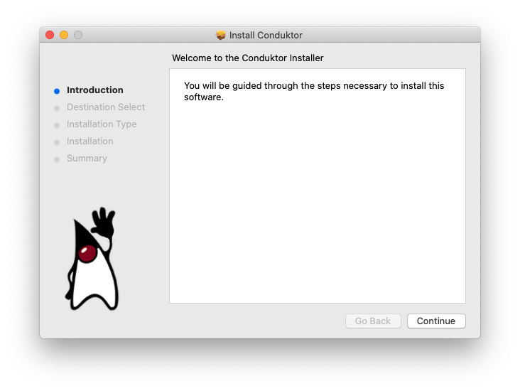

# Linux

## General Steps TODO

We have prepared an `.pkg` file for Mac OS X, example: `Conduktor-2.0.13.pkg` 

The installer is an easy step by step installer that will install Conduktor in your `Applications` folder

Conduktor requires about 300MB of space on your hard drive. 

You may be prompted to entire your admin credentials so that Conduktor can be installed

Conduktor is then installed ! 

Next step is to log into Conduktor

## Installation Issues

### I can't find my issue here

Please [contact us](https://www.conduktor.io/contact)

