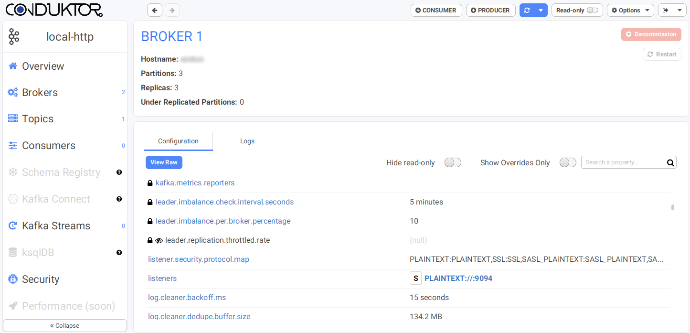
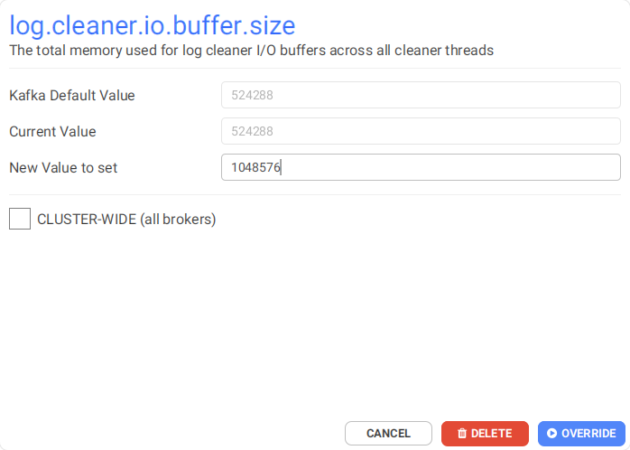

# Brokers Management


Work In Progress


## Listing

## Rolling Restart

## Configuration



You can modify non read-only configurations dynamically in the Broker details view.&#x20;

Readonly properties have a lock icon, and sensitive properties (value hidden) have a crossed-out eye icon.


Kafka versions before 2.4.x do not support the Incremental Alter Config API. Because of that, dynamically-set sensitive configurations will be lost when updating another configuration on the same broker. Proceed with caution (Conduktor will warn you if there is a risk)


Hover over an editable value to find the pencil icon. It will open the dynamic configuration dialog, that will let you set a new value for this property .

Readonly configurations (with the lock icons) must be modified through your broker's server.properties file. You can use the Rolling Restart button in the Brokers listing to apply the changes while keeping your cluster available.

