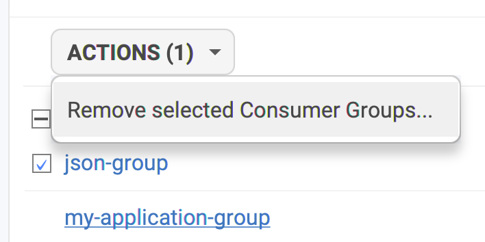
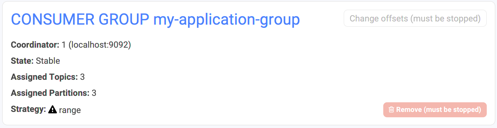
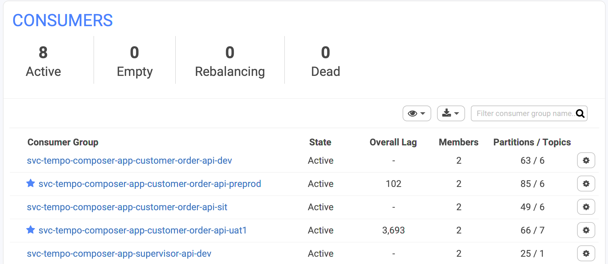
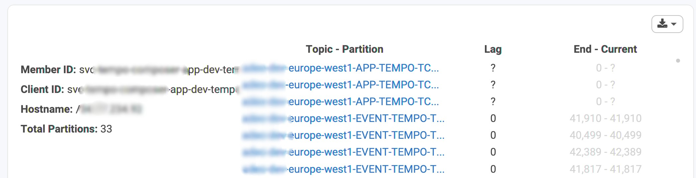

# Consumer Groups Management

Conduktor does NOT create any Consumer Group, it does not need too. Therefore, it's totally transparent for your Kafka cluster: Conduktor won't leave any traces and will not create anything here, you're safe.

## How can I create a Consumer Group?

_TLDR: you can't._

Conduktor does not create any Consumer Group and there is currently no possibility to create them here, because it makes little sense. The Consumer Group should be created by your applications, to be used by themselves. Why would you create a Consumer Group in Conduktor itself? 

If you have a valid use-case, feel free to contact us.

## How to delete a Consumer Group?

* **Stop the applications** running on this Consumer Group, otherwise you won't be able to delete it. ⚠️
* Two ways to delete a Consumer Group in Conduktor
  * from the main list
  * from the Consumer Group details

## How to Reset the Offsets of a Consumer Group?

* **Stop the applications** running on this Consumer Group, otherwise the buttons won't be accessible. Don't worry, we clearly state that the group must be stopped before acting on it 😉.

* Click on "Change offsets" then configure the strategy to how reset the offsets:
  * which topic: a consumer group can subscribe to multiple topics
  * which partition: sometimes you know exactly which message is stuck!
  * the new offset. It's computed automatically according to a few methods: 
    * **Earliest**: start from the beginning, reprocess everything!
    * **Latest**: start from the end, ignore all the existing records
    * **Latest minus X**: just reprocess the latest X records
    * **Current offset + X**: to jump over some records
    * **Specific Datetime**: when you know when your app started to crash
    * **Current time minus X seconds**: just the latest records in time
* When you change the strategy, Conduktor automatically recomputes the **New Offset** \(right column\).
* Click on `CHANGE OFFSETS (X)` when you're happy with the proposal
  * X is the number of changes
* Don't forget to restart your application! 💪

## How can I track the lag of my Consumer Group and my topics?

### Getting the lag for a Consumer Group

The global view of the Consumers shows the overall lag of your consumer groups. It is the sum of the lag for all topic-partitions the consumer group is subscribing to. When it's empty, it means there is no lag, and it's a good news!

* **The overall lag** is the sum of the **differences** between the latest offsets committed by the consuming applications for all their partitions, and the current end offset of all the partition where records are being written to.
* **Members**: how many instances of your applications are using this consumer group
* **Partitions / Topics**: how many partitions your consumer group is keeping track of

### Getting the lag per partition

You can also see the details per partitions in the details. Note that a consumer group can subscribe to multiple topics, like we can see below.

* **"?" means indeterminate**.
  * The Consumer Group has not committed yet any offset for this partition. This can happen when you don't have any record in this specific partition for instance \(or if you have a bug in your consuming application!\).
  * Sometimes, it can happen when Conduktor has troubles to simply get the offsets because the Kafka cluster is slow to respond, therefore Conduktor timeouts after a while \(30 seconds by default\).
  * The Current Offset of first three partitions below are also "?" because no commit were made yet, hence the lag is indeterminate.
* The lag is the **difference** between the latest offset committed by the consuming applications for the partition, and its current end offset where records are being written to.

## How to force a Member to leave a Consumer Group

You can **not** force a consumer to leave a consumer group permanently. 

However, Conduktor allows you to remove members from a group, which will have for effect to trigger a group rebalance. This is helpful if a member is dead, but its partitions are not yet reallocated to another member. Active members will re-join the group automatically during the rebalance and the partitions will be reallocated to them..

There are two ways to remove members from a consumer group:

* Remove all members at once with the `Remove All Members And Rebalance` button.
* Remove a selection of members : select the members and use the `ACTIONS` menu. This is only available for member of type static.

This action is designed to be used with _static group membership,_ a Kafka feature which can purposely delay the rebalance operation after a member is stopped.

