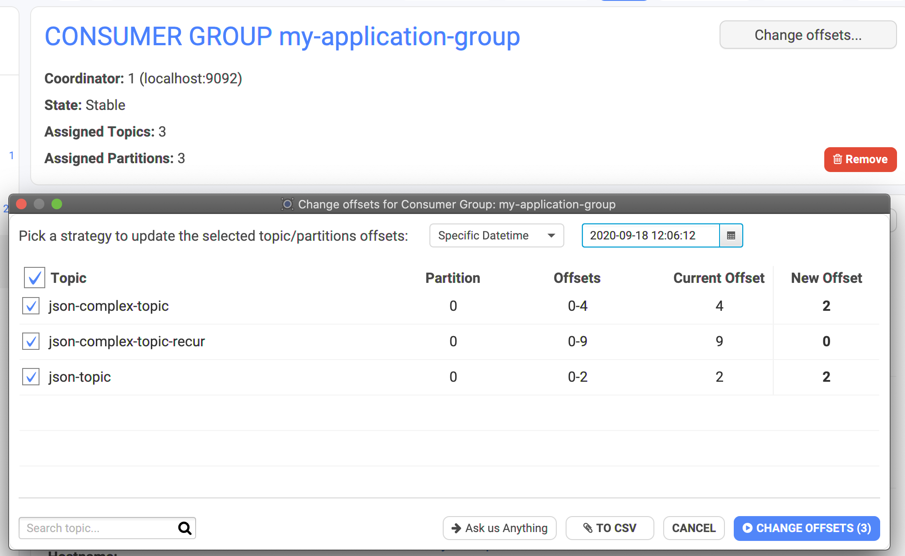

# Consumer Groups Management


Work In Progress


## How to delete a Consumer Group?

* **Stop the applications** running on this Consumer Group, otherwise you won't be able to delete it. ⚠️
* Two ways to delete a Consumer Group in Conduktor
  * from the main list
  * from the Consumer Group details

## How to Reset the Offsets of a Consumer Group?

* **Stop the applications** running on this Consumer Group, otherwise the buttons won't be accessible. Don't worry, we clearly state that the group must be stopped before acting on it 😉.

* Click on "Change offsets" then configure the strategy to how reset the offsets:
  * which topic: a consumer group can subscribe to multiple topics
  * which partition: sometimes you know exactly which message is stuck!
  * the new offset. It's computed automatically according to a few methods: 
    * **Earliest**: start from the beginning, reprocess everything!
    * **Latest**: start from the end, ignore all the existing records
    * **Latest minus X**: just reprocess the latest X records
    * **Current offset + X**: to jump over some records
    * **Specific Datetime**: when you know when your app started to crash
    * **Current time minus X seconds**: just the latest records in time
* When you change the strategy, Conduktor automatically recomputes the **New Offset** \(right column\).
* Click on `CHANGE OFFSETS (X)` when you're happy with the proposal
  * X is the number of changes
* Don't forget to restart your application! 💪

