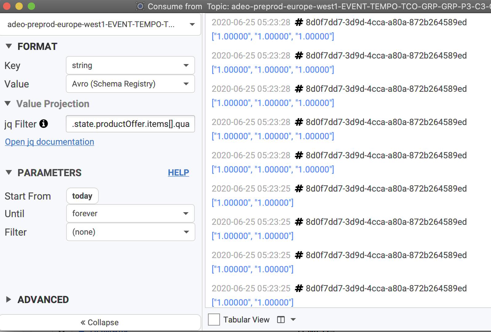
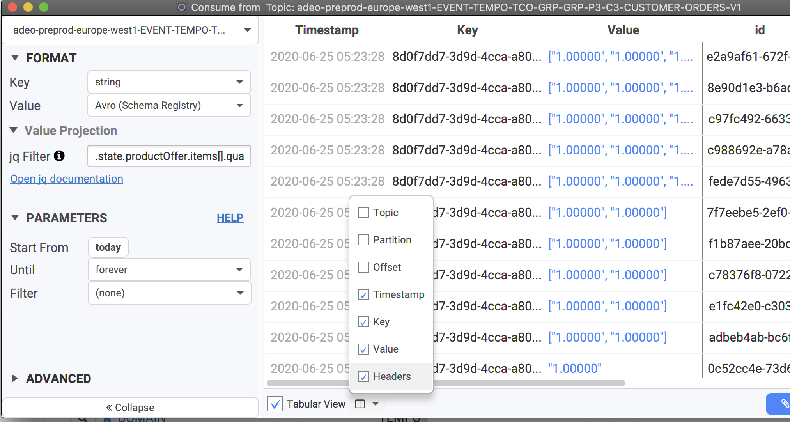
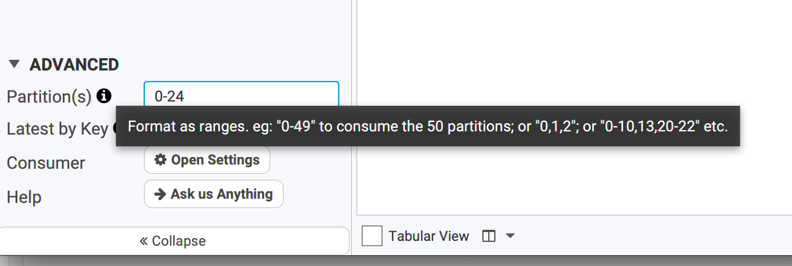
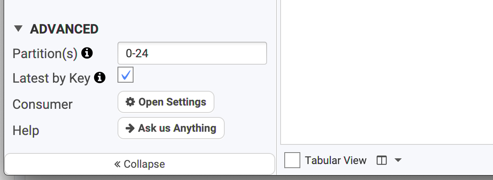
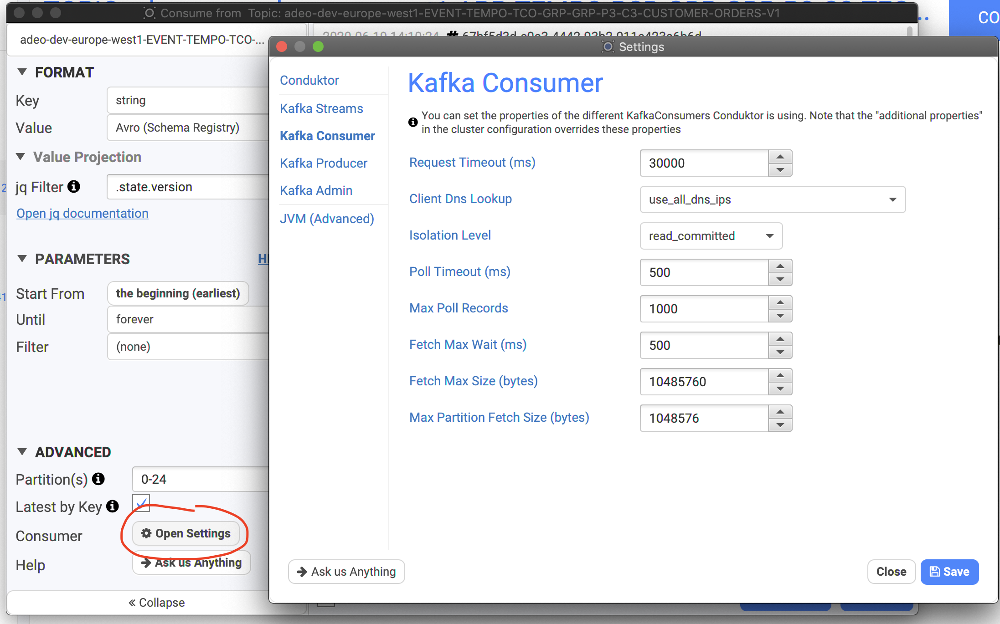
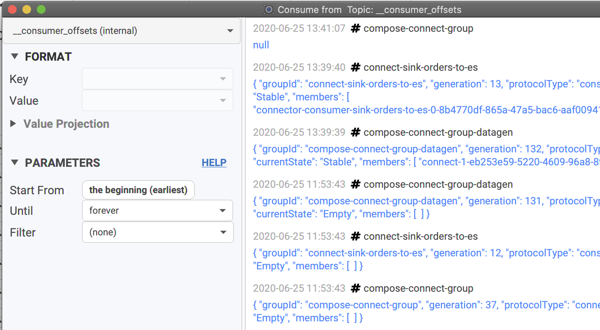

# Consuming data

## \(WIP\)

## How Conduktor consumes data

Conduktor always renders data **chronologically**.

Kafka only provides ordering within a single partition, not across partitions. Because it does not make sense to consume data non-chronologically in Conduktor, we've added our own optimization to always render the data in a deterministic way \(chronologically\) while preserving memory and CPU.

If you're using Kafka Transactions in your topic, note that by default, Conduktor consumes only committed data. You can change this by going to the Consumer Settings. 

## Viewing data inside a topic

From the main topics view, click on the icon next to its name to take a peek at its data:

We provide 2 views when consuming data: simple list and a tabular view. It's possible to switch back-and-forth by clicking on the "Tabular View" button below the list

You can double-click on a record to open a new dialog with all its info, its schema if it's Avro and so on. You can also open several of them at once to compare records.

From here, you can:

* copy the payload
* look for its headers
* its metadata \(partition, sizes\)
* the key/value Avro schema if you're using the Confluent Schema Registry. 
* if you are using the "binary" format, it's possible to Download into a file
* copy the record to Conduktor's producer to re-send it when needed \(useful when testing\)

### Multi-topics

It's possible to consume multiple topics at the same. It's useful when you're looking for a specific id across topics managed by different projects, to see "who's doing what" and retrace the lifecycle of your entity.

To do so, on the topics view, select multiple topics and click on "Consume selected Topics":

Then configure how you want to consume the data, \(start, until\), add a filter for instance on the user "1337", then start consuming to see where the users appears in the topics you selected.

When consuming multi-topics, you can see the topic name above the value:

## Pick your format wisely

Conduktor supports many formats when deserializing data and we keep adding some.

We don't support Protobuf yet, but it's on our roadmap. If you have specific needs, don't hesitate to **contact us**.

We support the most common formats, but also bytes, JSON, and multiple Avro flavours. We are compatible with the **Confluent Schema Registry** but we also support Avro data **not** written using the Confluent Schema Registry. You can even provide your own Avro schema directly within Conduktor.

## Monitoring the progress

When you're looking for a needle in a large topics, you'd like to know where Conduktor is at, to know how much take will it take. When consuming, it's possible to display the progress related to all partitions.

It's therefore possible to identify from here if a partition has issues \(no consuming or barely\)

## Advanced

### Consume only specific partitions

While most of the users will consume the data from a topic and all its partitions, some advanced users could only want to consume for a given set of partitions because they know where the info they're looking for is.

In the Advanced panel, you can set the partitions to a specific number, or a range, or a combinaison of ranges etc \(as the tooltip explains\).

Example:

* 42
* 20-30
* 20-21,24,26

### Show only the latest value

It's possible to get only the latest value for any keys when consuming data. If you know Kafka Streams, it's the same concept as the KTable, without Kafka Streams!

For instance, if you want to know what is the _last modification_ on a certain key, this is definitely a must.

In the Advanced panel, check "Latest by Key" and consume your topic. Nothing will change _except_ that all the visible keys will be the last version of them. You will see the records with the same key updated in-place with their latest value.

### Consumer tuning

By default, Conduktor is configured to work properly in the vast majority of use-case. For less common usage, it's possible to tune some properties used when working with the consumer

In the Advanced panel, click on Open Settings to get directly to the consumer settings: \(it's possible to get there by the main Settings button in Conduktor's main view\)

For instance, if you have large messages in your topic, consider:

* Reducing Max Poll Records
* Raising Fetch Max Size and Partition Fetch Size

### Consumer Offsets

Conduktor is able to read the special internal topic of Kafka where all the consumer committed offsets are stored. Not everybody has access to this topic **\_\_consumer\_offsets**. If you have, you'll see that you won't be able to choose how to read this topic, because there is only one way:

You will still be able to do classic operations like filtering, to look for your consumer group for instance. It's useful to track Kafka rebalancing, commits and so on.

There are different type of key/value in this topic that we won't explain here. If you're interesting reading this topic, I'm sure you know what you're doing!

