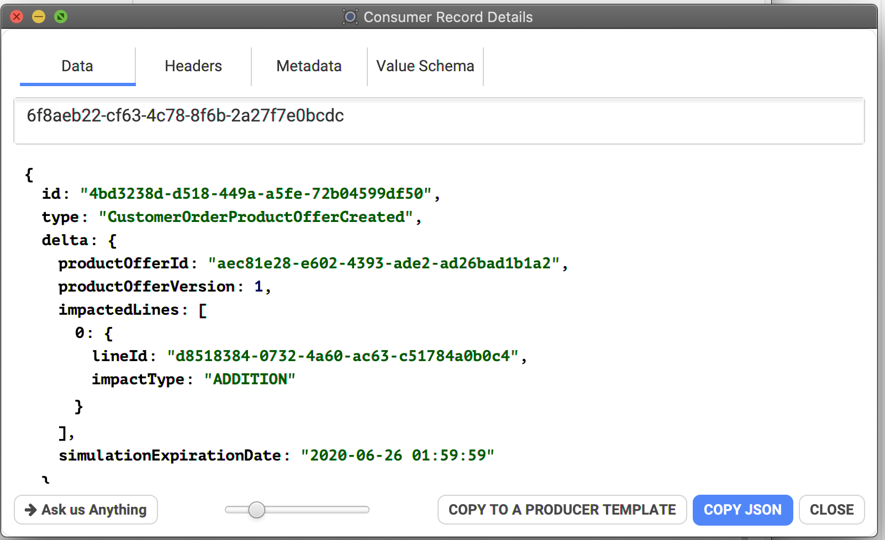
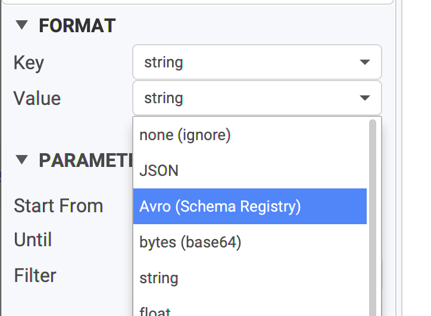
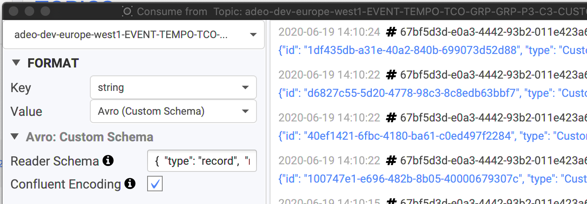
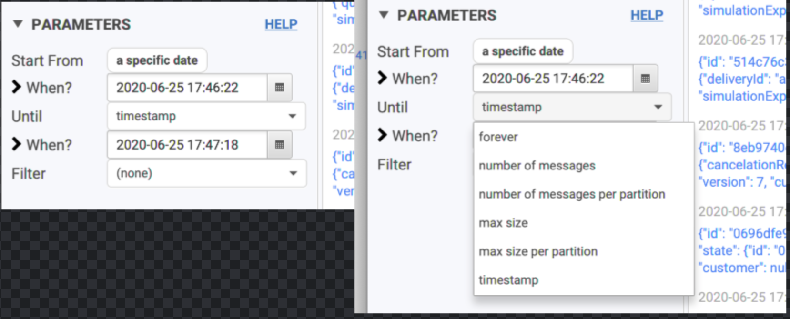
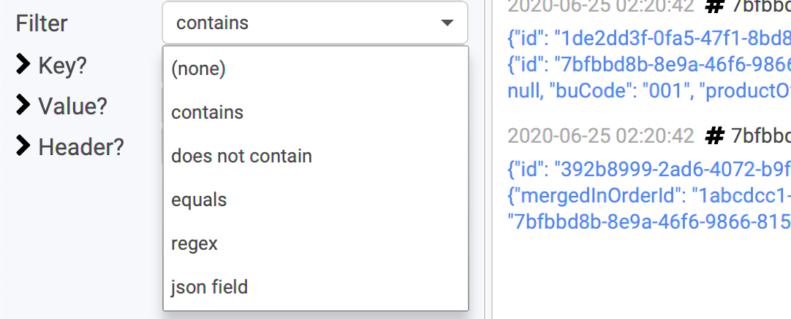
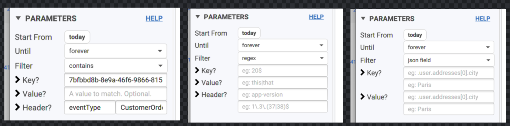

# Consuming data

## How Conduktor consumes data

Conduktor always renders data **chronologically**. 

Kafka only provides ordering within a single partition, not across partitions. Because it does not make sense to consume data non-chronologically in Conduktor, we've added our own optimization to always render the data in a deterministic way \(chronologically\) while preserving memory and CPU. This also works for multi-topics consumption \(see below\).

If you're using Kafka Transactions in your topic, note that by default, Conduktor consumes only committed data. You can change this by going to the Consumer Settings.

## Viewing data inside a topic

From the main topics view, click on the icon next to its name to take a peek at its data:


We provide 2 views when consuming data: simple list and a tabular view. It's possible to switch back-and-forth by clicking on the "Tabular View" button below the list


You can double-click on a record to open a new dialog with all its info, its schema if it's Avro and so on. You can also open several of them at once to compare records.



From here, you can:

* copy the payload
* look for its headers
* its metadata \(partition, sizes\)
* the key/value Avro schema if you're using the Confluent Schema Registry. 
* if you are using the "binary" format, it's possible to Download into a file
* copy the record to Conduktor's producer to re-send it when needed \(useful when testing\)

### Multi-topics

It's possible to consume multiple topics at the same. It's useful when you're looking for a specific id across topics managed by different projects, to see "who's doing what" and retrace the lifecycle of your entity.

To do so, on the topics view, select multiple topics and click on "Consume selected Topics":


Then configure how you want to consume the data, \(start, until\), add a filter for instance on the user "1337", then start consuming to see where the users appears in the topics you selected.

When consuming multi-topics, you can see the topic name above the value:


## Pick your format wisely


This is the first thing to setup when you're consuming a topic


Conduktor supports many formats when deserializing data and we keep adding some.

We don't support Protobuf yet, but it's on our roadmap. If you have this need or any other specific needs, don't hesitate to [contact us](https://www.conduktor.io/contact/).

We support the most common formats, but also bytes, JSON, and multiple Avro flavours. We are compatible with the **Confluent Schema Registry** but we also support Avro data **not** written using the Confluent Schema Registry. You can even provide your own Avro schema directly within Conduktor.

### Key and Value

There are 2 format to pick: the key format and the value format.

* In most cases, the key is a string so nothing to worry about here.
* the value is typically JSON or Avro
  * it can be long, float or other primitives when working with Kafka Streams where you're doing aggregations for instance


Conduktor automatically pick Avro when it detects a matching Confluent Schema Registry subject \(if configured\)





If you don't see "Avro \(Schema Registry\)", it means you didn't configured the url of your schema registry in your cluster configuration: [check the doc](https://docs.conduktor.io/kafka-cluster-connection/setting-up-a-connection-to-kafka#schema-registry).


### Avro without Confluent ?

Most Kafka installations rely on the Confluent Schema Registry, that's the Avro \(Schema Registry\) format. When data flow in, Conduktor knows the Avro schema to use because it's in the payload itself \(well, the id only, but that's enough\) if we follow the Confluent's convention.

But not everyone follows this convention! This means it's possible that the record does not contain the schema to read the data, and you need to help Conduktor. 

You can help Conduktor in 3 ways:

* Which subject to use \(if using Confluent Schema Registry\)
* Which schemaId to use \(if using Confluent Schema Registry\)
* Which schema to use \(no need to the registry\)


For instance, I want to provide a custom Avro Schema to read my data:

* I choose "Avro \(Custom Schema"\)
* I paste my custom schema
* I check "Confluent Encoding" because in my case, data are encoded using Confluent's convention
  * In most cases, this will NOT be checked if we're using this feature
* The data will be read using this schema!


It can be used to "project" the data: read and display only a subset of fields


```javascript
{
  "type": "record",
  "name": "myrecord",
  "namespace": "com.company.events",
  "fields": [
    {
      "name": "id",
      "type": "string"
    },
    {
      "name": "type",
      "type": "string",
      "default": "some default"
    }
  ]
}

```




### Possible errors

If you try to consume Avro data without properly configuring it \(and because it was not auto-detected by Conduktor for some reasons\), you'll end up with garbage data like this:


On the contrary, if you try to read non-Avro data using the Avro format, you'll end up with a list of errors \(Conduktor doesn't stop, in case it was test records for instance\):


ERR: Unknown magic byte!



## Filtering & Projecting data

Conduktor provides many ways when it comes to filtering and projecting data. This is an important use-case when using Conduktor:

* you're looking for a needle in your whole topic history
* you'd like to trace the events of your entity "abc" from today only
* you'd like to have in the same view how a _specific field_ changed across time
* you're looking for what happened between 5.05pm and 5.10pm yesterday
* ...

### Projecting data

You can choose to display only a subset of fields from a message. This works for JSON and Avro data \(because they are converted to JSON\). A section "Value projection" will appear where you can set a "jq" expression \([documentation](https://stedolan.github.io/jq/manual/v1.5/#.)\).

For instance, here, we only care about `.state.version` in:

```javascript
{
  "id" : "84504272-8473-48f6-8ad5-a7e836e58dc7",
  "type" : "CustomerOrderItemAdded",
  "delta" : {
    "itemId" : "1abcdcc1-cc36-4ae4-a6eb-3582df6f8e65"
  },
  "state" : {
    "id" : "570ccfea-6c8a-44a3-83a9-ab54797d104f",
    "version" : 6, // we care only about this! <<<<<<<<<<
    ...
}
```

We setup this as our filter, and we'll only see the value of `version`:


Typical use-cases:

* `.property.subprop.value` : just nested objects
* `.items[].object`: access objects inside an array
* `.items[].object.property`: access fields inside objects inside an array
* `.items | length`: returns the length of an array
* `.x.obj | keys` : list the keys "obj"
* `contains({"state":{"version": 1}})`: "true" if the element with this value exists
* ...
* * There are many functions availables: [check the jq documentation](https://stedolan.github.io/jq/manual/v1.5/#.)

If your jq filter is invalid, or only fails for some records, Conduktor will display the jq error in place of the value:



If you're using Avro, it's also possible to provide a custom schema \(with less fields\) by using the format "Avro \(Custom Schema\)", see [Avro without Confluent?](https://docs.conduktor.io/features/consuming-data#avro-without-confluent)


### Filtering data

It's possible to combine multiple filters on multiple dimensions: time, quantity, fields.

#### Choose where to start from


By default, Conduktor uses "**now \(latest\)**": it means that only new incoming data will appear in Conduktor, not the past.


* time based: a hour, a date
* offset based:
  * **an existing consumer group**: useful to see why an application is failing there, like a deserialization error
  * **latest minux X offsets**: just the latest data published, no matter when
  * **an offset**: this will be the starting offset for all the partitions consumed. You generally use this and select only one partition \(see Advanced\).


#### Choose until when to consume

Sometimes, you don't want to continuously consume incoming data and just want to consume a few messages and automatically stop.

* **forever** is the default: never stop 
* **number of messages**: when we just want to take a peek
* **max size**: rare use-case, when the size matters
* **timestamp**: consume data up until a particular date.
  * also useful when combined to a start date



#### Filter messages by their key/value/headers

We offer many ways to select only the interesting key/value you're looking for.

* **contains**: a simple string we're looking for \(fast\)
* **equals**: the whole key or value must match, often used for keys \(where it's generally a simple id\)
* **regex**: for more complex case when you know regexes 🤓. Can be quite slow when the payloads are large.
* **json field**: it's the same format as in "Projecting data" \(above\), except the extracted value must match a value you'll expect

Most works with key, value and headers.


If you set several filters, it's treated like an "**AND**".  
We **don't** support "OR" operand; we don't have any complex UI to tell "\(this or \(that and that\)\) or this"






#### Filter: Regex

Not familiar with regexes? Let's present a few use-case to understand their power:

* Looking for keys ending in `200` ? The default "contains" won't work, because it will match "200133" "343200343" and so on. With regex, it's possible:
  * `200$`: means "ends with 200"
  * `^200`: means "starts with 200"
* Looking for "london" or "paris" at the same time?
  * `london|paris`: this will match values containing either london or paris
  * `[wz]` it's the "same" but for single characters only \('w' or 'z'\)


Beware of "special" characters like `"(" "{" or "."`, they need to be "escaped". 

If you want to match "1.2.2" or "1.2.3", use `"1\.2\.[23]"` and NOT `"1.2.[23]"` or you will match "**1**0**2**4**3**": "." means "any character"



You can use regex with a json-ish syntax if you want to match the json payload, and not use the Json Field filter.

* `"state"\s:\s{\s"id"\s:\s".",\s"version"\s:\s*227`

This is the "equivalent" of the json field filter: `.state.version = 227`


#### Filter: Json Field

Regexes can be complicated \(look the above comment\). This is why we also offer a simpler way to work with JSON-ish payload: json field filter!

* Define the property you want to filter is
* Define the expected value you want

Here, we want to see only the Avro records where `.state.version` equals to 227:


Refer to [Projecting data](https://docs.conduktor.io/features/consuming-data#projecting-data) to know what's possible, it's the same syntax. 

## Monitoring the progress

When you're looking for a needle in a large topics, you'd like to know where Conduktor is at, to know how much take will it take. When consuming, it's possible to display the progress related to all partitions by clicking on the "Show Partitions" button at the bottom.

This will open a panel updated in real-time displaying the progress for all partitions \(and all topics, if several are consumed at once\):



It's possible to identify if a partition has issues if it's not moving on or barely \(probably that the leader broker of this partitions is in trouble\)


You know when a partition is totally consumed when it goes green. If some applications produces at the same-time, Conduktor automatically updates itself \(the end offsets\) and you may see partitions blinking between blue and green \(Conduktor consuming at the same rate than the producers\).

## Advanced

### Consume only specific partitions

While most of the users will consume the data from a topic and all its partitions, some advanced users could only want to consume for a given set of partitions because they know where the info they're looking for is.

In the Advanced panel, you can set the partitions to a specific number, or a range, or a combinaison of ranges etc \(as the tooltip explains\).

Example:

* 42
* 20-30
* 20-21,24,26


### Show only the latest value

It's possible to get only the latest value for any keys when consuming data. If you know Kafka Streams, it's the same concept as the KTable, without Kafka Streams!

For instance, if you want to know what is the _last modification_ on a certain key, this is definitely a must.

In the Advanced panel, check "Latest by Key" and consume your topic. Nothing will change _except_ that all the visible keys will be the last version of them. You will see the records with the same key updated in-place with their latest value.


### Consumer tuning

By default, Conduktor is configured to work properly in the vast majority of use-case. For less common usage, it's possible to tune some properties used when working with the consumer

In the Advanced panel, click on Open Settings to get directly to the consumer settings: \(it's possible to get there by the main Settings button in Conduktor's main view\)


For instance, if you have large messages in your topic, consider:

* Reducing Max Poll Records
* Raising Fetch Max Size and Partition Fetch Size

### Consumer Offsets

Conduktor is able to read the special internal topic of Kafka where all the consumer committed offsets are stored. Not everybody has access to this topic **\_\_consumer\_offsets**. If you have, you'll see that you won't be able to choose how to read this topic, because there is only one way:


You will still be able to do classic operations like filtering, to look for your consumer group for instance. It's useful to track Kafka rebalancing, commits and so on.

There are different type of key/value in this topic that we won't explain here. If you're interesting reading this topic, I'm sure you know what you're doing!


