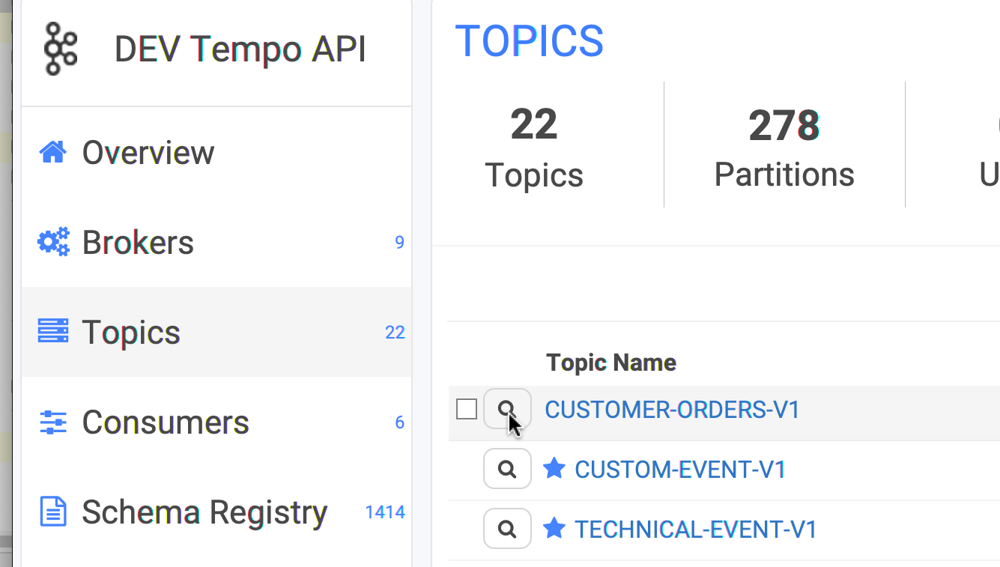
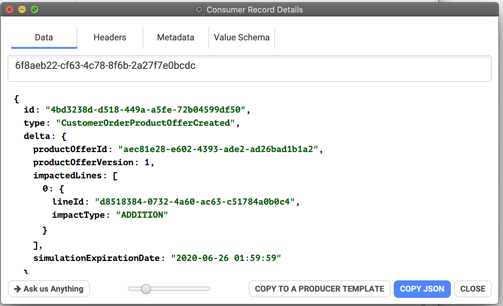
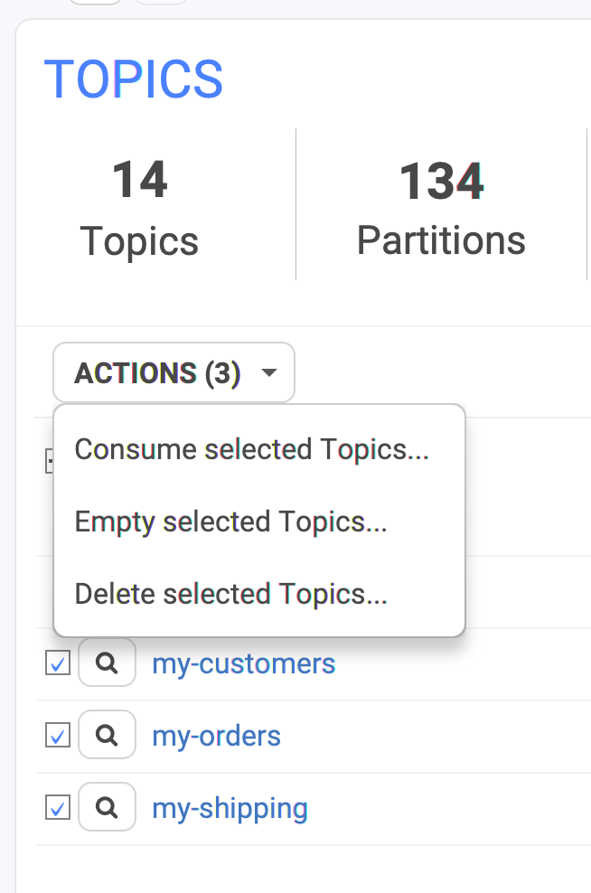
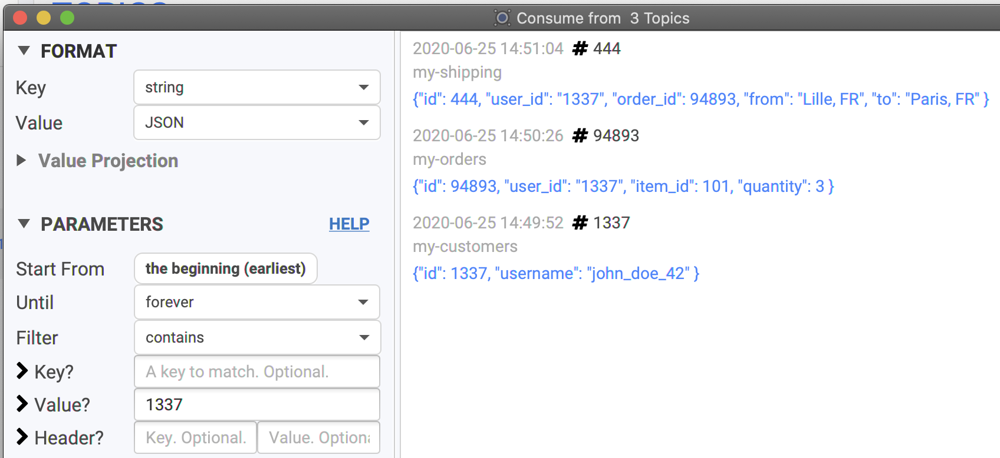

# How to Consume data?



## _How_ Conduktor consumes data


Conduktor always displays data **chronologically**.&#x20;


Kafka only provides ordering within a single partition, not across partitions. Because it does not make sense to consume data non-chronologically in Conduktor, we've added our own optimization to always render the data in a deterministic way (chronologically) while preserving memory and CPU. This also works for multi-topics consumption (see below).

If you're using Kafka Transactions in your topic, note that by default, Conduktor consumes only committed data. You can change this by going to the Consumer Settings.

## Viewing data inside a topic

From the main topics view, click on the icon next to its name to take a peek at its data:

We provide 2 views when consuming data: simple list and a tabular view. It's possible to switch back-and-forth by clicking on the "Tabular View" button below the list

.png>)

.png>)

You can double-click on a record to open a new dialog with all its info, its schema if it's Avro and so on. You can also open several of them at once to compare records.


Pick "JSON" as your Value deserializer to see the **formatted** **JSON** in the details dialog. If you pick just "string", it won't be formatted otherwise.


From here, you can:

* copy the payload
* look for its headers
* its metadata (partition, sizes)
* the key/value Avro schema if you're using the Confluent Schema Registry.&#x20;
* if you are using the "binary" format, it's possible to Download into a file
* copy the record to Conduktor's producer to re-send it when needed (useful when testing)

### Multi-topics

It's possible to consume multiple topics at the same. It's useful when you're looking for a specific id across topics managed by different projects, to see "who's doing what" and retrace the lifecycle of your entity.

To do so, on the topics view, select multiple topics and click on "Consume selected Topics":

Then configure how you want to consume the data, (start, until), add a filter for instance on the user "1337", then start consuming to see where the users appears in the topics you selected.

When consuming multi-topics, you can see the topic name above the value:

## Monitoring the progress

When you're looking for a needle in a large topics, you'd like to know where Conduktor is at, to know how much take will it take. When consuming, it's possible to display the progress related to all partitions by clicking on the "Show Partitions" button at the bottom.

This will open a panel updated in real-time displaying the progress for all partitions (and all topics, if several are consumed at once):

.png>)


It's possible to identify if a partition has issues if it's not moving on or barely (probably that the leader broker of this partitions is in trouble)


You know when a partition is totally consumed when it goes green. If some applications produces at the same-time, Conduktor automatically updates itself (the end offsets) and you may see partitions blinking between blue and green (Conduktor consuming at the same rate than the producers).

