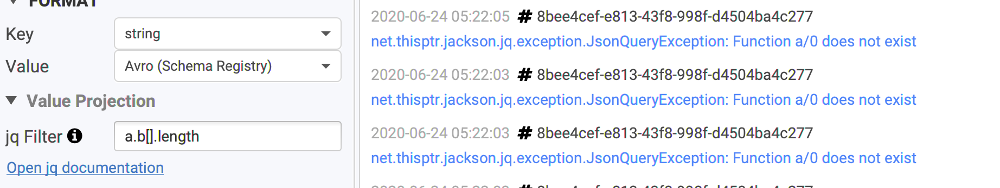
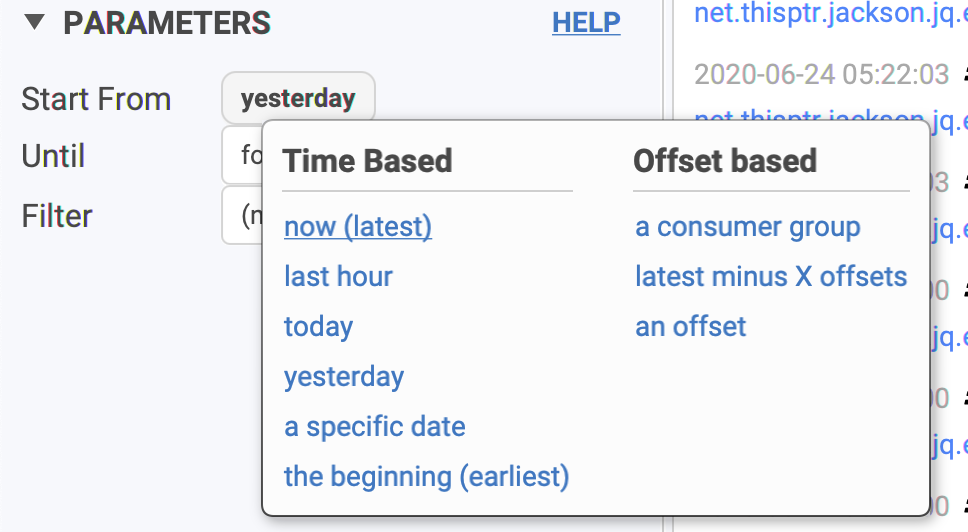

# Filtering & Projecting data

Conduktor provides many ways when it comes to filtering and projecting data. This is an important use-case when using Conduktor:

* you're looking for a needle in your whole topic history
* you'd like to trace the events of your entity "abc" from today only
* you'd like to have in the same view how a _specific field_ changed across time
* you're looking for what happened between 5.05pm and 5.10pm yesterday
* ...

## Projecting data

You can choose to display only a subset of fields from a message. This works for JSON and Avro data \(because they are converted to JSON\). A section "Value projection" will appear where you can set a "jq" expression \([documentation](https://stedolan.github.io/jq/manual/v1.5/#.)\).

For instance, here, we only care about `.state.version` in:

```javascript
{
  "id" : "84504272-8473-48f6-8ad5-a7e836e58dc7",
  "type" : "ItemAdded",
  "delta" : {
    "itemId" : "1abcdcc1-cc36-4ae4-a6eb-3582df6f8e65"
  },
  "state" : {
    "id" : "570ccfea-6c8a-44a3-83a9-ab54797d104f",
    "version" : 6, // we care only about this! <<<<<<<<<<
    ...
}
```

We setup this as our filter, and we'll only see the value of `version`:


Typical use-cases:

* `.property.subprop.value` : just nested objects
* `.items[].object`: access objects inside an array
* `.items[].object.property`: access fields inside objects inside an array
* `.items | length`: returns the length of an array
* `.x.obj | keys` : list the keys "obj"
* `contains({"state":{"version": 1}})`: "true" if the element with this value exists
* ...
* * There are many functions availables: [check the jq documentation](https://stedolan.github.io/jq/manual/v1.5/#.)

If your jq filter is invalid, or only fails for some records, Conduktor will display the jq error in place of the value:




If you're using Avro, it's also possible to provide a custom schema \(with less fields\) by using the format "Avro \(Custom Schema\)", see [Avro without Confluent?](https://docs.conduktor.io/features/consuming-data#avro-without-confluent)


## Filtering data

It's possible to combine multiple filters on multiple dimensions: time, quantity, fields.

#### Choose where to start from


By default, Conduktor uses "**now \(latest\)**": it means that only new incoming data will appear in Conduktor, not the past.


* time based: a hour, a date
* offset based:
  * **an existing consumer group**: useful to see why an application is failing there, like a deserialization error
  * **latest minux X offsets**: just the latest data published, no matter when
  * **an offset**: this will be the starting offset for all the partitions consumed. You generally use this and select only one partition \(see Advanced\).



### Choose until when to consume

Sometimes, you don't want to continuously consume incoming data and just want to consume a few messages and automatically stop.

* **forever** is the default: never stop 
* **number of messages**: when we just want to take a peek
* **max size**: rare use-case, when the size matters
* **timestamp**: consume data up until a particular date.
  * also useful when combined to a start date


### Filter messages by their key/value/headers

We offer many ways to select only the interesting key/value you're looking for.

* **contains**: a simple string we're looking for \(fast\)
* **equals**: the whole key or value must match, often used for keys \(where it's generally a simple id\)
* **regex**: for more complex case when you know regexes 🤓. Can be quite slow when the payloads are large.
* **json field**: it's the same format as in "Projecting data" \(above\), except the extracted value must match a value you'll expect

Most works with key, value and headers.


If you set several filters, it's treated like an "**AND**".  
We **don't** support "OR" operand; we don't have any complex UI to tell "\(this or \(that and that\)\) or this"



### Filter: Regex

Not familiar with regexes? Let's present a few use-case to understand their power:

* Looking for keys ending in `200` ? The default "contains" won't work, because it will match "200133" "343200343" and so on. With regex, it's possible:
  * `200$`: means "ends with 200"
  * `^200`: means "starts with 200"
* Looking for "london" or "paris" at the same time?
  * `london|paris`: this will match values containing either london or paris
  * `[wz]` it's the "same" but for single characters only \('w' or 'z'\)


Beware of "special" characters like `"(" "{" or "."`, they need to be "escaped". 

If you want to match "1.2.2" or "1.2.3", use `"1\.2\.[23]"` and NOT `"1.2.[23]"` or you will match "**1**0**2**4**3**": "." means "any character"



You can use regex with a json-ish syntax if you want to match the json payload, and not use the Json Field filter.

* `"state"\s:\s{\s"id"\s:\s".",\s"version"\s:\s*227`

This is the "equivalent" of the json field filter: `.state.version = 227`


### Filter: Json Field

Regexes can be complicated \(look the above comment\). This is why we also offer a simpler way to work with JSON-ish payload: json field filter!

* Define the property you want to filter is
* Define the expected value you want

Here, we want to see only the Avro records where `.state.version` equals to 227:


Refer to [Projecting data](https://docs.conduktor.io/features/consuming-data#projecting-data) to know what's possible, it's the same syntax. 

### Composed Filter
`introduced in 2.18.2`

Composed Filter allow to use multiple filter as one.
Two kind of composition are available
* `All`, [formally AND]. this composer will check that records match `all` the filtering rules
* `At least one`, [formally OR]. this composer will check that records match `at least one` filtering rules

All kinds of existing filters can be used in composed filter.

To add or remove a filter use the  `+` & `-` buttons.

