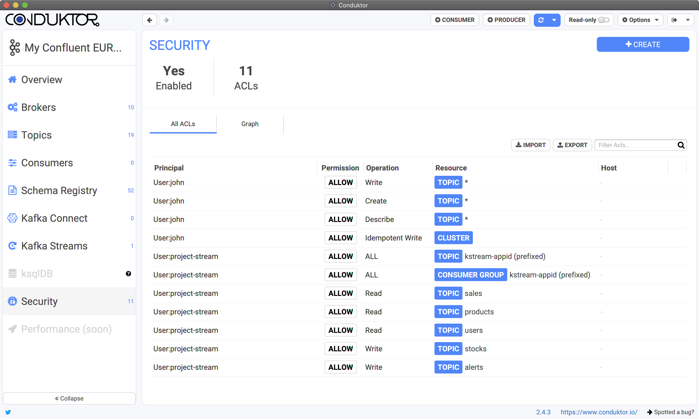
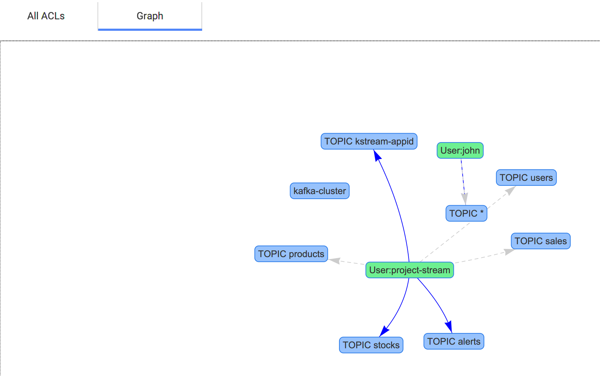
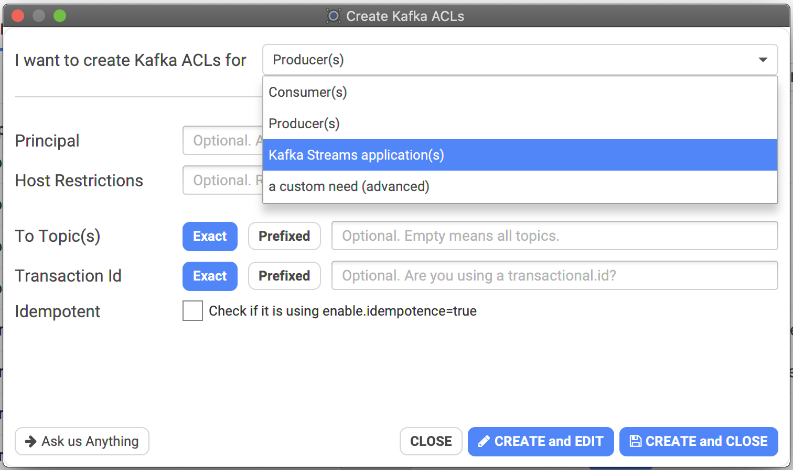

# Kafka Security (ACLs)



## List the ACLs

Conduktor "Security" tab lets you see the current ACLs of your Kafka cluster, and provide different views:

* Classic listing with filter:



* An experimental graphic view where you can see the links between users and topics.
  * Normal arrow means "producing to"
  * Dashed arrow means "consuming from"



## How to create new ACLs

Kafka's ACLs are quite "atomic", there are many ACLs possible. Generally, you must combine them to be able to provide a producer / a consumer / a kafka streams application, enough ACLs to make it work properly.


Documentation about ACLs: [https://docs.confluent.io/current/kafka/authorization.html](https://docs.confluent.io/current/kafka/authorization.html)


Conduktor helps you by providing a simple wizard.

It asks you which use-case do you want to use, then it adapts the fields you need to setup, and provide useful help and tips all around. When you validate, it will automatically create all the necessary ACLs behind the scene (that will be visible on the main list):



## Import/Export ACLs

From the list screen, it's possible to export the ACLs to a CSV file (this will export only the filtered ACLs if a filter is present). This will render the ACLs following the [kafka-security-manager](https://github.com/simplesteph/kafka-security-manager) format:

```
KafkaPrincipal,ResourceType,PatternType,ResourceName,Operation,PermissionType,Host
User:john,TOPIC,LITERAL,*,WRITE,ALLOW,*
User:john,TOPIC,LITERAL,*,CREATE,ALLOW,*
User:john,TOPIC,LITERAL,*,DESCRIBE,ALLOW,*
User:john,CLUSTER,LITERAL,kafka-cluster,IDEMPOTENT_WRITE,ALLOW,*
User:project-stream,TOPIC,PREFIXED,kstream-appid,ALL,ALLOW,*
User:project-stream,GROUP,PREFIXED,kstream-appid,ALL,ALLOW,*
User:project-stream,TOPIC,LITERAL,sales,READ,ALLOW,*
User:project-stream,TOPIC,LITERAL,products,READ,ALLOW,*
User:project-stream,TOPIC,LITERAL,users,READ,ALLOW,*
User:project-stream,TOPIC,LITERAL,stocks,WRITE,ALLOW,*
User:project-stream,TOPIC,LITERAL,alerts,WRITE,ALLOW,*
```

You can import the same kind of file (don't forget to add the **header as the first line**, to identify the columns).

