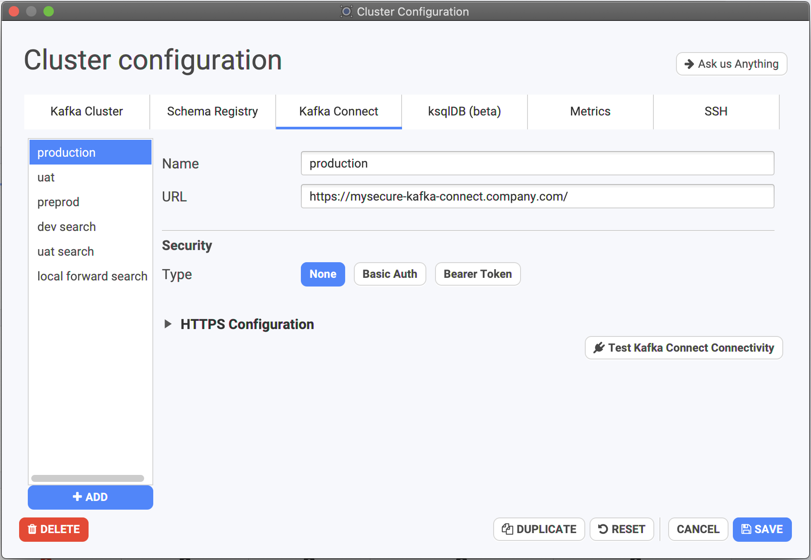

# Kafka Connect



## Configuration

You can configure your Kafka Connect instances from your Cluster Configuration:

Because it's quite rare to work only with one Kafka Connect cluster \(workload segmentation, team boundaries, type of connectors..\), you can add as many as you want in Conduktor, just give them a proper name if you have many. This will be added next to the name of connector in the main list. It's particularly important when you add multiple environments: a connector with the same name can be started on every one of them!

## Performances

Since [Conduktor 2.6.0](https://www.conduktor.io/changelog/#2.6.0), if you have Kafka Connect 2.3+, Conduktor will quickly load up all connectors state and tasks in Conduktor.

If you're running a lower version, it will take more time because each connector needs be queried one by one to get its info \(we limit the number of calls we're doing in parallel to not crash your instance!\). Consider upgrading.

## How to start with Confluent Cloud Kafka Connect

