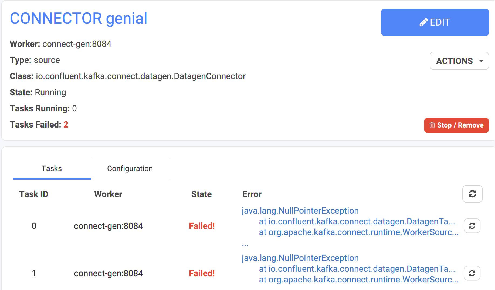
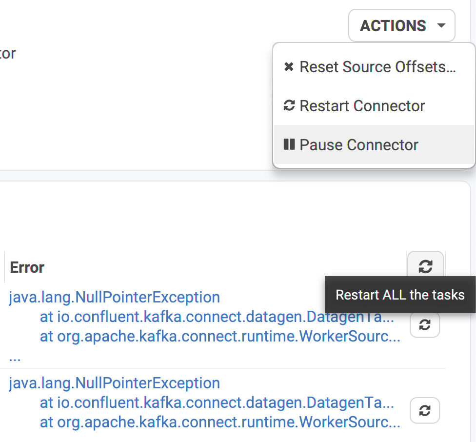
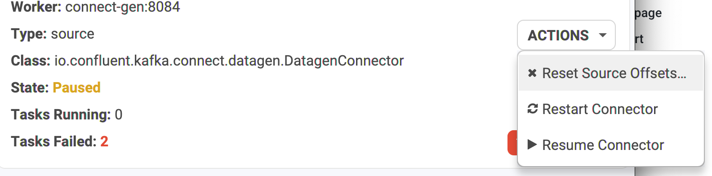
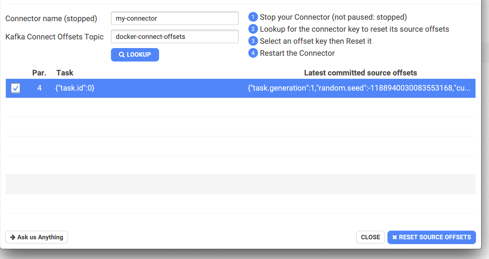
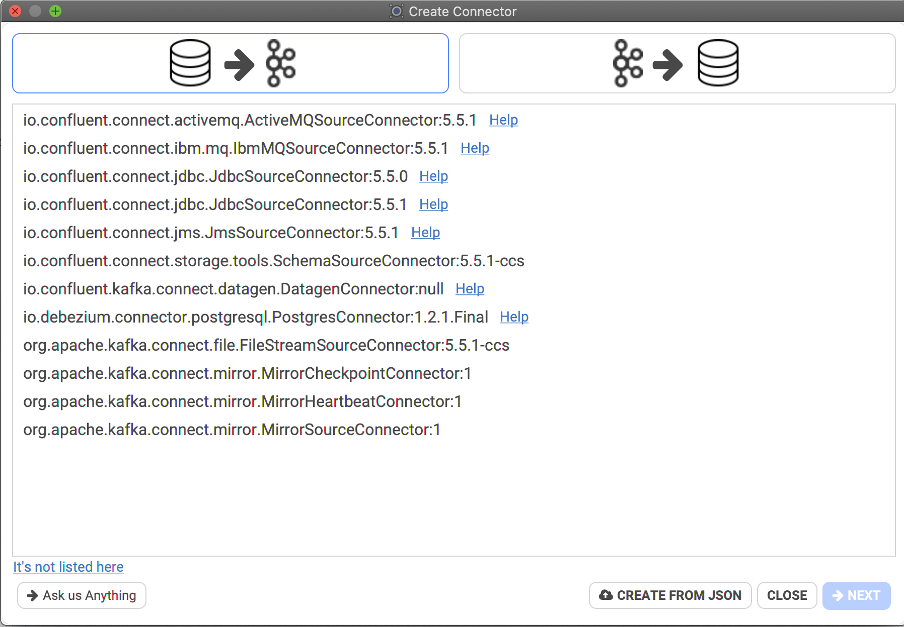
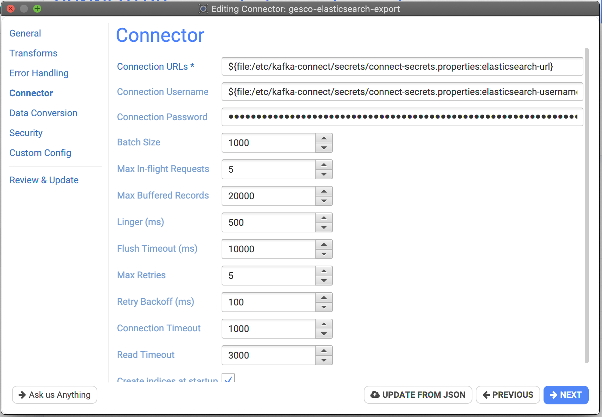

# Features

## List Connectors

There is a lot of information when it comes to Connectors!

* **Instance / Name**: instance is only displayed if you have multiple Kafka Connect instances configured, this is to distinguish between them.
* **Class**: the plugin used.
* **Type**: quickly understand what this connector does.
* **Topics**: which topics does the connector listen from or write into.
* **Status / Tasks**: red means trouble!

Here is a typical example with 6 Kafka Connect instances for multiple environments:

.png>)

## Error Management

Conduktor displays the connectors on the main list in error (clearly in red). In the details, it's possible to look at which task failed and why:

## Restart / Pause / Stop

It's possible to restart a Connector or simply a task (or all tasks at once, different of a full connector restart).

* Restart a Connector
* Pause/Resume a Connector
* Restart ALL the tasks of a Connector
* Restart a particular task of a Connector

### Connector States

A connector and its tasks can have different states:

* RUNNING
* FAILED
* PAUSED
* UNASSIGNED: no worker is picking it up!

## Reset Connector Source Offsets

Kafka Connect stores connectors state inside Kafka itself.

Sometimes (mostly when testing), you want to reset a connector to start from "scratch", as it was the first time ever you've started it. Unfortunately, **removing a Connector does not delete its state from Kafka**. You can either:

* change the Connector name: Kafka Connect won't find any existing state obviously
* reset the source offsets: using Conduktor!

Conduktor will look for the partition containing the latest occurrence of your connector configuration, to know "where" to reset it.

Here is an example:

* my connector name: "my-connector" which is already stopped (ie: removed)
* my Kafka Connect offsets topic: "docker-connect-offsets"
* Click Lookup and let Conduktor find the partition and latest value
* Select the key and "RESET SOURCE OFFSETS"
* Restart your Connector (re-create it), it will start from scratch.

## Create Connectors

We provide a wizard to easily create connectors. The available connector types depend on the Kafka Connect instance you're creating a connector. You can also simply load a JSON to init the wizard:

When you pick a Sink or a Source connector type (or Create From JSON), you have access to a nice wizard properly organized and fully documented (just hover the property names).

For instance, here, one of the step of the Elasticsearch Sink Connector:

## Update Connector

It's possible to update a Connector by using this same wizard or simply by providing an updated JSON.
