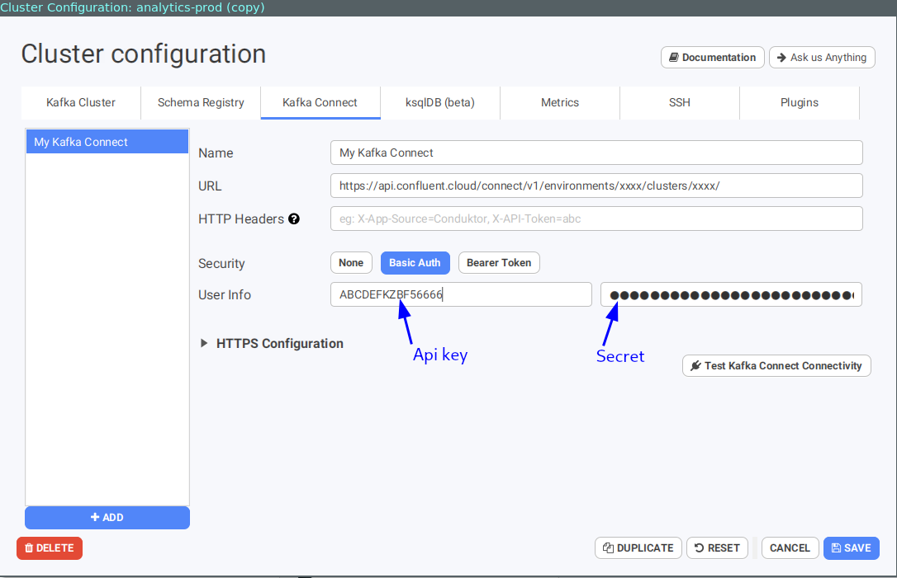

# How to start with Confluent Cloud kafka connect?

## Generate an API key

You need to generate an API key and secret to act as username and password specific for kafka connect. Do not use the Kafka credentials you should already got, this won't work. This can be done using Confluent Cloud CLI tool: `ccloud`. Install it using the official documentation: [https://docs.confluent.io/ccloud-cli/current/install.html](https://docs.confluent.io/ccloud-cli/current/install.html)

* Login and select your environment if you have several of them:

```text
$ ccloud login
$ ccloud environment
```


* Generate a key: write down the key & secret:

```text
$ ccloud api-key create --resource cloud
+---------+------------------------------------------------------------------+
| API Key | ABCDEFKZBF56666                                                  |
| Secret  | ToMaHaWkjQ1bt7BxvdyFjaJ8j3nSokaAd83Nhan739snAiufIAfdk7fFAAnBKxai |
+---------+------------------------------------------------------------------+
```

* The API Key is the username, the Secret is the token

## kafka connect URL 
* Get the ID of the environment where your cluster is located:
```text
$ ccloud environment list                                                                                                                                                                                   16:49:31
      Id      |    Name     
+-------------+------------+
    env-1234 | staging     
  * env-6789 | production  
```
* Get the ID of the kafka cluster :

```text
 ccloud environment use env-6789
 ccloud kafka cluster list                                                                    16:21:10
      Id      |         Name         | Type  | Provider |    Region    | Availability | Status  
+-------------+----------------------+-------+----------+--------------+--------------+--------+
    lkc-8888 | analytics-production | BASIC | gcp      | europe-west4 | single-zone  | UP      

```

* Then build the kafka connection URL for this env-id cluster-id couple

```text
https://api.confluent.cloud/connect/v1/environments/env-6789/clusters/lkc-8888/
```
## Configure Conduktor using this API key

Configure your Conduktor with all these elements, selecting Basic Auth to add the username/password:



Test for the Connectivity here, to ensure the API Key is ready, it may takes a few minutes!

