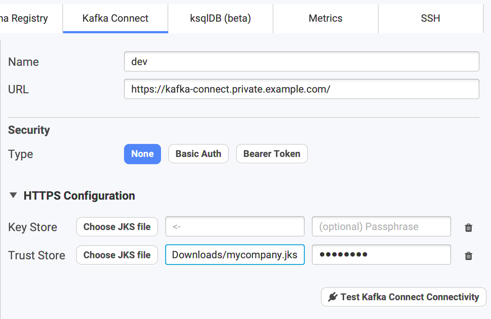
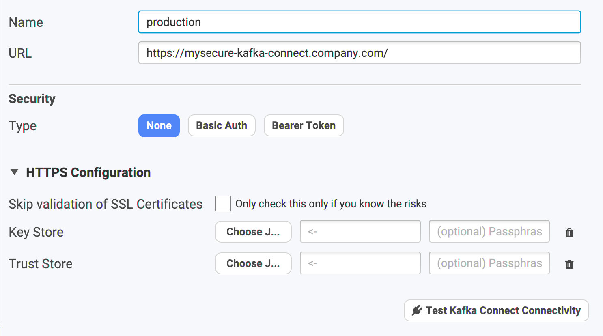

# Security

## HTTP Security

We support 3 types of security by headers:

* **None** \(!\)
* **Basic Auth**: username & password
* **Bearer Token**: you can protect your Kafka Connect REST API through an `Authorization: Bearer xxx` header

## Certificates / PKIX path building failed

If your Kafka Connect instance is running on HTTPS with a **self-signed** certificate, you will need to trust the Certificate Authority who signed this certificate \(ie: your company Certificate Authority generally\).

You know this is the case when you have this error "PKIX path building failed" when connecting to your Kafka Connect cluster. You must define the truststore to use in your Kafka Connect Configuration \(we may provide a simple fallback later on the Conduktor custom truststore if it's defined, right now it's not the case\).


Here is a command line to convert your company CA certificate "mycompany.crt" to a useful keystore "mycompany.jks" \(with password "changeit"\) you can use as truststore:

```text
keytool -import -v -trustcacerts -alias mycompany -file mycompany.crt -keystore mycompany.jks -keypass changeit -storepass changeit
```


You can then use the generated .jks in your configuration:



## The Unsecured Way

Since [Conduktor 2.6.0](https://www.conduktor.io/changelog/#2.6.0), it's possible to ignore SSL certificates validation. Note that this is highly unsecured because you're basically ignoring the real identity of where you are connecting to. It could not be who you think it is.



