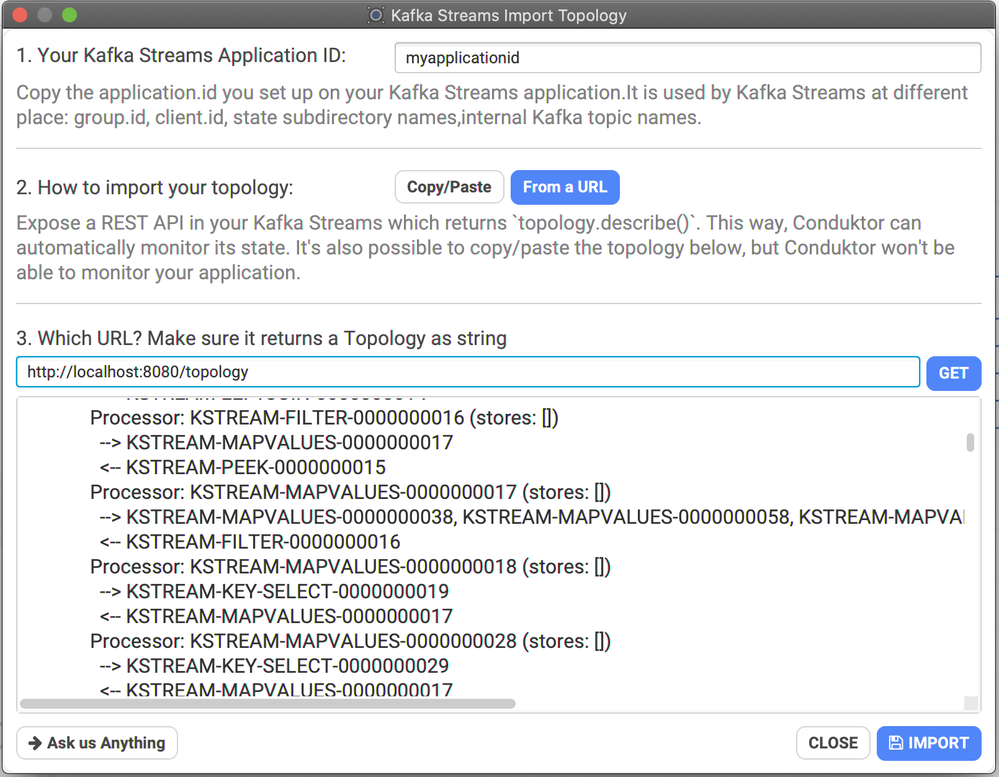
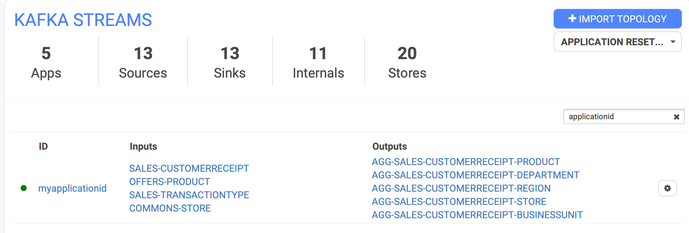
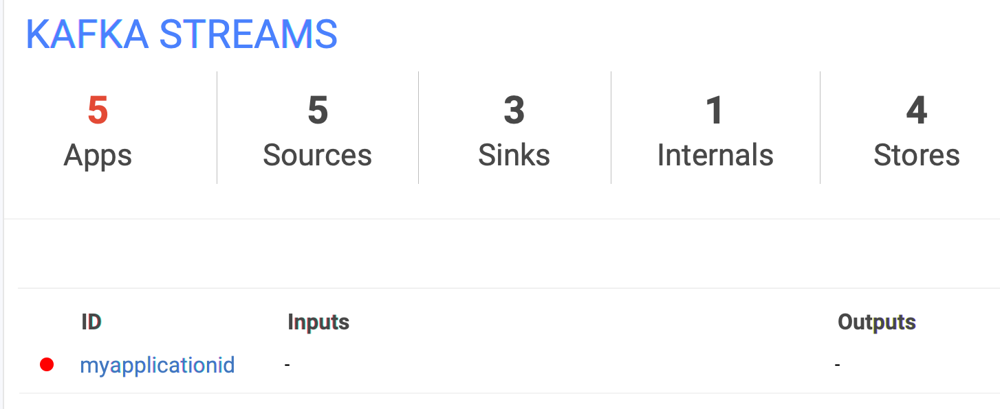
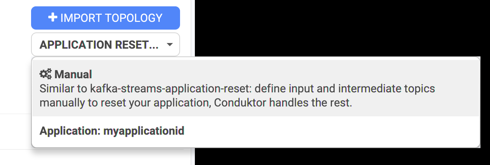
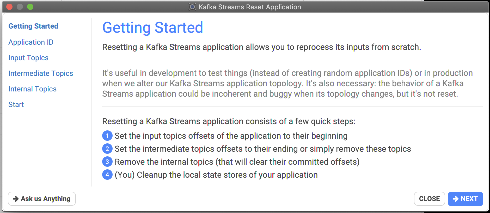

# Kafka Streams



## Where to start with Kafka Streams?

We're providing an example you can try and fork: [https://github.com/conduktor/kafka-streams-wordcount-topology](https://github.com/conduktor/kafka-streams-wordcount-topology)

It will start a typical Kafka Streams application and expose an HTTP API to be connected to Conduktor (optional). This way, you can monitor your application state, topics, statestores etc.

## How to import a Topology inside Conduktor, and why?

Kafka Streams applications are outside of the scope of Kafka itself, they can be running anywhere. They generally work with many topics (in/out/internal/intermediates) and can be reset when you want to start it fresh again.

Conduktor can help you monitoring these applications, and the topics being used.&#x20;

To do so, go to the Kafka Streams menu and click on `IMPORT TOPOLOGY,` then:

* Specify the `application.id` of your application
* Specify the topology
  * **Static**: paste your topology directly inside Conduktor
  * **by URL**: paste the endpoint of your application exposing its topology.
    * Conduktor will automatically fetch it regularly, adapt the metrics accordingly, and warn you if it's down

Here is an example importing a Kafka Streams application using the application.id `myapplicationid` and exposing a endpoint `/topology`:



Conduktor will then monitor the endpoint and display a summary (topics in and out) in the main listing:



If the application is down, the topology disappears and it becomes redish, time to call the developers!




## How do I retrieve my Topology description?

You need access to your `Topology` object in your Java/Scala/Kotlin code.

For instance, when your program starts, you can simply emit the Topology on stdout to copy/paste it:

```java
Topology topology = builder.build();
System.out.println(topology.describe());
```

If your Kafka Streams application also exposes some HTTP routes, you can add a new route `"/topology"` that returns the result of `topology.describe()` , that you can use in Conduktor.

## How to reset a Kafka Streams Application?

Conduktor can help you in two ways:

* Do it manually by specifying all of topics in/out/internals/intermediate. It's not super practical.
* Do it with all topics already set because you imported the Topology within Conduktor already



A wizard will then helps you by explaining the steps:



If you're doing a reset of a registered Kafka Streams application within Conduktor, you can just hit Next until the end, everything is setup automatically! 🤩

