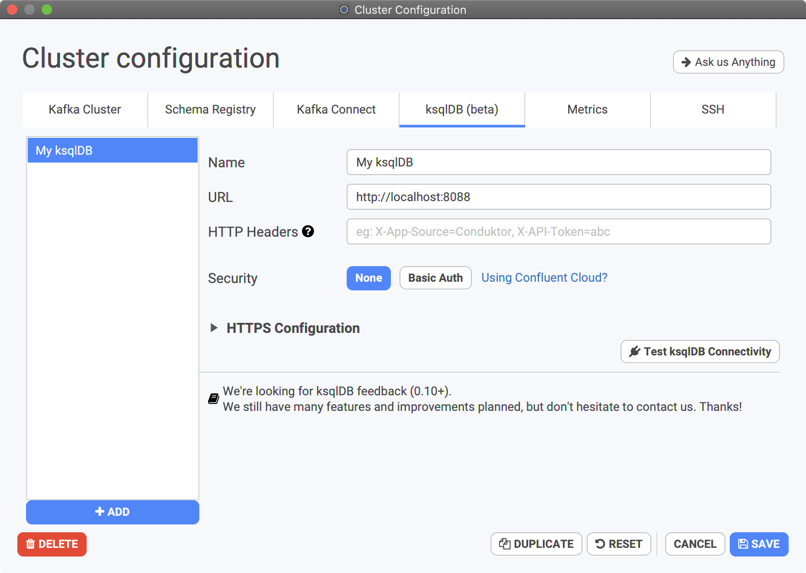

# Connect Conduktor to ksqlDB clusters

Conduktor can connect to multiple ksqlDB clusters at once. It's often useful because it's not always a good idea to have only one large ksqlDB cluster for an environment.

## Conduktor Compatibility

We try our best to be compatible since ksqlDB 0.10.x onwards \(up to 0.14 as of today\). ksqlDB still being in development, it's possible the developers break stuff to move forward, therefore we need to fix stuff.

## Connect to ksqlDB on Confluent Cloud

If you're using Confluent Cloud, consider reading the dedicated documentation to be sure you're using the right credentials.



## Configuration

The default configuration when starting ksqlDB locally is to connect to http://localhost:8088, as seen below:

## Security

Conduktor supports custom headers, basic auth \(username/password\), and TLS security \(1-way or mutual TLS\).

