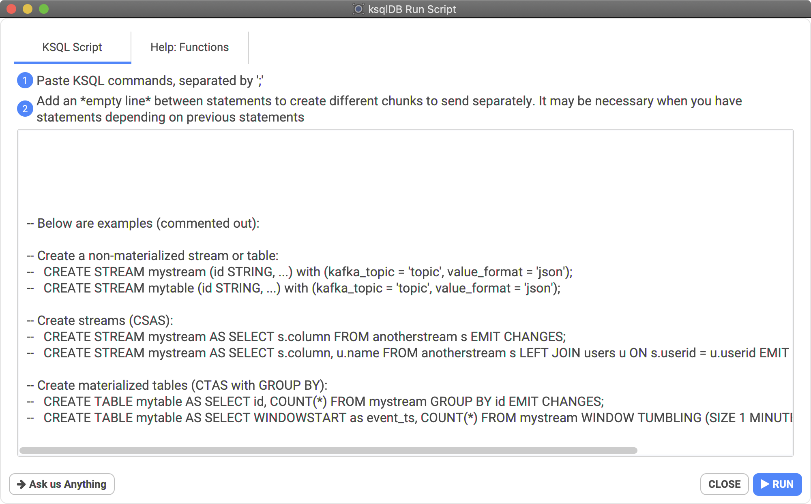
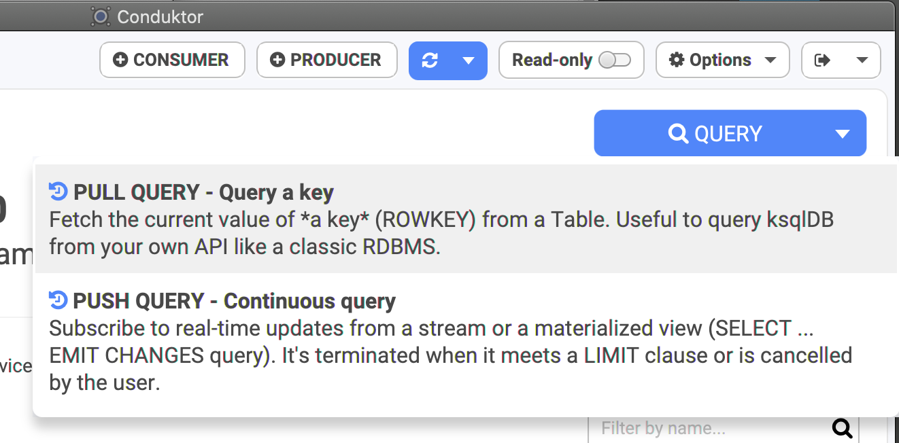
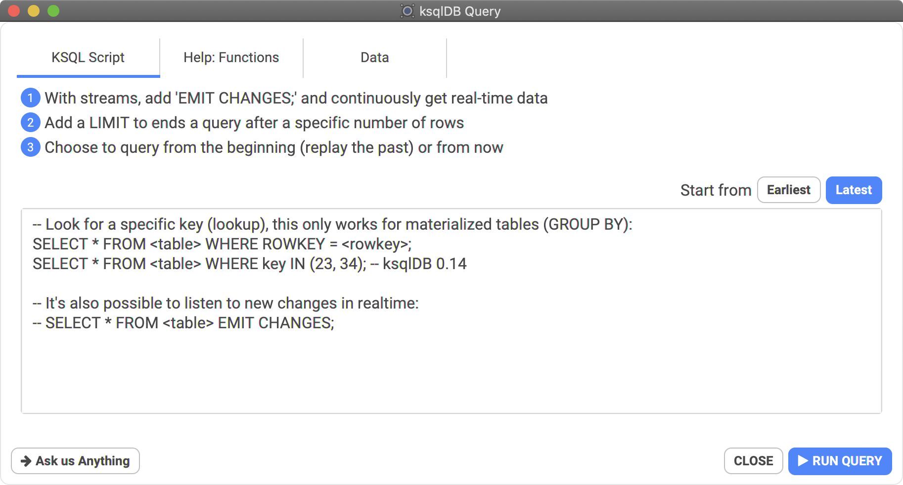
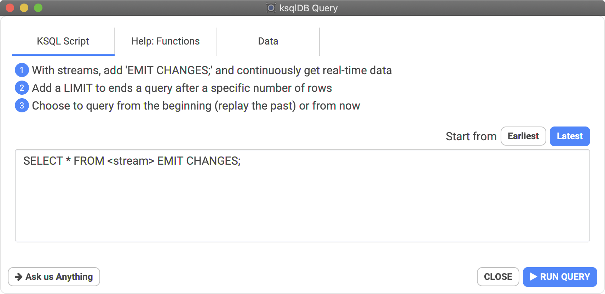

# How to query with ksqlDB?

## Create Streams or Tables

You can create streams or tables using a simple KSQL editor.  You can have many queries, just add empty lines between each queries, for them to be considered independent. They will be execute one by one in different statements.


It's for KSQL stream queries, not metadata queries like "SHOW STREAMS;".


## The 2 types of ksqlDB queries

With ksqlDB, you can PUSH or PULL!

### Pull query: a specific key

With TABLEs, you can ask the value of a specific key at the current moment, instead of consuming a whole STREAM just to find the key you're looking for.

A pull query results its result instantly. The value can be there, or not. It's exactly like querying a classic relational database.

### Push query: follow the real-time updates!

A push query never stops! It's what the `EMIT CHANGES` suffix suggests. It will emit all changes in real-time to you. A stream is simply an endless "stream" of data.

It's like consuming a topic except that a STREAM has a proper defined SQLish structure, therefore we can select only the fields we want, do computation directly from the query etc. Conduktor is then able to render a classic "table" of columns/rows, because the data format is known.

