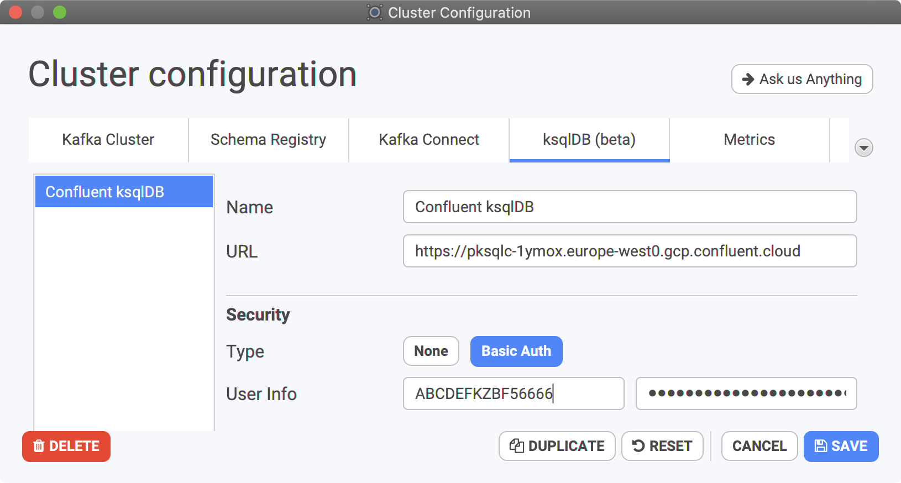

# How to start with Confluent Cloud ksqlDB?

## Generate an API key

You need to generate an API key and secret to act as username and password specific for ksqlDB. Do not use the Kafka credentials you should already got, this won't work. This can be done using Confluent Cloud CLI tool: `ccloud`. Install it using the official documentation: [https://docs.confluent.io/ccloud-cli/current/install.html](https://docs.confluent.io/ccloud-cli/current/install.html)

* Login and select your environment if you have several of them:

```text
$ ccloud login
$ ccloud environment
```

* Grab your `<ksql-cluster-id>` and its endpoint:

```text
$ ccloud ksql app list
       Id      |     Name     | Topic Prefix |   Kafka   | Storage |                         Endpoint                          | Status
+--------------+--------------+--------------+-----------+---------+-----------------------------------------------------------+--------+
  lksqlc-0yp12 | ksqlDB_app_0 | pksqlc-1ymox | lkw-o1yvz |     500 | https://pksqlc-1ymox.europe-west0.gcp.confluent.cloud:443 | UP
```

* Generate a key: write down the key & secret:

```text
$ ccloud api-key create --resource lksqlc-0yp12
It may take a couple of minutes for the API key to be ready.
Save the API key and secret. The secret is not retrievable later.
+---------+------------------------------------------------------------------+
| API Key | ABCDEFKZBF56666                                                  |
| Secret  | ToMaHaWkjQ1bt7BxvdyFjaJ8j3nSokaAd83Nhan739snAiufIAfdk7fFAAnBKxai |
+---------+------------------------------------------------------------------+

# you can list all the keys (without secrets)
$ ccloud api-key list --resource lksqlc-0yp12
```

* The API Key is the username, the Secret is the token

## Configure Conduktor using this API key

Configure your Conduktor with all these elements, selecting Basic Auth to add the username/password:



Test for the Connectivity here, to ensure the API Key is ready, it may takes a few minutes!

