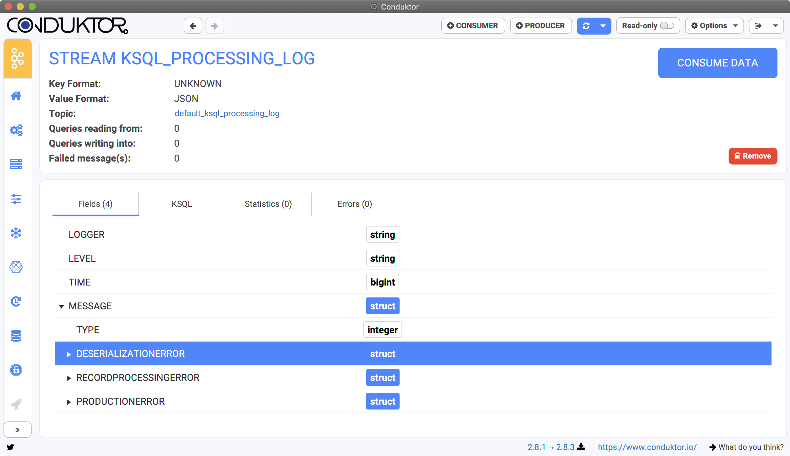

# What to do with ksqlDB?

Conduktor shows the most useful informations you need to work with ksqlDB:

* **Streams**: real-time streaming!
* **Tables**: when you GROUP BY a stream, it gives you a TABLE for instance \(aggregation by key for instance\)
* **Queries**: the running queries on your cluster. 
* **Services**: you can connect to multiple ksqlDB clusters in Conduktor, each has its own configurations, custom types etc. ksqlDB distinguishes its clusters by the "Service" name.
* **Types**: you can create type alias instead of always relying on the raw types \(such as `address<string, string>`, you can now use the `address` type in your streams and tables\)

Conduktor also alerts you in case of problems on your streams, also visible in the details.

## Collections Details

The details of the Stream or Table shows many things:

* The **format** of the key / value \(only Value before 0.14.x\)
* The **topic** from which the data are read
* The **queries** reading from or writing into this stream
* The fields of the stream / table, to understand the data

Also, Conduktor will be redish in case of record errors:

## Services

You can connect to multiple ksqlDB clusters in Conduktor, each has its own configurations, custom types etc. ksqlDB distinguishes its clusters by the "Service" name.

* The default service name is generally "default\_"
* You can see all the configuration of your service, if the properties have their default value or not
* Each service has its own custom types and functions
  * New ksqlDB functions can be added to your clusters by deploying a package \(.jar\)

