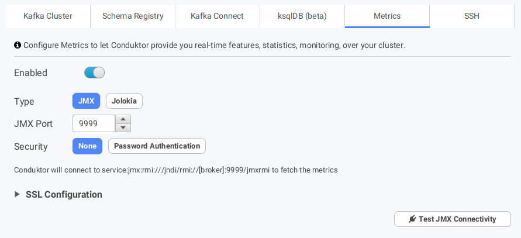
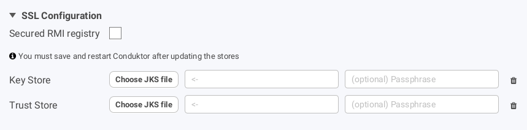
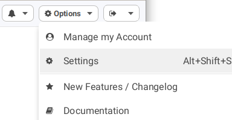
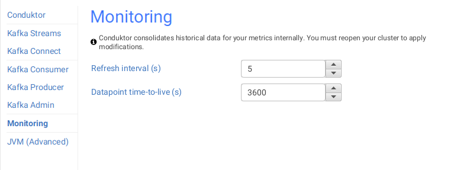

# Monitoring



Currently, Conduktor provides only a few features from the metrics system. We only handle the metrics when the Kafka brokers expose their metrics using JMX or Jolokia (JMX over HTTP).&#x20;

## Configuration

In your Cluster Configuration, you can enable either JMX or Jolokia access for Conduktor to access the metrics.

### JMX

JMX is a common protocol used in Java applications to expose metrics. Apache Kafka is a Java application, and exposes naturally tons of JMX metrics.


JMX is not an HTTP protocol, it cannot be accessed through an Internet browser




With this configuration, Conduktor will regularly fetch the JMX endpoints:

* \<broker advertised listeners>:9999, using the JMX protocol

The \<broker advertised listeners> are **NOT** the bootstrap address you have configured in Conduktor to connect to your Kafka cluster. These things are entirely different, this is a specificity of how Kafka works. Please refer to [understanding-kafka-listeners](https://docs.conduktor.io/kafka-cluster-connection/setting-up-a-connection-to-kafka/impossible-connection-setups#understanding-kafka-listeners) if you have no idea what we are talking about.

Therefore, your computer must be able to connect to this address:port for Conduktor to fetch the metrics.

Conduktor also supports connecting to JMX endpoints and registries through both one and two-way SSL.&#x20;



To enable JMX over SSL, specify the following JVM arguments when starting the brokers :&#x20;

```
-Dcom.sun.management.jmxremote.registry.ssl=true \
-Djavax.net.ssl.keyStore=/path/to/keystore.jks \
-Djavax.net.ssl.keyStorePassword=keystore_password \
-Djavax.net.ssl.trustStore=/path/to/truststore.jks \
-Djavax.net.ssl.trustStorePassword=truststore_password 
```

and add in Conduktor the client truststore containing the server key certificate.

To enable mutual TLS (recommended), add the following JVM argument :

```
-Dcom.sun.management.jmxremote.ssl.need.client.auth=true
```

and add in Conduktor the client keystore, containing the certificate that must be trusted by the server.

To enable the secured RMI registry, make sure the brokers are started with the following JVM argument :

```
-Dcom.sun.management.jmxremote.registry.ssl=true
```

and check the "Secured RMI Registry" checkbox in Conduktor

### Jolokia

Jolokia is a technology to expose a HTTP server to access JMX metrics over a simple HTTP request.

It's often started as a Java agent directly on the main Java program. When Jolokia starts, it starts an HTTP server on a configurable port (default: 8778).


This is the power of Jolokia. Because it exposes the metrics through HTTP, they are accessible through an Internet browser



With this configuration, Conduktor will regularly fetch the HTTP(S) endpoints:

* \<broker advertised listeners>:8778/jolokia

The \<broker advertised listeners> are **NOT** the bootstrap address you have configured in Conduktor to connect to your Kafka cluster. These things are entirely different, this is a specificity of how Kafka works. Please refer to [understanding-kafka-listeners](https://docs.conduktor.io/kafka-cluster-connection/setting-up-a-connection-to-kafka/impossible-connection-setups#understanding-kafka-listeners) if you have no idea what we are talking about.

Therefore, your computer must be able to connect to this address:port for Conduktor to fetch the metrics.

## Usage in Conduktor

For now, Conduktor barely used the power of the metrics. We're working to expose common metrics to monitor as graphs and notify you if sometimes looks wrong.

* **Version**: without metrics, Conduktor can only apply some heuristics to determine the version of the brokers. With metrics, we can know exactly which one it is!
  * It's important to be sure that all your version are up-to-date and similar


* **Topic throughput**: we display the throughput (in/out). Useful to know the activity of a topic. Does it have many consumers, or many producers, or none?


* **Rolling Restart**
  * This is an ops oriented feature, only available when you host your own Kafka and when Conduktor can ssh into the machines.
  * The metrics are necessary to monitor the Under Replicated Partitions


## Configuring Conduktor

Conduktor has a few configurations related to Monitoring, accessible from Options > Settings



Then choose Monitoring on the left to display the Monitoring settings (you must have enabled the metrics on your cluster to edit these settings)



The refresh interval defines the rate at which Conduktor retrieves data from your metric endpoint (and therefore the speed at which it will display the latest metric values).

The datapoint time-to-live parameter determines how long Conduktor keeps the data retrieved from your metric endpoint. Conduktor stores the datapoints internally to feed the upcoming monitoring dashboard and issue detection features.&#x20;

These settings are still experimental and the default may not be suitable for all systems. If you are experiencing unusually high resource consumption, increasing the refresh interval and decreasing the time-to-live can help.

## More to come

* Add Prometheus support
* A Monitoring dashboard with graphs to monitor well-known metrics
* Alert you within Conduktor in case of metrics issue detection
* Integrate the topic metrics into other screens

