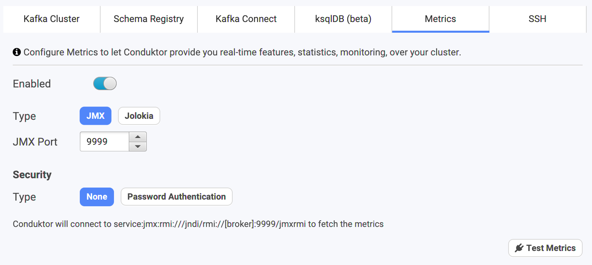
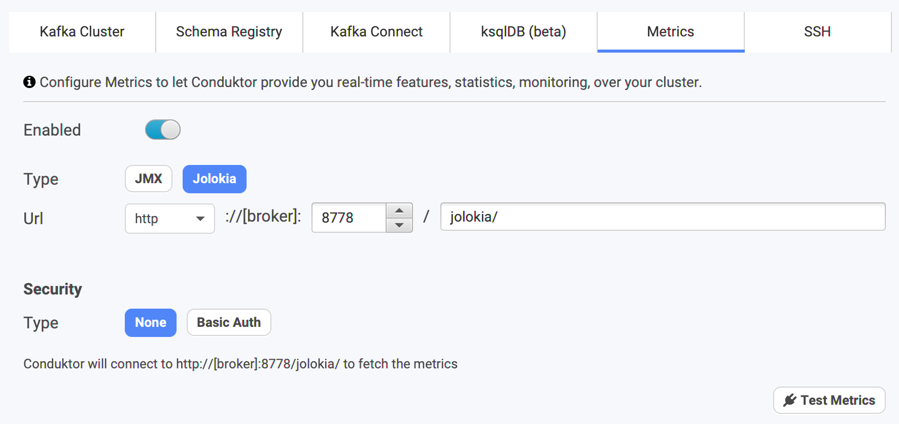
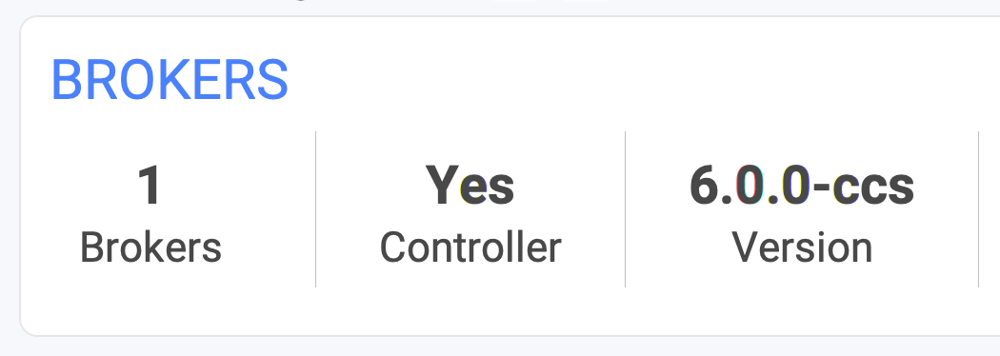
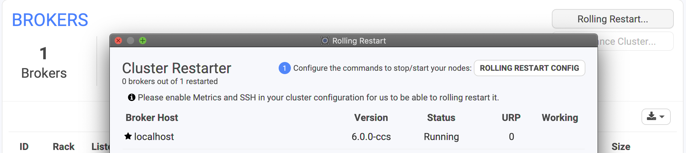

# Monitoring

Currently, Conduktor has a very light integration with metrics system. We only manage the Kafka brokers when they expose their metrics using JMX or Jolokia \(JMX over HTTP\). 

## Configuration

### JMX

JMX is a common protocol used in Java applications to expose metrics. Apache Kafka is a Java application, and exposes naturally tons of JMX metrics.


JMX is not an HTTP protocol, it cannot be accessed through an Internet browser


With this configuration, Conduktor will regularly fetch the JMX endpoints:

* &lt;broker advertised listeners&gt;:9999, using the JMX protocol

The &lt;broker advertised listeners&gt; are **NOT** the bootstrap address you have configured in Conduktor to connect to your Kafka cluster. These things are entirely different, this is a specificity of how Kafka works. Please refer to [understanding-kafka-listeners](https://docs.conduktor.io/kafka-cluster-connection/setting-up-a-connection-to-kafka/impossible-connection-setups#understanding-kafka-listeners) if you have no idea what we are talking about.

Therefore, your computer must be able to connect to this address:port for Conduktor to fetch the metrics.

### Jolokia

Jolokia is a technology to expose a HTTP server to access JMX metrics over a simple HTTP request.

It's often started as a Java agent directly on the main Java program. When Jolokia starts, it starts an HTTP server on a configurable port \(default: 8778\).


This is the power of Jolokia. Because it exposes the metrics through, they are accessible through an Internet browser


With this configuration, Conduktor will regularly fetch the HTTP\(S\) endpoints:

* &lt;broker advertised listeners&gt;:8778/jolokia

The &lt;broker advertised listeners&gt; are **NOT** the bootstrap address you have configured in Conduktor to connect to your Kafka cluster. These things are entirely different, this is a specificity of how Kafka works. Please refer to [understanding-kafka-listeners](https://docs.conduktor.io/kafka-cluster-connection/setting-up-a-connection-to-kafka/impossible-connection-setups#understanding-kafka-listeners) if you have no idea what we are talking about.

Therefore, your computer must be able to connect to this address:port for Conduktor to fetch the metrics.

## Usage in Conduktor

For now, Conduktor barely used the power of the metrics. We're working to expose common metrics to monitor as graphs and notify you if sometimes looks wrong.

* **Version**: without metrics, Conduktor can only apply some heuristics to determine the version of the brokers. With metrics, we can know exactly which one it is!
  * It's important to be sure that all your version are up-to-date and similar

* **Topic throughput**: we display the throughput \(in/out\). Useful to know the activity of a topic. Does it have many consumers, or many producers, or none?

* **Rolling Restart**
  * This is an ops oriented feature, only available when you host your own Kafka and when Conduktor can ssh into the machines.
  * The metrics are necessary to monitor the Under Replicated Partitions

## More to come

* Add Prometheus support
* A Monitoring dashboard with graphs to monitor well-known metrics
* Alert you within Conduktor in case of metrics issue detection
* Integrate the topic metrics into other screens

