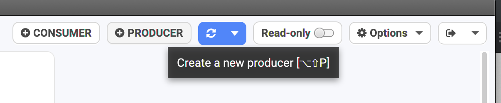
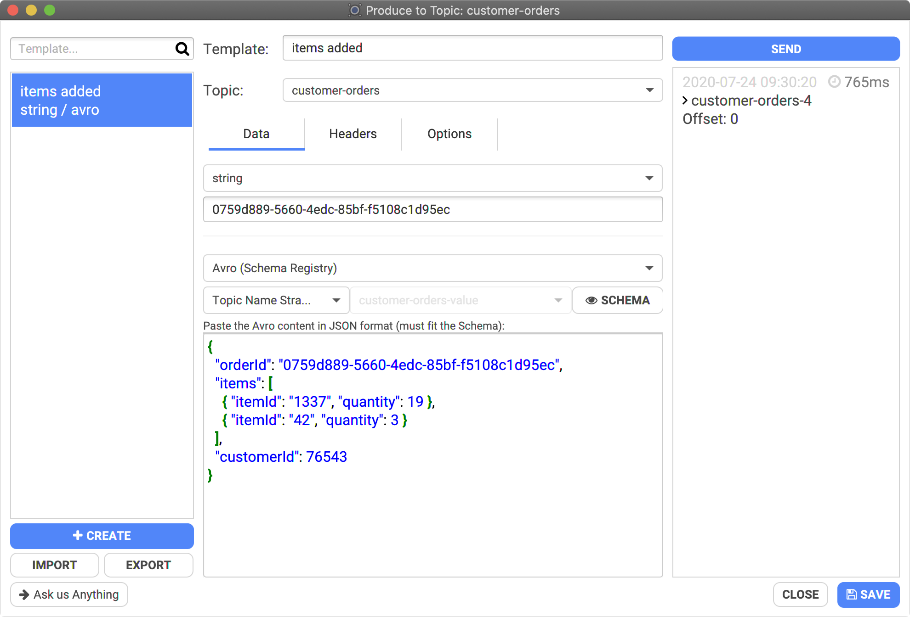
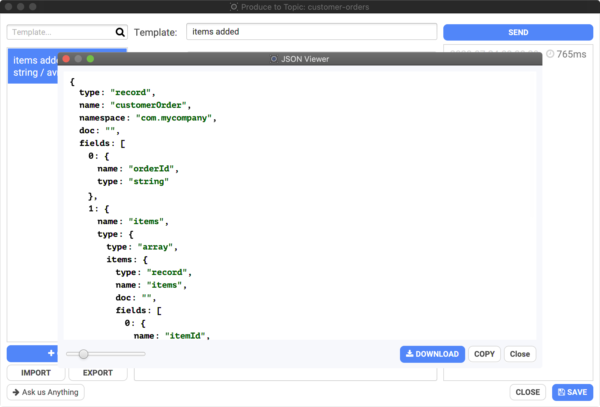

# Producing data

## How to produce data

Click on the Producer button in the top bar to open the Producer dialog:

You'll have a new dialog on top of Conduktor you can freely move around:

## Configuration

From here, you must at least select which topic to send some data to, set the format of the key and value, and provide their payload \(or empty to send a NULL\).

Conduktor supports common format when producing:

* basic types \(int, string, etc.\)
* bytes as base64
* JSON: it's a string but Conduktor validates that the payload is a proper JSON
* Avro: define it using JSON and Conduktor converts it to Apache Avro binary data automatically

## Sending Apache Avro data

In this example, we are sending Apache Avro data corresponding to the schema of the topic:

* topic: "customer-orders"
* key: a string "0759d889-5660-4edc-85bf-f5108c1d95ec"
* value: a JSON that Conduktor will convert to Apache Avro binary data using the selected "Topic Name Strategy", here "customer-orders-value"

* You can see the corresponding Apache Avro schema by clicking on "SCHEMA":

Click "Send" \(top right\) as many times as you want to send the payload to Kafka.

## Templates

Conduktor has a notion of "template" to save & reuse what you're producing to your topic. It's useful when you don't want to retype everything each time, and to test the same thing across time.

You can create as many template as you want, and duplicate them to easily create them from existing ones.


Do not forget to click "SAVE" on the bottom right of the dialog to save your modification, otherwise you'll lose them.


## Advanced Options

For advanced usages, it's possible to alter more how the data are sent to Kafka. For instance, if you want to specifically target a partition, it's possible by forcing the partition in the options:

* Force Partition: by default, Conduktor uses the default Kafka Producer strategy \(random partition if the key is empty, otherwise a hash of the key determines which partition will be used\)
* Compression Type: not enabled by default
* Idempotence: not enabled by default
* Acks: All

## Roadmap

We're planning to add more options to our producer: macros, random data, sending batches \(instead of single record\). Don't hesitate to contact us if you need such features: support@conduktor.io.

