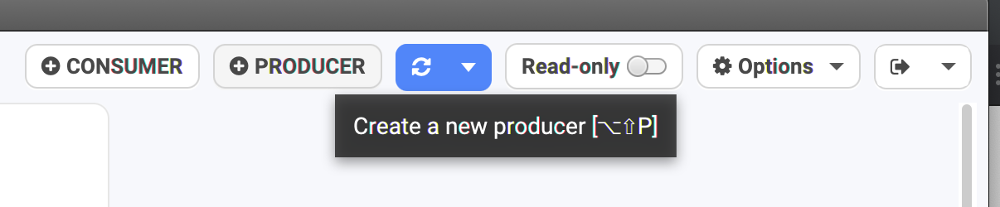
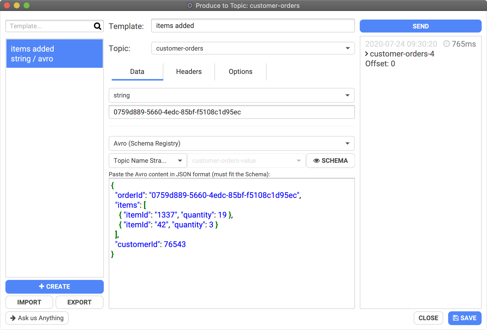
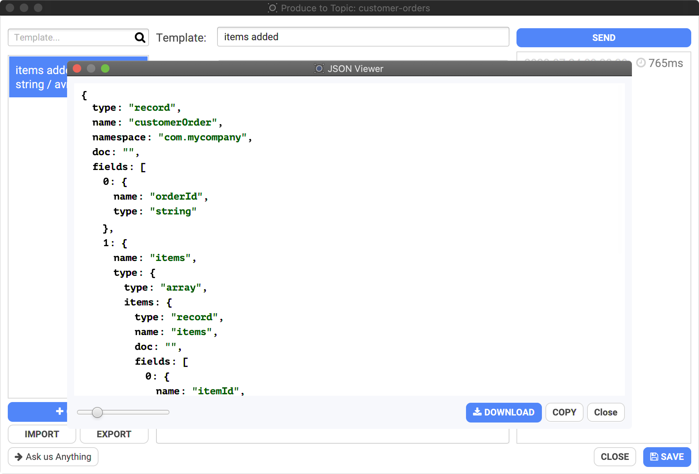
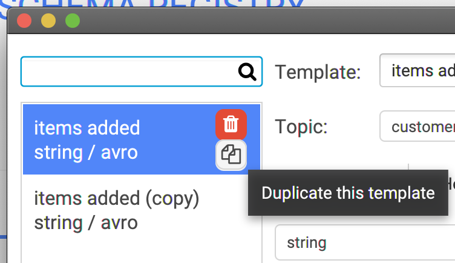
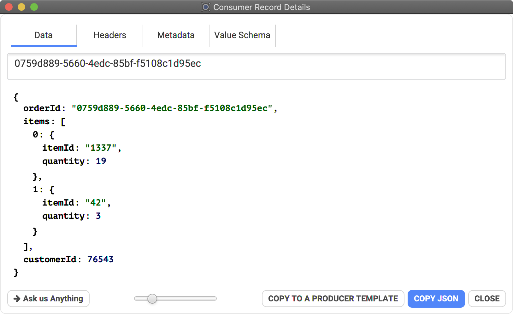
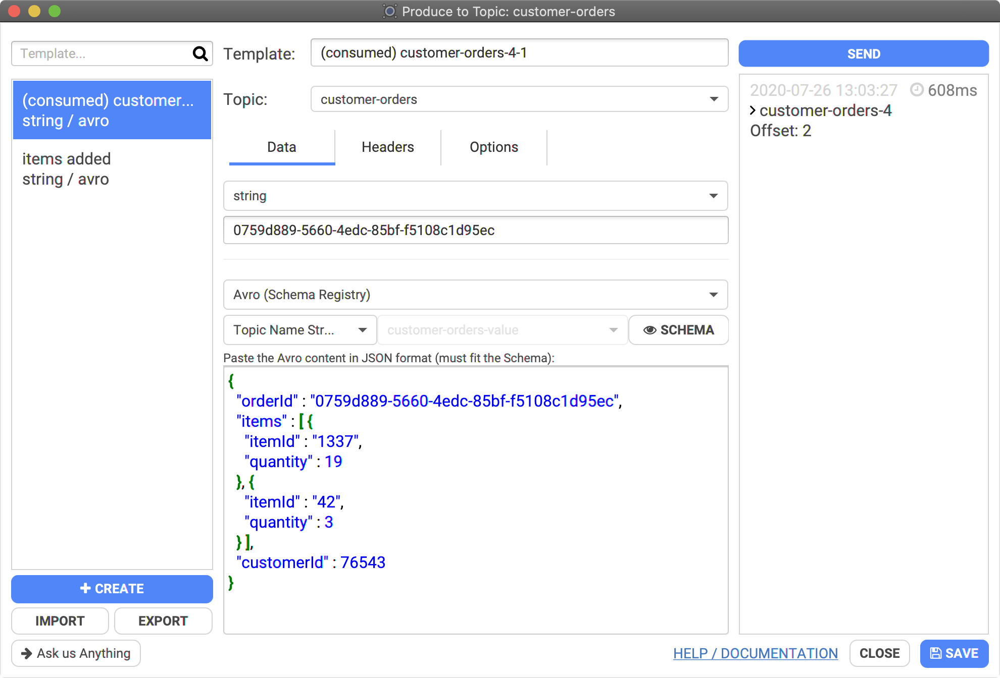
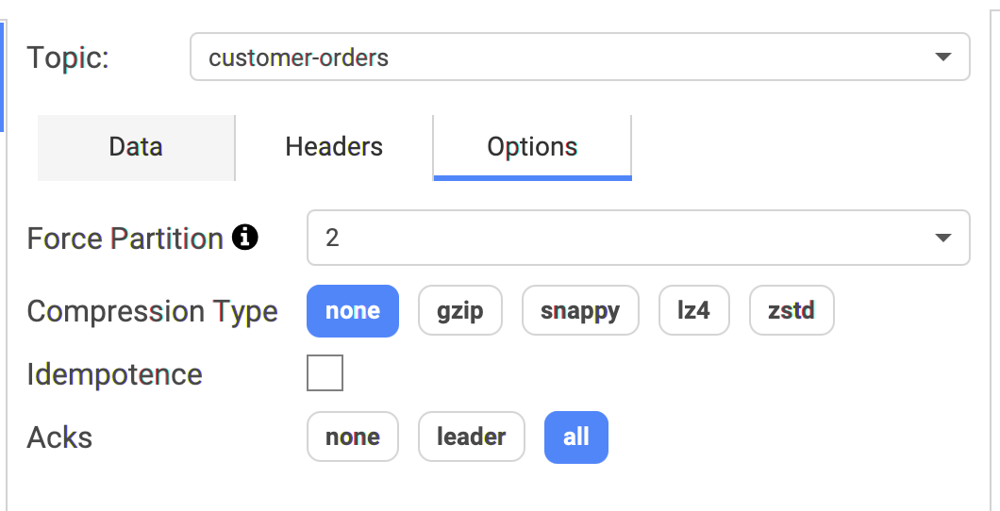

# How to Produce data?



## The Producer Dialog

Click on the Producer button in the top bar to open the Producer dialog:



You'll have a new dialog on top of Conduktor you can freely move around:



## Configuration

From here, you must at least select which topic to send some data to, set the format of the key and value, and provide their payload (or empty to send a NULL).

Conduktor supports common Kafka serializers to produce data:

* basic types (int, string, etc.)
* bytes as base64
* JSON: it's a string but Conduktor validates that the payload is a proper JSON
* Avro: define the payload to send using JSON and Conduktor converts it to Apache Avro binary data automatically (keep reading to understand how special Apache Avro types are handled)

## Sending Apache Avro data

In this example, we are sending Apache Avro data corresponding to the schema of the topic:

* topic: "customer-orders"
* key: a string "0759d889-5660-4edc-85bf-f5108c1d95ec"
* value: a JSON that Conduktor will convert to Apache Avro binary data using the selected "Topic Name Strategy", here "customer-orders-value"


* You can see the corresponding Apache Avro schema by clicking on "SCHEMA":



Click "Send" (top right) as many times as you want to send the payload to Kafka.

### Apache Avro complex types (bytes, logical types...)

Apache Avro has special types that does not exist in plain JSON, such as "bytes", and its "logical types" which are encoded using a more simple type underneath, but have a particular semantics that we care about (decimal number, date, timestamp-micros etc.)

Conduktor Desktop supports Apache Avro 1.9.0 specification: [https://avro.apache.org/docs/1.9.0/spec.html#Logical+Types](https://avro.apache.org/docs/1.9.0/spec.html#Logical+Types)


Conduktor Desktop is made for **humans**, therefore we handle human-friendly representations of such complex types when consuming and when producing data to Avro topics.


When producing data from Conduktor Desktop, the format must be in JSON. When sending the data, Conduktor translates the JSON payload to an Apache Avro format. Most types are simple and exist in JSON and Apache Avro (like integers, strings) but some needs a special handling by Conduktor to be "understood" and properly converted.

Here is the list of the Apache Avro types with logicalTypes and the special handling by Conduktor:

* `bytes`: when producing to a bytes field **WITHOUT** any logical type associated, it must be a base64 encoded string to avoid any weird/breaking/invisible characters that could cause parsing issues:
  * eg: `"name": "conduktor"` should be written `"name": "Y29uZHVrdG9y"`


* `bytes` as a `decimal` logicalType: it can be encoded in JSON as a number or as a string. The scale of the Apache Avro schema must fit or Conduktor will try to round it.
  * eg: `"value": 123.45` or `"value": "123.450"` if the logicalType has scale=3 (3 digits after ".").


* `int`: can be encoded with the "raw" int or a string
  * as `date`: can be encoded with a string: `"my_date": "2020-02-03"`
  * as `time-millis`: can be encoded with a string: `"my_time": "02:47:41"`


* `long` : can be encoded with the "raw" long or a string
  * as `timestamp-millis` and `timestamp-micros`: can be encoded with a string ISO 8601 or human friendly date:
    * `"my_timestamp": "2020-07-26T01:03:29Z"`
    * `"my_timestamp": "2020-07-26 01:03:29"` (the default when consuming)
  * as `time-micros`: can be encoded with a string: `"my_time": "02:47:41"`

### Apache Avro Unions

To produce Apache Avro data from JSON, Avro has a specific JSON encoding ([https://avro.apache.org/docs/current/spec.html#json\_encoding](https://avro.apache.org/docs/current/spec.html#json\_encoding)). Unfortunately, when it comes to unions, it's a bit verbose to deal with.

Conduktor helps here by allowing simple JSON conversion. Sometimes, it's not enough, when you have a union with many complex rypes. You may need to specify which type to use explicitely:

* Apache Avro union with multiple types:

```javascript
{
    "name" : "myGreatUnion",
    "type" : [ // 4 types possible
      "null",
      "string",
      {
        "type" : "record",
        "name" : "Price",
        "fields" : [{
          "name" : "salesPrice",
          "type" : "double"
        }]
      }, {
        "type" : "record",
        "name" : "Discount",
        "fields" : [{
          "name" : "discount",
          "type" : "double"
        }]
      }]
}
```

* We can specify the exact type to use (Price or Discount) explicitely, using "namespace.Record":

```javascript
"myGreatUnion": { "namespace.Price": { "salesPrice": 12.00 } }
"myGreatUnion": { "namespace.Discount": { "discount": 12.00 } }
```

## Templates

Conduktor has a notion of "template" to save & reuse what you're producing to your topic. It's useful when you don't want to retype everything each time, and to test the same thing across time.

You can create as many template as you want, and duplicate them to easily create them from existing ones. It's also possible to create a template from a consumed message!


Do not forget to click "SAVE" on the bottom right of the dialog to save your modification, otherwise you'll lose them.




### "Replay" a Consumed record

When consuming records, it's possible to create a "Produce Template" from it. This is useful to grab the initial payload and send it again and again after.

To do so, consume some data and open the details dialog, then click on the button "Copy To A Producer Template"&#x20;



This will create a new template in your producer, with the same deserialized payload, that you can resend at will!



## Producing data from CSV

On the producer view, after selecting a topic, the "PRODUCE FROM CSV" button (bottom right) gets enabled.


It will open a dialog that explains the different formats accepted by Conduktor :&#x20;

* two columns with no headers (the first being the key, the second being the value)
* a single column with no header (value only, keys will be set to null)
* X columns with headers, containing at least a column with the "key" header and a column with the "value" header, in any order. Extra columns will be ignored

Concerning Avro Records, we expect the JSON-ish representation (not bytes)

Bear in mind that the options and serializers of the underlying Producer Template will be applied (excepted the generation options).

Choose a CSV file and click on Import to start producing to the topic.

## Advanced Options

For advanced usages, it's possible to alter more how the data are sent to Kafka. For instance, if you want to specifically target a partition, it's possible by forcing the partition in the options:

* Force Partition: by default, Conduktor uses the default Kafka Producer strategy (random partition if the key is empty, otherwise a hash of the key determines which partition will be used)
* Compression Type: not enabled by default
* Idempotence: not enabled by default
* Acks: All



## Roadmap

We're planning to add more options to our producer: macros, sending batches (instead of single record). Don't hesitate to contact us if you need such features: support@conduktor.io.

