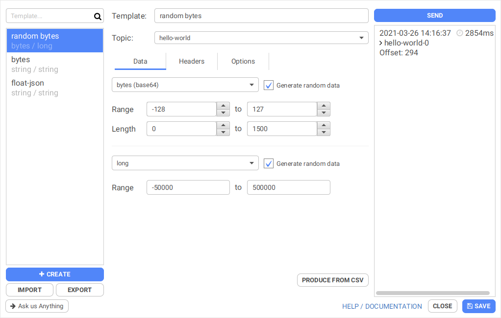
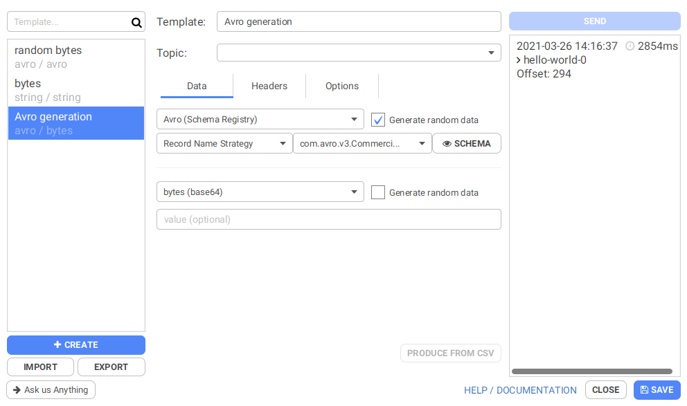
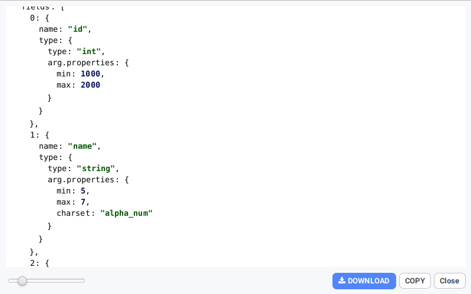

# Produce random data

## Conduktor can generate any types of data

Conduktor allows generating random data for all data types supported by the producer, excepted JSON for now.

Simply check  "Generate random data" next to the key or value Serializer type to enable generation and display the available options.

You can constraint the range on numeric data types, the length on string and bytes, and the charset on string.

## Avro Records Random Generation in depth

We allow generating Avro records out of the box, including most complex types. Simply check the "Generate random data" checkbox, pick a strategy and subject and start generating data on the fly !&#x20;

If you want to customize individual field generation, we support annotation-based configuration inspired by [Confluent's Avro Data Generator library](https://github.com/confluentinc/avro-random-generator), using an `arg.properties` **** field containing properties mirroring the generation options for basic serialization types of our Producer.

The following field type / properties combinations are available :&#x20;

* `string` :&#x20;
  * `min` : the min length of the string (integer, positive)
  * `max` : the max length of the string (integer, positive)
  * `charset` : one of  `unicode` , `alpha_num` , `ascii`
* `int` , `long` , `float` , `double` , `timestamp-millis` , `timestamp-micro`&#x20;
  * `min` : min value (can be negative)
  * `max` : max value (can be negative)
* `time-millis` , `time-micros`
  * `min` : min value (integer, positive, lower than 24 hours)
  * `max` : max value (integer, positive, lower than 24 hours)
* `date` : number of days since 1970-01-01
  * `min` : min value (integer)
  * `max` : max value (integer)
* `bytes` ,  `array`
  * `min` : the min length of the array (integer, positive)
  * `max` : the max length of the array (integer, positive)
* `boolean`&#x20;
  * `odds` : the odds of this boolean to be true
