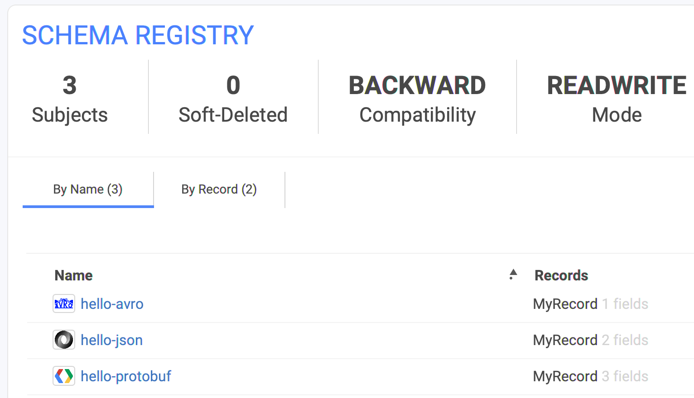
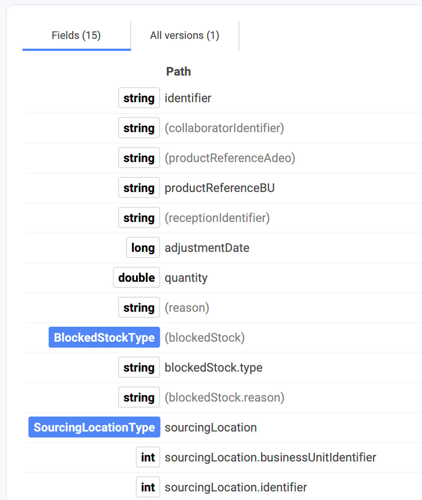
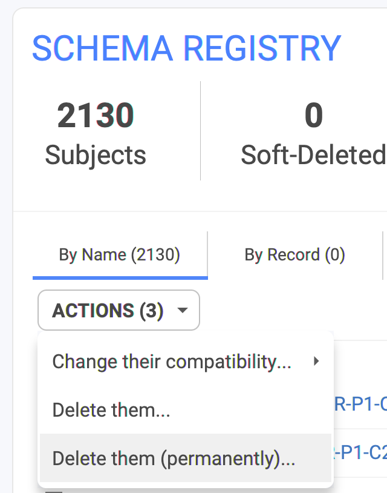
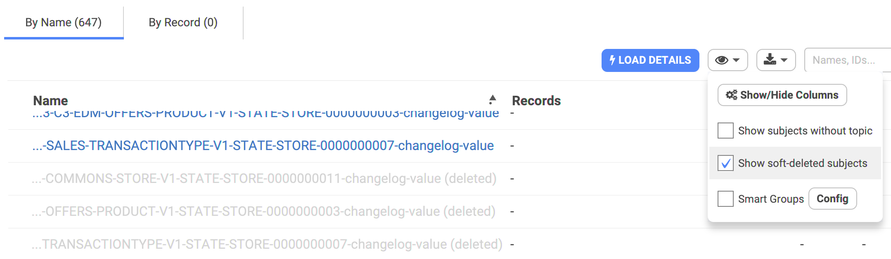

# Schema Registry



## Supported Formats

Conduktor handles the whole set of format providing by the Schema Registry:

* Apache Avro (.avsc)
* Protobuf Buffers (.proto)
* JSON Schemas (.json)

In the Schema Registry, we distinguish them by using their respective icon:

We parse them and display their content (their fields, structures, etc.) in a similar flatten way. This way, it's easier to take a quick look at them and see the depth of the fields. Example:

## How to delete a Subject from the Schema Registry? Soft or Hard.

If you are using the Confluent Schema Registry, you can soft-delete or hard-delete the subjects. A soft-delete does not really remove the subject, it's still readable but should not be used. It's still count in your Schema Registry quota (Confluent has quotas like "1500 subjects max on your registry"). Consider hard-deleting subjects when you won't be using them.

In Conduktor, we translate this with a simple "Delete" (soft-delete), or "Delete (permanently)" to be more explicit:

When a subject is "soft-deleted", it appears greyish if you "Show soft-deleted subjects" is checked. (by defaut, it is NOT checked):

## Using Aiven's Schema Registry (Karapace)?

If you are running Kafka at Aiven's (good idea!), then you're using karapace as the Schema Registry. It's totally different of the Confluent Schema Registry. It's almost 100% compatible.



