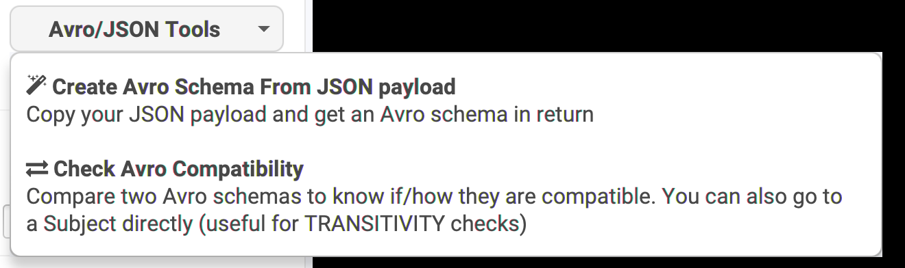
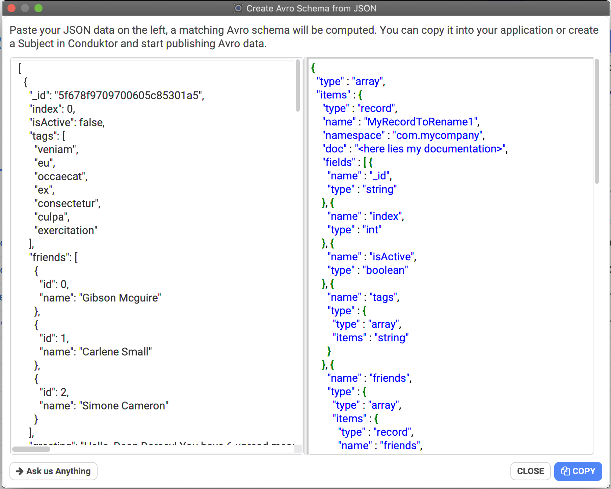
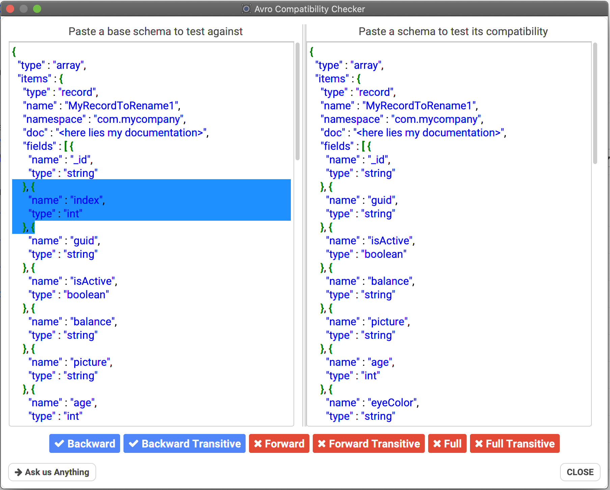
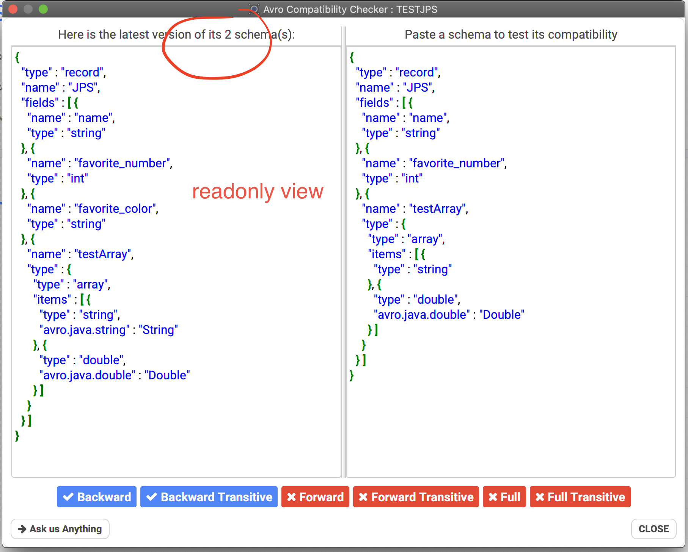

# Avro Tools

They are available from the Schema Registry screen:

* Create an Avro Schema from JSON
* Check the different compatibilities between 2 Avro Schemas \(useful to be sure it will be compatible!\)

## Generate an Avro Schema from JSON

When your company is slowly moving to Apache Avro, you generally already have some JSON here and there. Instead of starting from scratch and try to learn how to structure your Apache Avro schema, you can just use this tool.

Paste your JSON on the left, Conduktor answers with an Avro Schema on the right, easy!

## How to check for Avro schemas compatibility rules?

Let's say you are unsure about a schema change you'd like to apply, or if something the business wants to change makes sense regarding the communication between the different technical services using Kafka and Avro as pipeline.

You start from your original schema, try to see what would be the resulting Avro schema with the changes. You must then ensure the schemas are compatible according to your Schema Registry rules \(backward, forward, full, etc.\)

Put the original schema on the left, the future schema on the right, and you'll know instantly "how" they are compatible.

For instance, here, if we remove a field, we know it's not FORWARD nor FULL compatible, but only BACKWARD compatible \(a consumer could be updated without taking this field into account\):

### Subjects and Transitive checks

Often you start from a Subject, no need to copy the original schema in the left part. Go to the Subject and click on "Check Compatibility", the dialog will display the latest version of the Subject, but will also have all the schemas lineage in memory, to be used in the Transitive checks.


The transitive checks are useful only when you are comparing a **lineage** of schemas.


