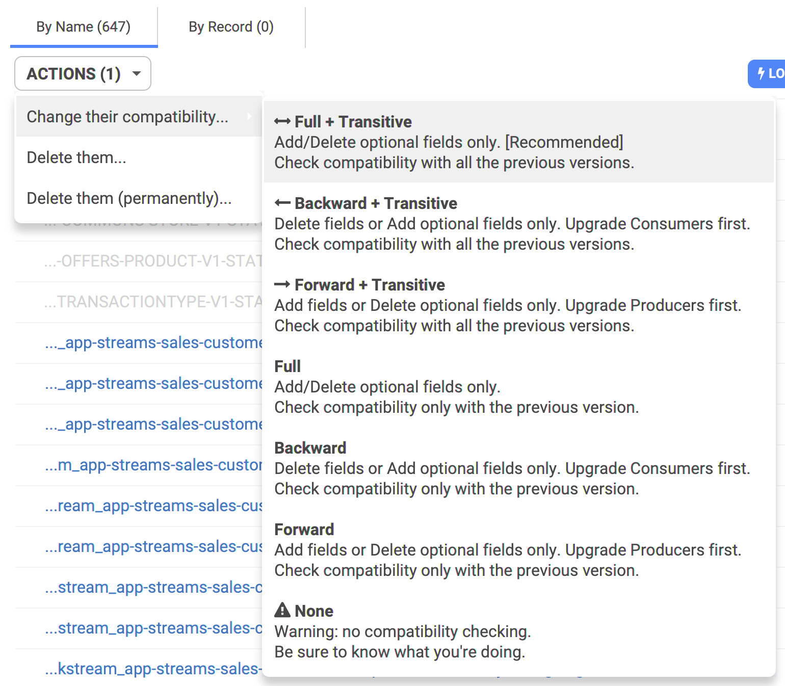

# Subjects & Schema Compatibilities

## Compatibilities

Long story short, there are 7 modes of compatibility handled by the Schema Registry:


**Transitive** means the whole lineage of schemas is verified. Not transitive means only the last 2 schemas are verified.


* **Full + Transitive**: The safest, recommended.
  * Add/Delete optional fields only. 
    * You can **ONLY** add optional fields \(basically, all your fields are optional!\): the consumer must explicitly handle the case each field is not present
* **Backward + Transitive**: Delete fields or Add optional fields only.
  * Upgrade Consumers first.
* **Forward + Transitive**:
  * Add fields or Delete optional fields only.
  * Upgrade Producers first.
* **Full**:  Almost the safest.
  * Add/Delete optional fields only.
* **Backward**: Delete fields or Add optional fields only.
  * Upgrade Consumers first.
  * Check compatibility _only_ with the previous version
* **Forward**: Add fields or Delete optional fields only.
  * Upgrade Producers first.
  * Check compatibility _only_ with the previous version
* **None**: Be careful.
  * No compatibility checking. You can push incompatible schemas as you want.
  * Be sure to know what you're doing

You can see them in Conduktor, at the different places where you can change it \(global or per subject\):

## Resources

Confluent has a really [good article](https://docs.confluent.io/current/schema-registry/avro.html) about compatibility.

