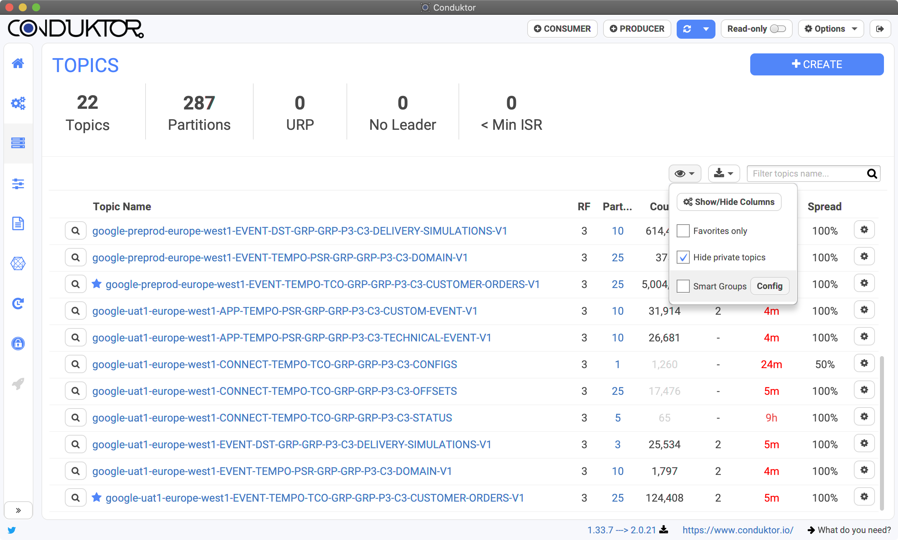
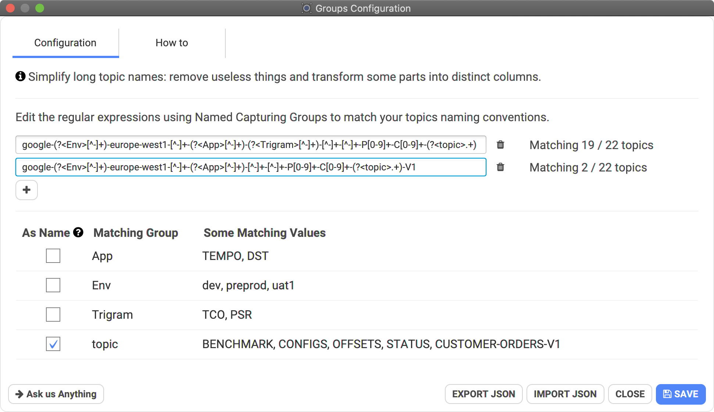
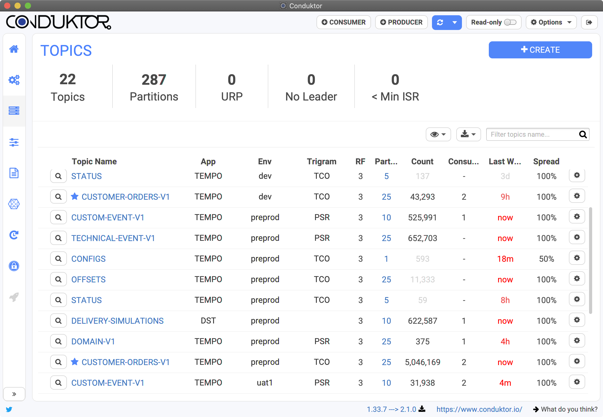

# Smart Groups


This is an advanced feature due to the usage of regular expressions. This provides a poor readability and non-technical people should be assisted in order to use it.


## Simplify topics or subjects name

Let's say we have many topics \(or subjects\) with a complex naming convention.

The feature is accessible through the visibility button on topics or on schema registry \(disabled by default\):



This will open a configuration dialog where the magic will be configured, through regular expressions:



* We setup regular expressions \(as many as we want\)
* We pick one group to be the name of the entity in the listing \(instead of the long name\)


To create columns from parts, we must use **Named Capturing Groups**. \([https://docs.oracle.com/javase/8/docs/api/java/util/regex/Pattern.html](https://docs.oracle.com/javase/8/docs/api/java/util/regex/Pattern.html)\)


The following is a capturing group named "environment" matching multiple characters. 

```text
(?<environment>[a-z]+)
```

This will create a column named "environment" in Conduktor if this group is _not_ selected as the main name \(otherwise the name of the topic will be this value, that's probably not what we want\).


In our previous example, we have setup two regular expressions:

```text
google-(?<Env>[^-]+)-europe-west1-[^-]+-(?<App>[^-]+)-(?<Trigram>[^-]+)-[^-]+-[^-]+-P[0-9]+-C[0-9]+-(?<topic>.+)
google-(?<Env>[^-]+)-europe-west1-[^-]+-(?<App>[^-]+)-[^-]+-[^-]+-P[0-9]+-C[0-9]+-(?<topic>.+)-V1
```

We can say a lot about them:

1. Our parts are separated by dashes
2. We match and **ignore** the prefix "google-" because we don't want to see it
3. They look alike but the first one has one more group named _Trigram_ because in our example, some topics have it "_-TCO-_", others don't
4. There are 4 groups here: _App_, _Env_, _Trigram_, _topic_
5. "_topic_" appears in both expressions: we want to "merge" the resulting values \(extracted from the topic name\) into the same column
6. "_topic_" is the part we want to use as main name in our listing

The result is a screen way more readable, by removing useless information and distinguishing between important parts:





The usage of regular expressions is necessary but we may provide a wizard later to simplify this step. Don't hesitate to contact us if that matters to you: [https://www.conduktor.io/contact/](https://www.conduktor.io/contact/)



