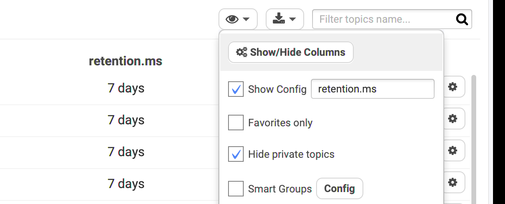
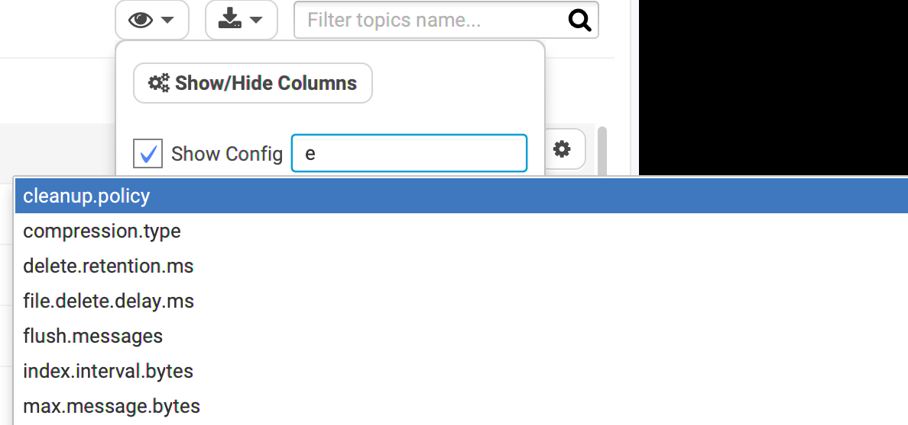
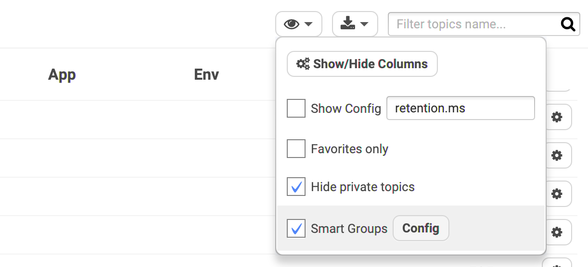
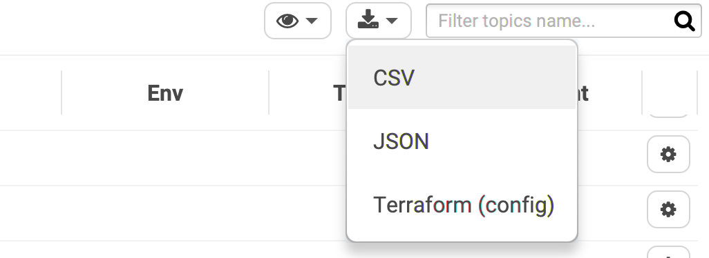

# Topics Management



## Columns Customization / Performances

### Comparing Topics with a Custom Column

Sometimes, you want to see a given configuration for all topics to compare them. Is the retention the same everywhere? What about the segment size? The minimum in-sync replicas? In an instant, you can get the answer by showing a given config in a dedicated column.

The field is automatically populated and auto-completes:

### Avoid long names and use Smart Groups

Conduktor has a feature called [Smart Groups](smart-groups.md) to remove long names from the list and instead create distinct columns to work with.

## Exports Topics to file

* **CSV/JSON**: export what you see on the screen
* **Terraform**: export the topics with their configuration into a .tf using the provider [https://github.com/Mongey/terraform-provider-kafka](https://github.com/Mongey/terraform-provider-kafka) format

