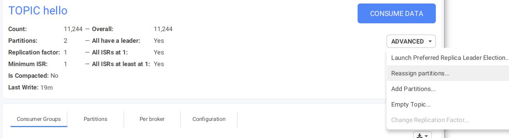
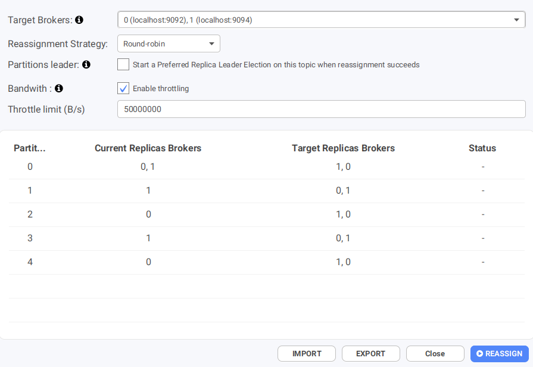
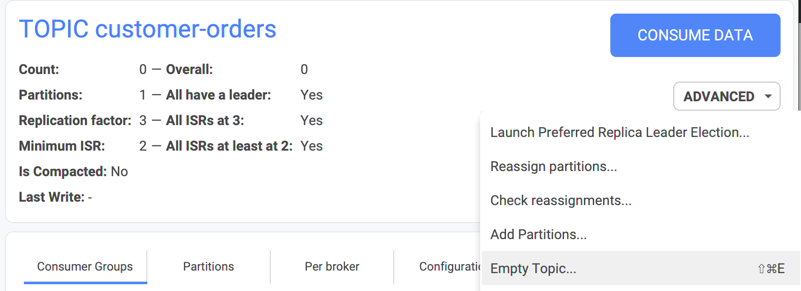
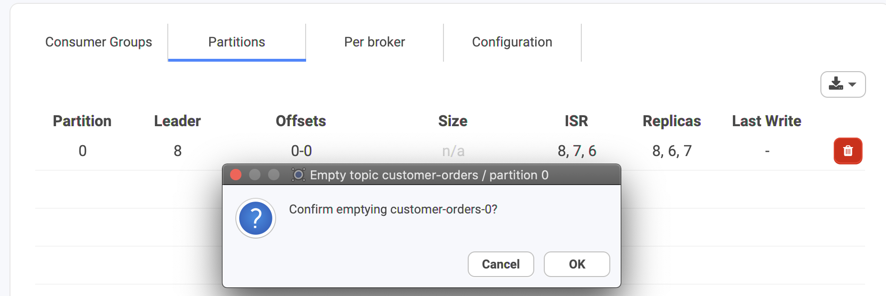

# How to

## How Conduktor helps when Kafka is failing?



## How to consume data from a Topic?

Several ways:

* from the top bar: add a Consumer and select your topic inside
* from the topic list: the inspect button next to the name of the topic
* from the topic details view: from the _CONSUME DATA_ button

Also see [Consuming data ](../consuming-data/)for all the details.

## How to reset the offsets of a Topic?

The question is more: _how to reset the offsets for a Consumer Group and a Topic it has subscribed to?_

The offsets of a Topic cannot be "reset". The offsets are ever growing for all partitions of a Topic (data incoming into a Topic => offsets increases).&#x20;

Go to the Consumer Group itself, and Reset Offsets from here.

## How to reassign the partitions of a Topic?

In the Topic Details view, click on the "Advanced" drop-down, then choose "Reassign partitions..." to open the Reassignment dialog.



Choose the destination brokers, pick a strategy and Conduktor will generate the Reassignment Plan for you.\
You can also choose to import your own in the json format expected by kafka-reassign-partitions.sh.



You can decide to automatically elect partition leaders after the reassignment.

The throttle limit is an important option in production : without it, the reassignment may end up using all the available bandwidth, degrading your cluster performance. You can alter this configuration even when a reassignment is in progress, it will take effect immediately.

When a reassignment is in progress, you can monitor it from anywhere using the topbar button :&#x20;


The opened dialog allows you to check the reassignment status and update the throttle limit.

## How to add partitions to a Topic?

While you will have made calculations on the number of partitions required for a topic at the creation stage, applications evolve and you may need to add more, usually to aid on throughput.

&#x20;You can add partitions on the fly in Conduktor and it's a straightforward procedure. Go to the "Advanced" section of a topic as shown below and click on "Add Partitions", you will then have the option to add more partitions.

However, it is important to understand if messages are produced with keys. When publishing a keyed message, Kafka provides a guarantee that messages with the same key are always routed to the same partition. This guarantee can be important for certain applications since messages within a partition are always delivered in order to the consumer. If the number of partitions changes, such a guarantee may no longer hold.&#x20;

.png>)

.png>)

## How to remove data from a Topic?

Conduktor can empty a topic, or a specific partition:

* a whole topic: "Empty Topic..."



* a specific partition: the Delete icon on the right



### Errors

You can only delete topic which have the "delete" policy.

If your topic only has the "compact" policy, this may not work:&#x20;

```
Error emptying topics

org.apache.kafka.common.errors.PolicyViolationException:
Request parameters do not satisfy the configured policy.
```
