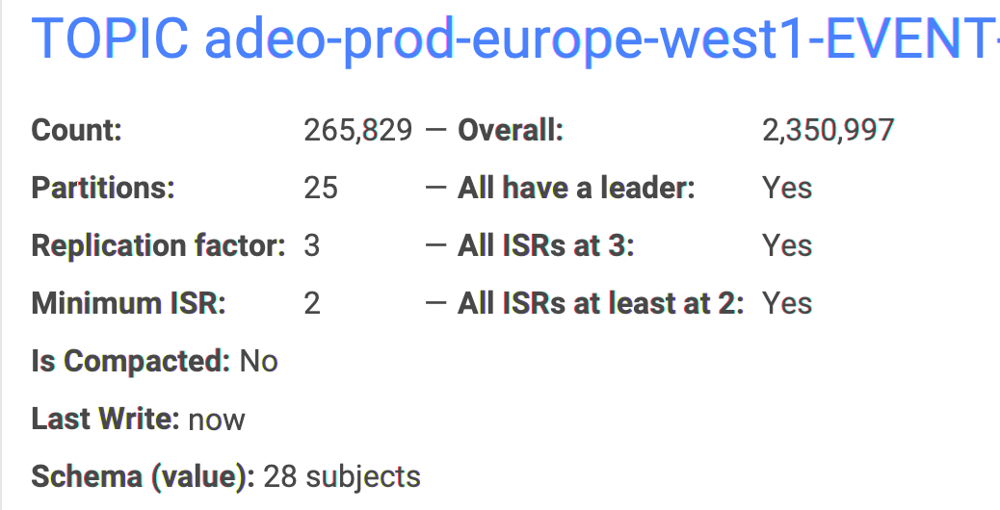

# Topic Details

## Information Panel

* **Count** / **Overall**
  * **Count** is the sum \(end offsets - beginning offsets\) for all partitions \(the beginning offsets are moving forward due to limited topic retention time/size\).
  * **Overall** is the sum of all end offsets for all partitions. It means that as least this many records have been published to this topic since its creation.


* If the topic is **compacted**, it barely means something because the partitions have many "holes" in them \(Conduktor warns you about that in this case\).
* Even without compaction, Count doesn't mean that you have published this number of records in your topic if you are using **transactions** \(because you would have transaction markers hidden in there, and even aborted transactions with their "aborted" data..\)


* **Partitions** / All have a leader
* **Replication Factor** / All ISRs at N
* **Minimum ISR** / All ISRs at least at N
* **Last Write**: the minimum of its partition last writes
* **Schema**: if using Avro, we display the related schemas \(key and/or value\). It can be greater than 1 when using the TopicRecordNameStrategy

## Inspecting the lag of the Consumer Groups

## Inspecting the partitions of a Topic

Conduktor offers two views for this.

* The first one is a classic: per partitions

* The second one is by broker. This is useful to understand how the partitions are distributed in your cluster

## How to update the configuration of a Topic?


It's possible you do not have access to the configuration of a Topic because your Kafka user does not have the necessary ACLs configured.


## How to detect if a Topic is in trouble?

* In the summary
* In the partitions

