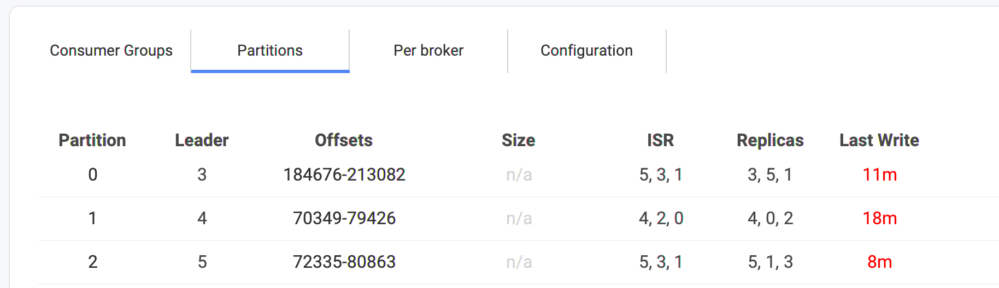
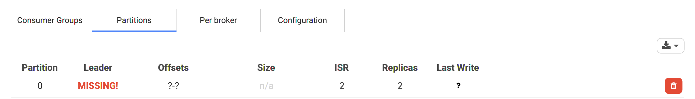
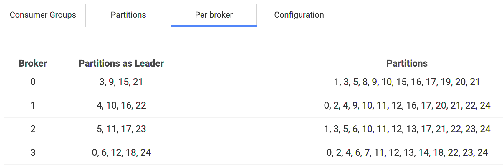
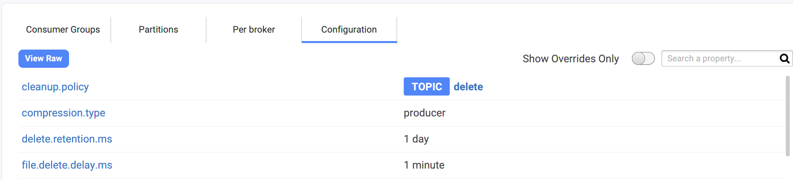
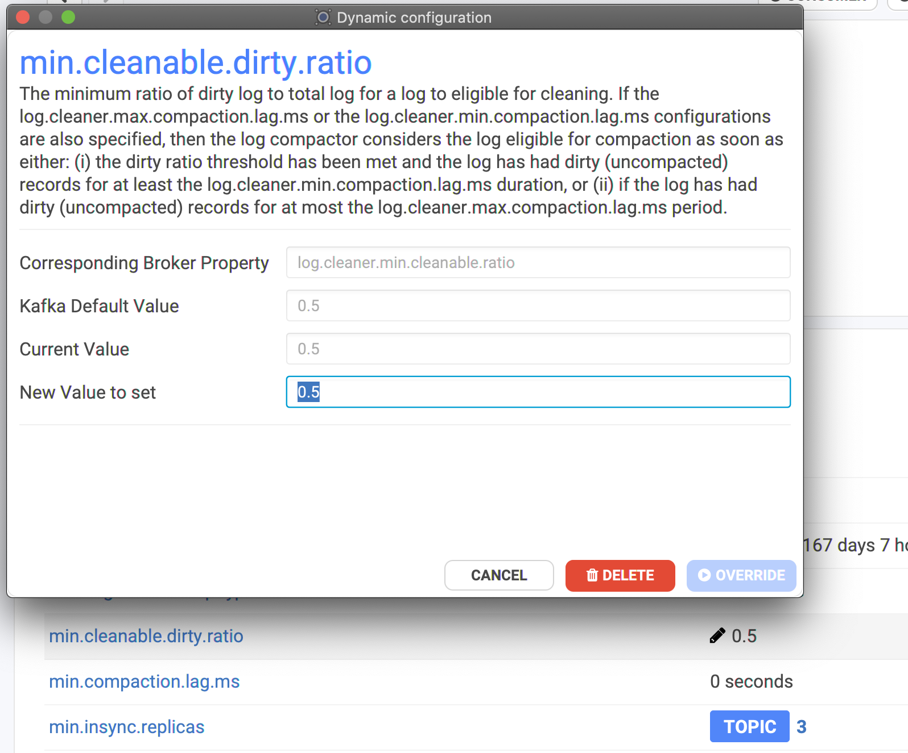
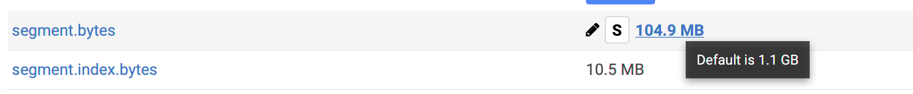

# Topic Details

## Information Panel

When you go to the details of a topic, we present a summary with many of the most useful information we need to know regarding a topic health. (it's all red-ish if something is wrong!)

.png>)

* **Count** / **Overall**
  * **Count** is the sum (end offsets - beginning offsets) for all partitions (the beginning offsets are moving forward due to limited topic retention time/size).
  * **Overall** is the sum of all end offsets for all partitions. It means that as least this many records have been published to this topic since its creation.


* If the topic is **compacted**, it barely means something because the partitions have many "holes" in them (Conduktor warns you about that in this case).
* Even without compaction, Count doesn't mean that you have published this number of records in your topic if you are using **transactions** (because you would have transaction markers hidden in there, and even aborted transactions with their "aborted" data..)


* **Partitions** / All have a leader
* **Replication Factor** / All ISRs at N
* **Minimum ISR** / All ISRs at least at N
* **Last Write**: the minimum of its partition last writes
* **Schema**: if using Avro, we display the related schemas (key and/or value). It can be greater than 1 when using the TopicRecordNameStrategy

## Inspecting the lag of the Consumer Groups

## Inspecting the partitions of a Topic

Conduktor offers two perspectives for this.

### A view per partition

* **partition** number: 0 to N
* **leader**: this is a [broker.id](https://kafka.apache.org/documentation/#broker.id) of the leader. It can be any integer (0 to [reserved.broker.max.id](https://kafka.apache.org/documentation/#reserved.broker.max.id) typically 1000). It can also be `MISSING!` if Kafka doesn't find any leader for this partition. It generally means a broker is offline and that no replicas were up to date (or the topic was not replicated enough..) 😱
* **offsets**: the start and end offset for this partition. The difference is not always the number of records in the partition, due to _compaction_ (creates "holes") or _transactions_ (markers and aborted transactions)
* **size**: the size of the partition in bytes. This info is not always available (hence the n/a in the screen below), like with the Confluent Cloud offer.
* **ISR**: the list of the Kafka Broker IDs that are _In-Sync_ (meaning they have grab the latest data for this partition, so they are safely replicated!). It's one of **the most important metrics** when it comes to Kafka. The ISR is the knowledge that your data are properly (or not) replicated and that your cluster can deal with failures without losing your data. It must contain as many IDs as the _replication.factor_ of the topic.
* **Replicas**: the list of the Kafka Broker IDs that takes care of replicating the data for this partition. It's generally the same as the ISR, except when some brokers are in trouble and can't replicate in time the data. You'll get `size(ISR) < size(Replicas)` meaning you can get into troubles.
* **Last Write**: this is the last write we detected to this partition. It's not a real-time metrics (we are not subscribing to all topics of your cluster!) but computed in background from time to time. It may not always be available depending on the partition (if it's unavailable, or slow, or have transactions..)

### A view per broker

This is useful to understand how the partitions are distributed in your cluster.&#x20;


Also, if some partitions are in trouble, you can go to this screen and see at a glance if they all belong to the same broker.


## How to update the configuration of a Topic?



Go to the Configuration tab on the topic:


It's possible you do not have access to the configuration of a Topic because your Kafka user does not have the necessary ACLs configured.


You'll see all the properties of your topic. Even if you didn't configured anything, we can see the default that Kafka is using for the topic, and all the custom configuration you did are flag as TOPIC.

* You can hover the property name to get the help
* You can click on the property value to edit it (it's not always possible, some are readonly!)

For instance, here, we want to increase `min.cleanable.dirty.ratio`, we can hover the value, and click on the pencil icon. That will open a dialog with:

* the help
* the Kafka default value
* the current value (always useful to know the defaults to be sure we are not doing anything crazy 🤭 )
* a textfield with the new value to set


It's also possible to DELETE an override to fallback on the default value of the cluster. (the defaults are configurable by the Kafka clusters administrators)


### Where does the configuration comes from?

The used configuration of a topic comes actually from a _bunch_ of layers where each property is evaluated and the last layer defining it wins:

* Kafka defaults
* server.properties: the static file on the machine where Kafka is hosted and runs
* topic broker-wide override
* topic cluster-wide override
* topic custom override

Conduktor helps you to know where the config comes from:

* nothing? it's a Kafka default
* **ALL**: from a cluster-wide override
* **BROKER**: from a broker-wide override
* **TOPIC**: from a topic override (doesn't know if default for all or custom)
* **S**: for static. It's quite common to have many of them for well configured Kafka clusters


You may have noticed the toggle button "Show Overrides Only" in this Configuration panel: it's used to remove the Kafka defaults and see only what have been modified.


## How to detect if a Topic is in trouble?

It will be all red-ish in:

* the generic metrics on the Overview screen
* the main list with all the topics
* the summary in the details
* the partitions tab: which one is in trouble, and why

Therefore if you don't see any red in Conduktor, it's a good sign! ✅

