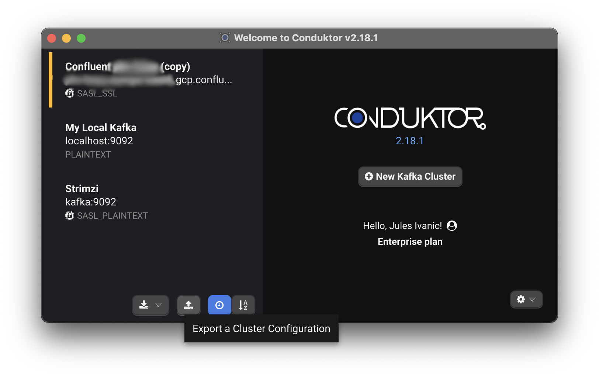
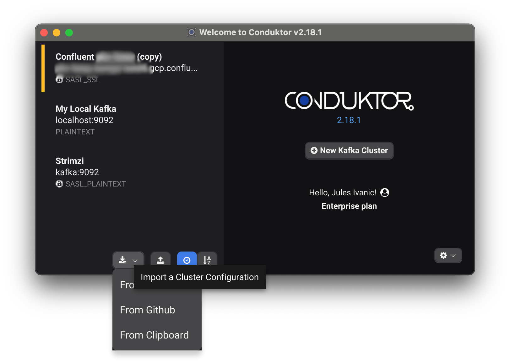
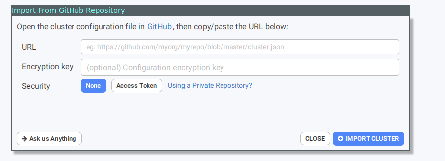

# Import/Export configurations

This feature is for **Enterprise** users where this is typically needed, to share your configuration with your team.

### Export the configuration all several clusters
with the  button you can export all your cluster in a single file.

As this export contains credentials, secretes and certificate files, you will have to provide a password
this password will be used to encrypt all secrets.

### Export a specific Cluster Configuration

On the welcome screen, you can export your configuration to a file \(cluster-name.json\).

### Import a Cluster Configuration

You can import a Cluster Configuration from a file or directly from your clipboard! If this cluster did not exist yet in your Conduktor, it will create it directly. Otherwise, it will ask you if you want to override the existing cluster configuration or not \(see below\).

### Overriding or Copying an existing cluster configuration

Conduktor will detect if you already have the cluster configuration and will ask you what to do. This can happen when you clone a configuration of yours for instance, or if you just want to update a cluster configuration that you got from someone.

### What the import/export does copy

The import/export is only about the configuration, not your personal preferences, which topics or consumer groups you've favorited, your producer templates etc. It's only about the cluster configuration \(Apache Kafka, Kafka Connect, Kafka Streams, ksqlDB, Schema Registry, Metrics...\)

### Sharing a configuration with teammates on Github

1. Export the configuration
2. Commit the file on a Github repository \(can be private\)
3. Share the github URL of the file to your teammates, e.g.: [http://github.com/trobert/conduktor-configs/blob/main/config.json](http://github.com/trobert/conduktor-configs/blob/main/config.json)

Now for the teammates: On the welcome screen select import from github

note : if you try to import a not encrypted configuration, let the password field empty

If your repo is private, you can easily create a github token: The "Generate" button will bring you to a pre-filled github form to generate the token

All you need is to Click on "Generate Token" and copy/paste it in conduktor

#### Updating the shared configration

If you want to push a modification of the cluster configuration, just re-export the modified configuration and commit the updated file on github.

Now, next time on of your team connect to this cluster, he will prompted to update his configuration:

