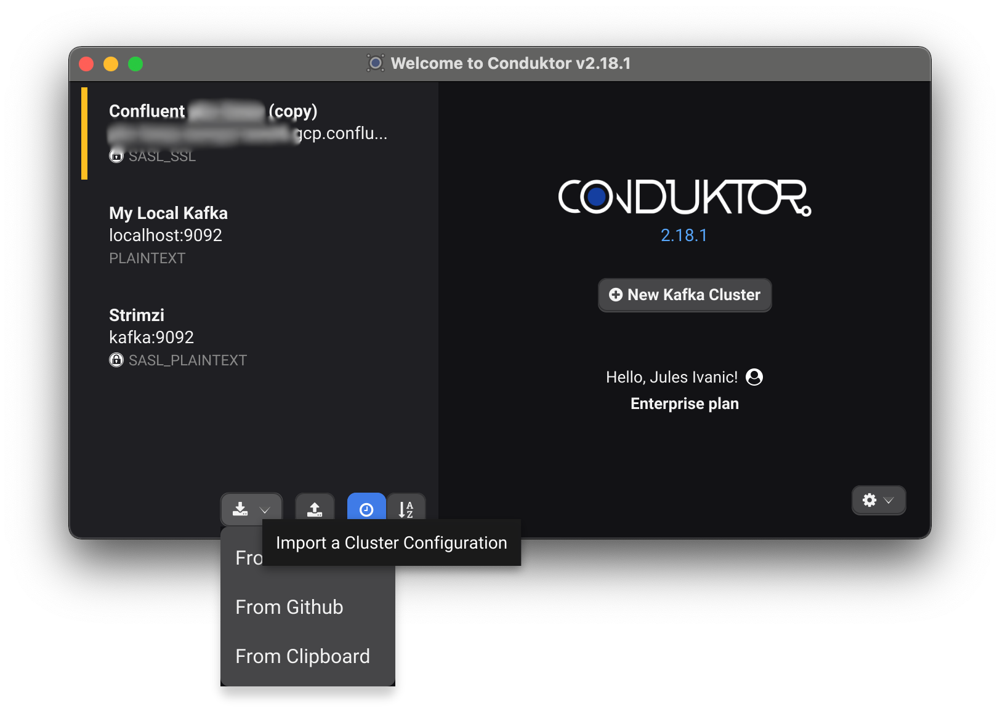
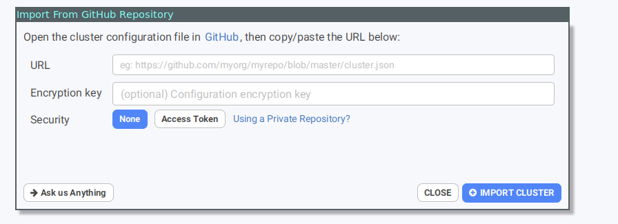

# GitHub \(Enterprise subscription\)

## How to share a cluster configuration with teammates using Github

* As a Team Manager:

1. Export the configuration cf : [Import/Export](./import-export.md)
2. Commit the file on a Github repository \(can be private\)
3. Share the github URL of the file to your teammates

   e.g.: [http://github.com/trobert/conduktor-configs/blob/main/config.json](http://github.com/trobert/conduktor-configs/blob/main/config.json)

## How to import clusters configuration from github

On the welcome screen select import from github.

note : if you try to import a not encrypted configuration, let the password field empty

If your repo is private, you can easily create a github token: The "Generate" button will bring you to a pre-filled github form to generate the token

All you need is to Click on "Generate Token" and copy/paste it in conduktor

This will create the clusters in your Conduktor by fetching the configuration remotely, and keep them sync each time you connect to it.

### What if I have a Private Repository?

If your repository is private, you can easily create a Github token: 
* The "Generate" button will bring you to a pre-filled github form to generate the token:

All you need is to Click on "Generate Token" and copy/paste it in conduktor:

## How to update a shared configuration

If you want to push a modification of the cluster configuration, just re-export the modified cluster configuration and commit the updated file on Github, at the same location.

Now, next time on of your teammate connect to this cluster, he will prompted to update his configuration:

