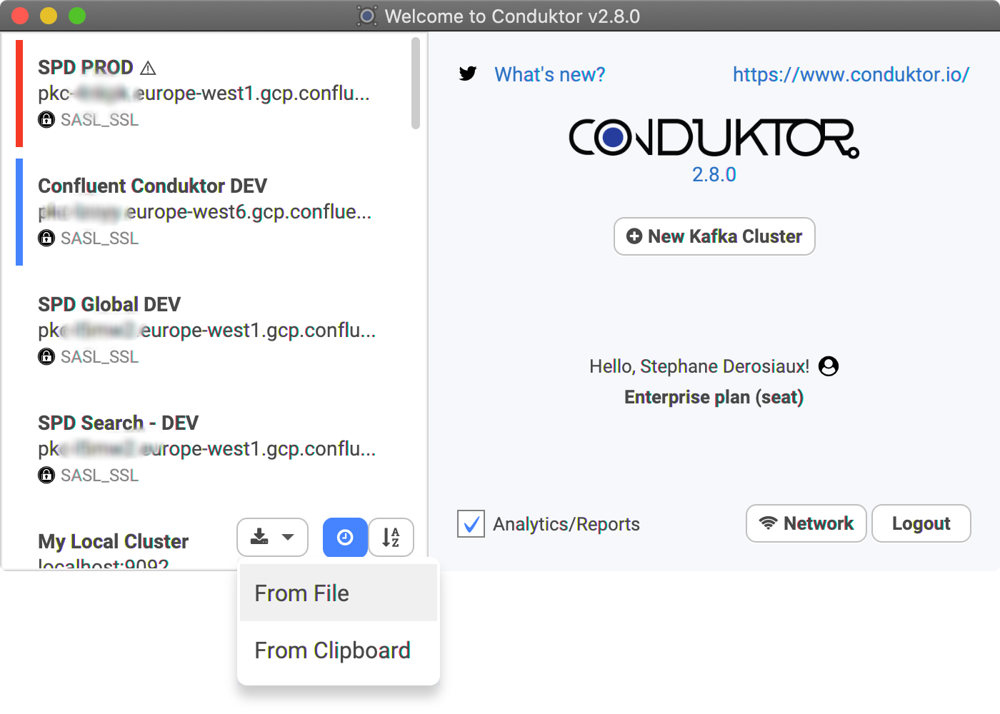
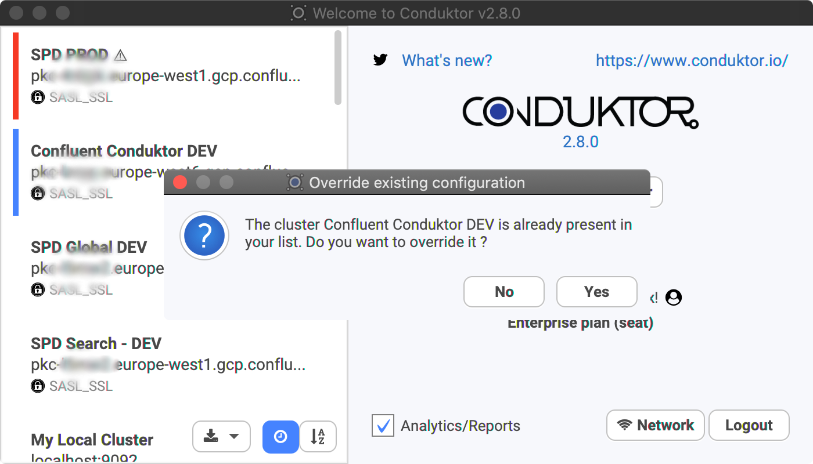

# Import/Export configurations

This feature is for **Enterprise** users where this is typically needed, to share your configuration with your team.
You can also use [Github](github-enterprise.md) to auto-synchronize your configuration with your team.

### Export the configuration all several clusters
with the    button you can export all your cluster in a single file.

This export include sensitive data like credentials, secretes and certificate files, you will have to provide a password to secure it.

### Export a specific Cluster Configuration

On the welcome screen, you can export your configuration to a file \(cluster-name.json\).

### Import Configurations

You can import Cluster Configurations from a file, from [Github](github-enterprise.md) or directly from your clipboard!
If the cluster already exist,we will ask you if you want to override the existing cluster configuration or not \(see below\).

### Overriding or Copying an existing cluster configuration

Conduktor will detect if you already have the cluster configuration and will ask you what to do. This can happen when you clone a configuration of yours for instance, or if you just want to update a cluster configuration that you got from someone.

### What the import/export does copy

The import/export is only about the configuration, not your personal preferences, which topics or consumer groups you've favorited, your producer templates etc. It's only about the cluster configuration \(Apache Kafka, Kafka Connect, Kafka Streams, ksqlDB, Schema Registry, Metrics...\)

