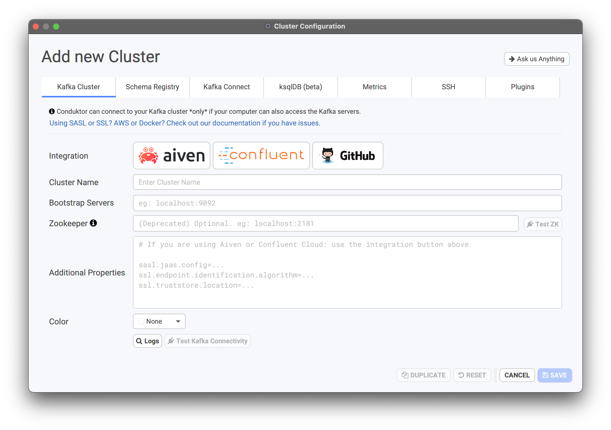
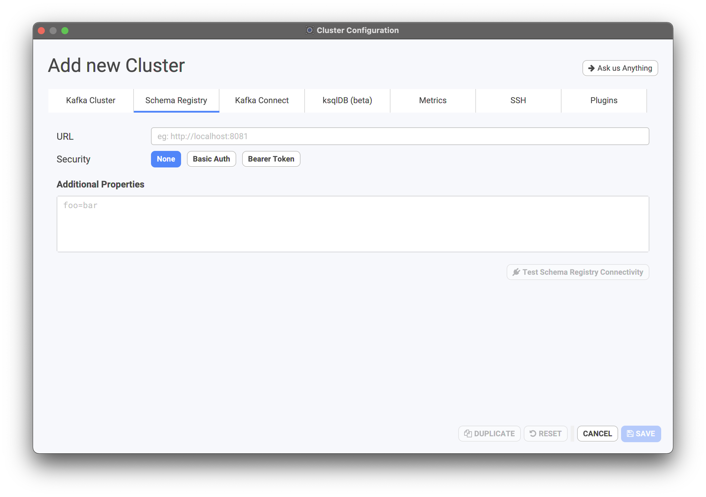
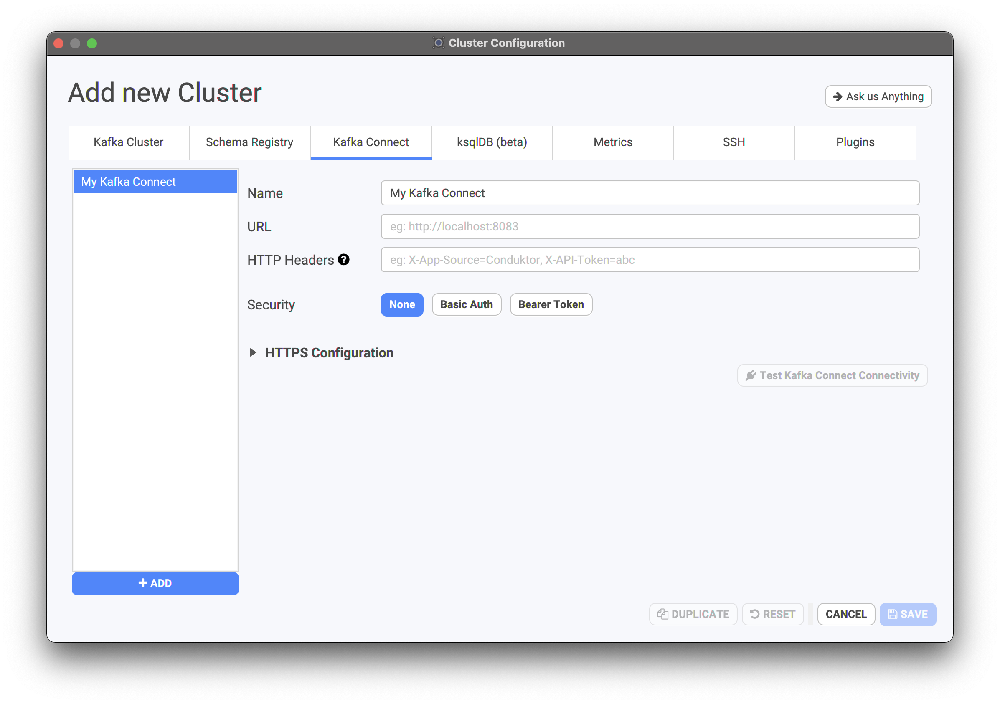
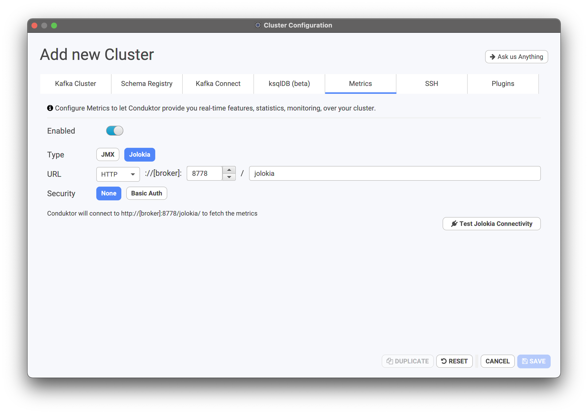
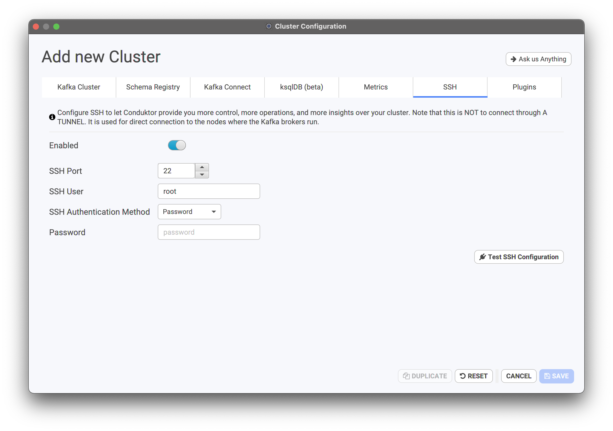
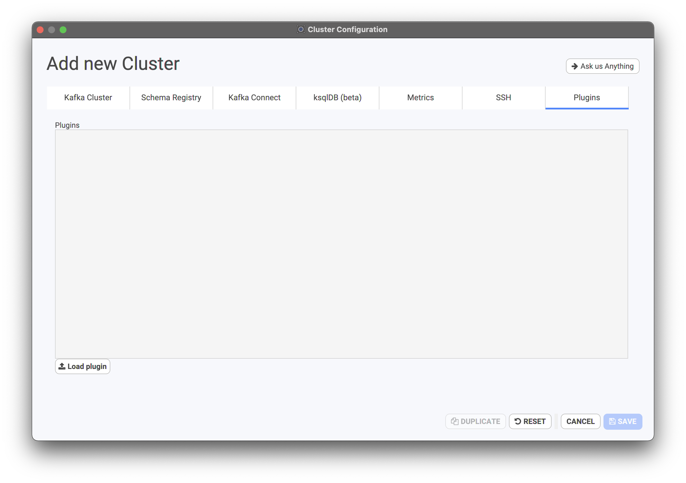

# Setting up a connection to Kafka



## Adding a Cluster

To add a cluster, please click on the "Add new cluster" button

.png>)

This will open up a list of configurations you can set for Conduktor



### Kafka Cluster

this tab is the most important tab, and you have the following options:

* **integration:** in case you are using Aiven or Confluent Cloud, you have the possibility to quickly integrate with them through a dialog. In case you're not using those, rest assured you can connect to your cluster!
* **cluster name:** this will be the name of your cluster when navigating the list of clusters on the right-hand side of the Conduktor splash screen
* **bootstrap servers:** list of Kafka brokers to connect to, usually providing two or three brokers is enough. In the form of `broker1-url:9092,broker2-url:9092`, or `PLAINTEXT://broker1-url:9092,broker2-url:9092`
* **zookeeper (optional):** providing a Zookeeper URL will allow you to access more features through Conduktor, for example partition reassignment. Over time, as Kafka migrates away from using Zookeeper, this configuration will become less and less necessary to provide. In the form of `zookeeper1-url:2181,zookeeper2-url:2181`
* **additional properties:** this is one of the most important section, especially if you have a [secure Kafka cluster](connecting-to-a-secure-kafka.md). Any additional properties you usually provide to your CLI or your Java clients should be inserted here. For more information, please read the [secure Kafka cluster section](connecting-to-a-secure-kafka.md).

You can use the two buttons to test the Kafka and Zookeeper connectivity to ensure you connection details are accurate.

#### Aiven

If using Aiven, you can use our integration to setup the configuration:


Download the 3 necessary files on Aiven's interface (service.key, service.cert, ca.pem). Conduktor will generate files out of them in the folder you chose (don't remove them!).


### Schema Registry

In case you are using the [Confluent Schema Registry](https://docs.confluent.io/current/schema-registry/index.html) and usually Avro data, you should use this tab to setup the connection details to your registry. These detail are necessary to activate the "Schema Registry" tab in Conduktor, as well as consume and produce data in Avro format.



* **URL:** HTTP or HTTPS endpoint of your schema registry.
* **Security:** Choose the security type (None, Basic Auth, Bearer Token)
* **Additional Properties:** any key value pair needed to make the connection work

After entering the necessary details, you can test the connectivity to your schema registry.

#### How to Connect to a secured Schema Registry?

Add this in the additional properties (notice the `schema.registry.` prefix):

```
schema.registry.ssl.truststore.location=/kafkassl/kafka.client.truststore.jks
schema.registry.ssl.trusstore.password=<xxx>
schema.registry.ssl.keystore.location=/kafkassl/kafka.client.keystore.jks
schema.registry.ssl.keystore.password=<xxx>
schema.registry.ssl.key.password=<xxx>
```

### Kafka Connect

Here you can add a list of Kafka Connect clusters that are linked to this Kafka cluster.



Each Kafka Connect cluster will have

* **Name:** unique name to identify a connect cluster
* **URL:** HTTP or HTTPS endpoint of your connect cluster
* **Security:** basic authentication (if secure connect cluster), as well as key and trust store locations in case of TLS encryption.

You can also test the connectivity to your Connect clusters from there.

### Metrics

Enabling metrics allows Conduktor to get real-time features, statistics, monitoring over your cluster, as well as the rolling restart feature.



We current support Jolokia and JMX to extract metrics.

* **Jolokia:** please provide the protocol as well as the Jolokia port. The [Jolokia agent](https://jolokia.org/agent.html) should be installed on all your Kafka brokers.
* **JMX:** if you have started the JMX utility on your Kafka brokers, please provide the JMX port for Conduktor to connect to.


Please contact us in case you need other metrics mechanisms.


### SSH (note: not a connection setting)


The SSH configuration is quite powerful and should only be allowed to be set-up for your Kafka administrators. Average Kafka users should not need to fill up the details of that tab.


The SSH configuration enables Conduktor to directly access your brokers machines, enabling features like the rolling restart feature.



Please provide the port, user, authentication method (password or SSH key pair) and test the SSH configuration.

### Plugins (aka "custom jars")



The Plugins configuration allows you to load your custom jars into Conduktor.\
These customs jars are useful to extend the capabilities of our internal Kakfa clients.

The plugins have two main usages:

1. Authentication of Conduktor requests to your Kafka cluster(s) if you're using an authentication mechanism not natively supported by Kafka.
2. Deserializing your topics messages with a custom Kafka deserializer. (MessagePack, etc.)

For example, if you're using OAuth2 to authenticate the connections to your Kafka cluster, to allow Conduktor to connect to your cluster, you'll need to:

1. Configure your cluster with an additional property: `sasl.login.callback.handler.class=io.example.client.MyCustomLoginCallbackHandler`
2. Load your jar containing the `io.example.client.MyCustomLoginCallbackHandler` class in Conduktor plugins

With this additional property and this jar configured, Conduktor will be able to configure its internal Kafka client to successfully connect to your Kafka cluster.

To learn more about custom Kafka deserializers and how to use them in Conduktor, please the dedicated documentation: [Custom deserializers](../../features/consuming-data/custom-deserializers/)

⚠️ When adding a plugin to a cluster configuration, this plugin is only available for this cluster.\
If you want to use this same plugin with a second cluster configured in Conduktor, you'll need to add this plugin in this second cluster configuration too.

#### Current limitations of the "Plugins" feature

* For now, a plugin can only be composed of one jar (Coming soon)

**Scala support & limitation**

As Conduktor is powered by Scala 2.13, it natively supports the plugins compiled with Scala 2.13.\
If your plugin is using a different version of Scala, it may not work in Conduktor.\
If your plugin is compiled with another version of Scala and doesn't work in Conduktor, you have two solutions:

1. Recompile your plugin with Scala 2.13
2. Build a `fatjar` out of your plugin code that will contain your Scala version code.\
   However, for this solution to work, you'll have to shadow your Scala version code by renaming all the `scala.*` packages to `yourorganisation.scala.*`, for example.

Don't hesitate to contact our support if you meet any issue with your plugins and Conduktor.

## Testing the Connection to a Cluster

Conduktor has utilities to test the connectivity to your Kafka clusters. In case you cannot establish a connectivity to your clusters, please make sure to read the following two pages:


[connecting-to-a-secure-kafka.md](connecting-to-a-secure-kafka.md)



[impossible-connection-setups.md](impossible-connection-setups.md)


## Multi Cluster Management

Conduktor allows you to manage and save the configuration and connection details to multiple Kafka clusters for easy and quick connections. The clusters you have used last will appear at the top of your cluster list.

.png>)

To edit the configuration of a cluster, hover your mouse over a cluster, and the "config button" will appear.

.png>)


The ability to export, backup and share Kafka cluster configurations is an upcoming feature of the Enterprise License.


## Secure Kafka Clusters

Setting up Conduktor with secure clusters is possible but requires you to have the exact properties. We have setup a longer guide here to help you out:


[connecting-to-a-secure-kafka.md](connecting-to-a-secure-kafka.md)


## Connectivity Issues

Having connectivity issues? Be sure that you're not in a case of "impossible connection setup". Read more here:


[impossible-connection-setups.md](impossible-connection-setups.md)

