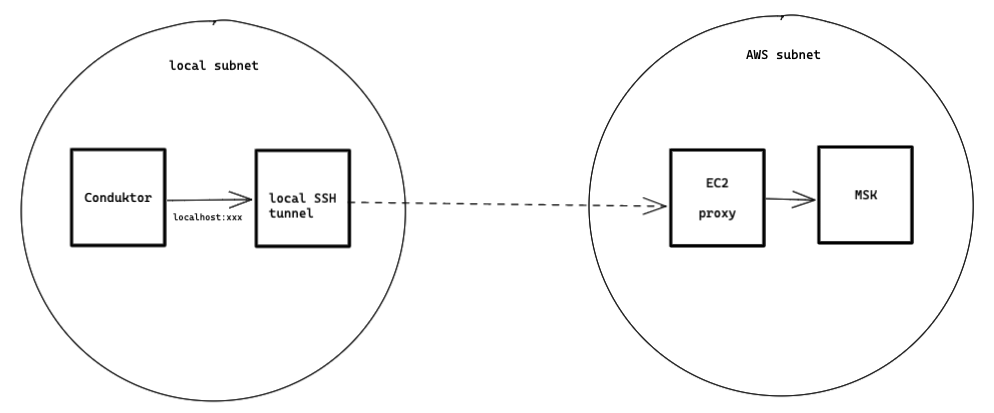
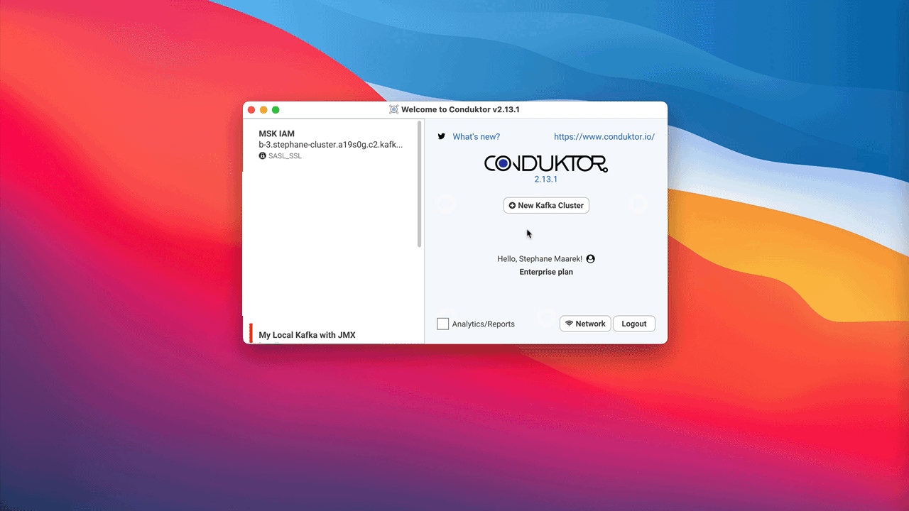

# Connect to Amazon MSK

## What is MSK?

Amazon MSK is a self-managed service that makes it easy to build and run applications that use Apache Kafka to process streaming data.&#x20;

It lacks several important Apache Kafka features like Kafka Connect, Kafka Streams, ksqlDB, and is not cloud-native (serverless, like S3 or Kinesis) but is just a provisioned infrastructure


AWS MSK supports also Kafka Connect clusters. [Read more about it](https://aws.amazon.com/blogs/aws/introducing-amazon-msk-connect-stream-data-to-and-from-your-apache-kafka-clusters-using-managed-connectors/).


## Conduktor & MSK

Conduktor, which is running on your computer, has no access by default to MSK. Still, it's possible to connect it to the cluster by using a specialized kafka proxy in-between.

To make it work:

* Start a proxy [https://github.com/dajudge/kafkaproxy/](https://github.com/dajudge/kafkaproxy/) on a EC2 instance that has access to the cluster. For instance, using Docker:

```
$ sudo docker run --net host \
    -e KAFKAPROXY_HOSTNAME=localhost\
    -e KAFKAPROXY_BASE_PORT=4000 \
    -e KAFKAPROXY_BOOTSTRAP_SERVERS=MYBROKER1:9092,broker2:9092,broker3:9092 \
    dajudge/kafkaproxy:latest

```

* On your local machine, do a ssh-tunnel to this EC2 instance:

```
$ ssh -i ~/.ssh/ec2-key.pem -N \
     -L 4000:localhost:4000 \
     -L 4001:localhost:4001 \
     -L 4002:localhost:4002 \
     <ec2instance>
```

* Connect Conduktor using localhost:4000

The networking layer looks like this (not public):



### Alternative: Another Proxy


If you get some errors such as "Exception in upstream channel.: java.lang.IllegalArgumentException: Invalid version for API key METADATA: 11", your proxy may be incompatible with your version of Apache Kafka.


You can try running another proxy: [https://github.com/grepplabs/kafka-proxy](https://github.com/grepplabs/kafka-proxy) It's a bit more complicated to setup but is more configurable.

* Run the proxy on an EC2 machine running in the MSK network:
  * Map all your brokers

```
docker run --rm --net host grepplabs/kafka-proxy:latest \
          server \
        --bootstrap-server-mapping "b-1.mymsk.xxx.kafka.us-west-2.amazonaws.com:9092,0.0.0.0:32500,127.0.0.1:32500" \
        --bootstrap-server-mapping "b-2.mymsk.xxx.kafka.us-west-2.amazonaws.com:9092,0.0.0.0:32501,127.0.0.1:32501" \
        --bootstrap-server-mapping "b-3.mymsk.xxx.kafka.us-west-2.amazonaws.com:9092,0.0.0.0:32502,127.0.0.1:32502" \
        --bootstrap-server-mapping "b-4.mymsk.xxx.kafka.us-west-2.amazonaws.com:9092,0.0.0.0:32503,127.0.0.1:32503" \
        --dynamic-listeners-disable \
        --debug-enable

```

* SSH forward locally to your EC2 machine:
  * Forward all the ports

```
ssh -i ~/.ssh/ec2-key.pem -N \
     -L 32500:localhost:32500 \
     -L 32501:localhost:32501 \
     -L 32502:localhost:32502 \
     -L 32503:localhost:32503 \
     ec2-user@ec2-1-2-3-4.us-west-2.compute.amazonaws.com
```

* Connect your Conduktor to localhost:32500

## Connect using AWS IAM

Conduktor fully handles AWS IAM, you just have to setup your connection with your IAM access.

Read our guest blog on AWS for more details: [https://aws.amazon.com/blogs/big-data/securing-apache-kafka-is-easy-and-familiar-with-iam-access-control-for-amazon-msk/](https://aws.amazon.com/blogs/big-data/securing-apache-kafka-is-easy-and-familiar-with-iam-access-control-for-amazon-msk/)



### AWS MSK + IAM Architecture

A small overview of "what's going on" when you use AWS MSK and configure IAM (read the mentioned blog above for more details):


.png>)

### Configuration Example

Here is an example of configuration you can copy/paste. Just update the `awsProfileName` to yours:

```
security.protocol=SASL_SSL
sasl.mechanism=AWS_MSK_IAM
sasl.jaas.config = software.amazon.msk.auth.iam.IAMLoginModule required awsProfileName="stephane-msk";
sasl.client.callback.handler.class=software.amazon.msk.auth.iam.IAMClientCallbackHandler 
```

## IAM Example

A basic (broad) example of configuring IAM policy to access everything on MSK:

```
{
  "Version": "2012-10-17",
  "Statement": [
    {
      "Effect": "Allow",
      "Action": "kafka-cluster:*",
      "Resource": [
        "arn:aws:kafka:us-east-1:111222333444:cluster/*/*",
        "arn:aws:kafka:us-east-1:111222333444:group/*/*/*",
        "arn:aws:kafka:us-east-1:111222333444:transactional-id/*/*/*",
        "arn:aws:kafka:us-east-1:111222333444:topic/*/*/*"
      ]
    },
    ...
}
```


