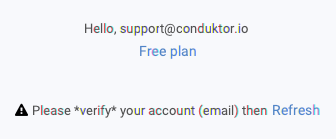
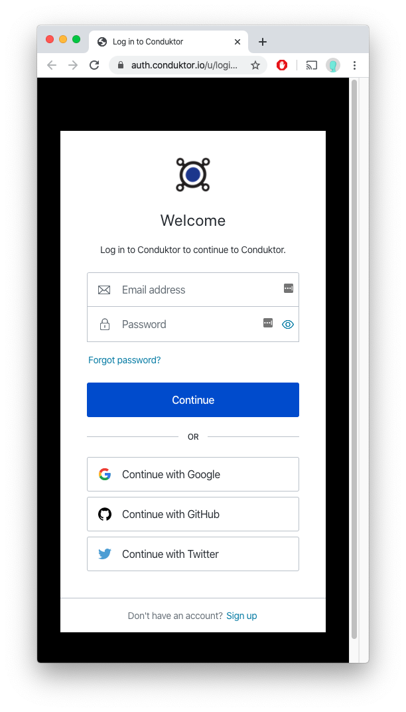

# Logging into Conduktor

In order for us to verify the license you have purchased, we require you to log into Conduktor. For this, we are using Auth0 for user management. 

> ## Do you have an internet proxy? 
>
> Don't forget to check out the [internet proxy section](using-an-internet-proxy.md)

Upon starting Conduktor, you will have to first sign-up & login

This will open a web browser window to allow you to log-in 

A valid internet connection is required to access the domain auth.conduktor.io. 

## Google / GitHub / Twitter:

This is the easiest way to get started with Conduktor. We will retrieve your email address, which will be automatically verified, and you'll be all set! 

## Manual Login

You must create a username and a password with the following constraints:

After being signed-up correctly, you will have to verify your email before using Conduktor:

Check your spam folder if you can't find anything from us

After verifying your email, you can **refresh** Conduktor

And you're all set!

