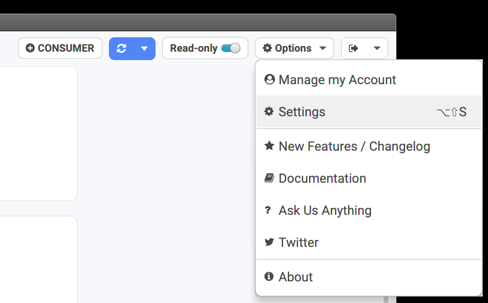
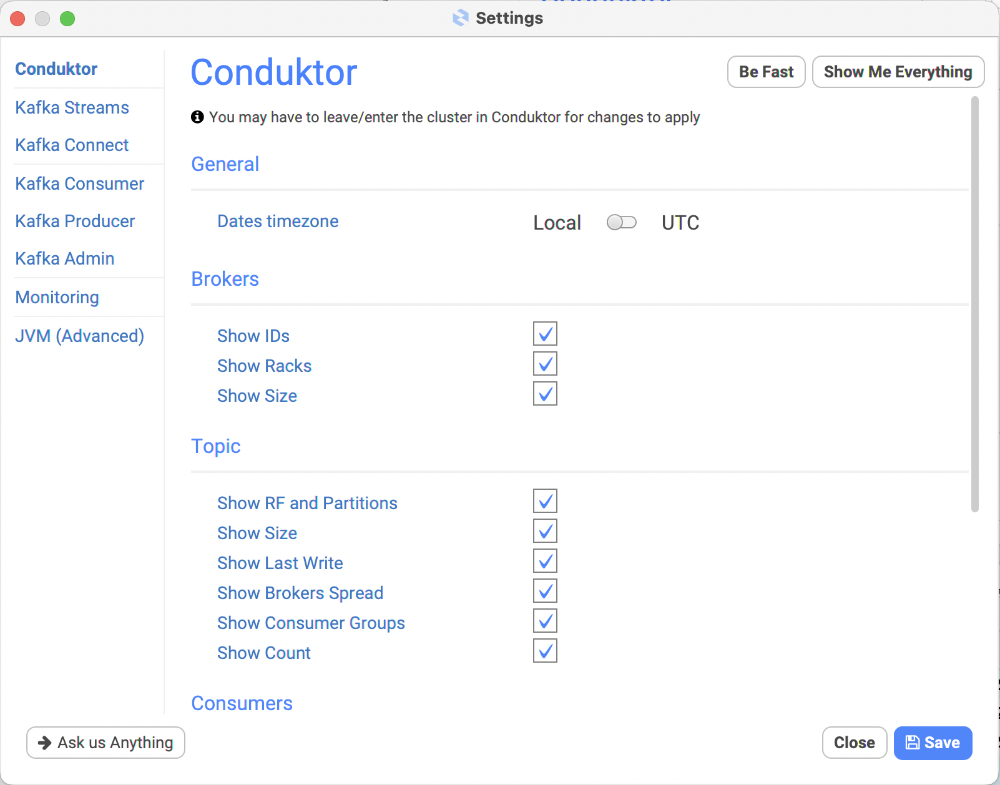
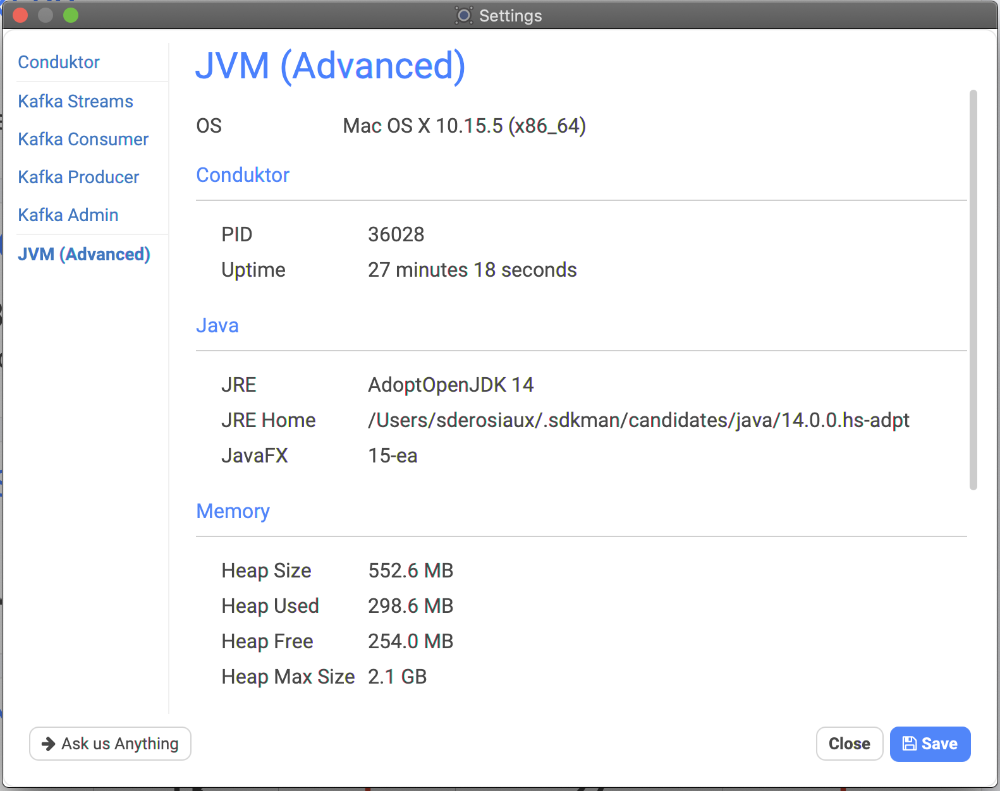
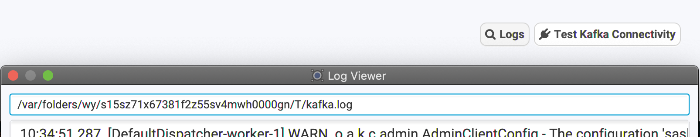

# Configuring Conduktor

## Conduktor's Settings

Conduktor comes with many options (and growing) to customize its behaviour. This is important when it comes to large clusters: you don't need everything, so better remove some useless overhead.


Also, _unfortunately_, sometimes the clusters are just too big for Conduktor to handle properly, making it crash after some time ☹ (improving!)️


It's also there to configure:

* the Kafka clients used across Conduktor (administration, consumer, producer...)
  * Increase the timeouts if your cluster or connection is slow (default is 30s)
  * Does that ring a bell? _org.apache.kafka.common.errors.TimeoutException: Failed to update metadata after 30000 ms._
* a few Kafka Streams options

Go Options > Settings:



We can choose to display dates as UTC instead of using the local timezone.

We can also decide which columns to hide or show. When columns are hidden, processing is not done (like with "Show Last Write" which can be quite expensive if you have many topics, it's a good idea to hide it).



## JVM (Advanced)

It's possible to grab some stats about the JVM (read-only!):



It's mostly for advanced users who understand what's going on.

By default, Conduktor is limited to 2GB of memory heap. It's possible to increase this and alter any Java configuration by editing the configuration file yourself:

* MacOS: `/Applications/Conduktor.app/Contents/app/Conduktor.cfg`
* Windows: `C:\Program Files\Conduktor\app\Conduktor.cfg`
* Linux: `/opt/conduktor/lib/app/Conduktor.cfg`


We do **NOT** recommend to alter this file, **all changes will be lost **when upgrading Conduktor


The default options are:

```
[JavaOptions]
-Xms128m
-Xmx2048m
-Dsun.io.useCanonPrefixCache=false
-Djava.net.preferIPv4Stack=true
-XX:+HeapDumpOnOutOfMemoryError
-XX:+UseCompressedOops
-Dfile.encoding=UTF-8
```

## Custom environment variables

It's possible to customize the -D\* without losing them when upgrading.&#x20;

Instead of playing with `Conduktor.cfg`, create the file `conduktor.vmoptions` in your Conduktor personal folder and add as many "-D" as you want (**only -D, no -XX**), to set them when Conduktor starts (only on startup, it's not taken into account after):

* MacOS: `/Users/<user>/Library/Application Support/conduktor/conduktor.vmoptions`
* Windows: `C:\Users\<user>\AppData\Local\conduktor\conduktor\conduktor.vmoptions`
* Linux: 
  * .deb/.rpm : `/home/<user>/.config/conduktor/conduktor.vmoptions` (or XDG Config path if set)
  * Flatpak : `/home/<user>/.var/app/io.conduktor.Conduktor/config/conduktor/conduktor.vmoptions`

Example:

```
-Djava.net.preferIPv4Stack=false
-Dhttp.proxyHost=1.2.3.4
-Djava.security.auth.login.config=/tmp/kafka_jaas.conf
-Duser.timezone=UTC
```

## Logs

### Kafka logging

Conduktor logs all Kafka client warnings and errors to a file, directly accessible from the Conduktor interface.

* Go to the Cluster Configuration screen
* Test Kafka Connectivity
* Click on "Logs"

A popup will open with the logs and the path to the kafka.log file:



### Managed Kafka logging

Conduktor can manage Kafka clusters by downloading and running Zookeeper, Kafka and optionally Schema-registry locally.

Log files of managed services can be found on files `zookeeper.log`, `kafka.log` and `schema-registry.log` located in directory :

* MacOS : `/Library/Application Support/conduktor/jumpstart/<clusterId>/logs/`
* Windows : `C:\Users\<User>\AppData\Local\conduktor\conduktor\jumpstart\<clusterId>\logs\`
* Linux : 
  * .deb/.rpm : `/home/<user>/.local/share/conduktor/jumpstart/<clusterId>/logs/` 
  * Flatpak : `/home/<user>/.var/app/io.conduktor.Conduktor/data/conduktor/jumpstart/<clusterId>/logs/`

### Conduktor logging

Starting Conduktor 2.7.0, we log everything into a `conduktor.log` file. This may help to troubleshoot odd behaviour, connection issues and so on.

* Windows: `C:\Users\<User>\AppData\Local\Temp\conduktor.log`
* Linux: 
  * .deb/.rpm : `/tmp/conduktor.log`
  * Flatpak : `/run/user/<UID>/.flatpak/io.conduktor.Conduktor/tmp/conduktor.log`
* macOS: `/var/folders/wy/xxx/T/conduktor.log`
  * the path is random. The best way to find it is to look for the kafka.log path (above). conduktor.log sits at the same place


On Linux and macOS, you can directly start Conduktor from the console to display the logs on stdout. (this does not work on Windows, except using alternative unix-ish shells like gitbash)

