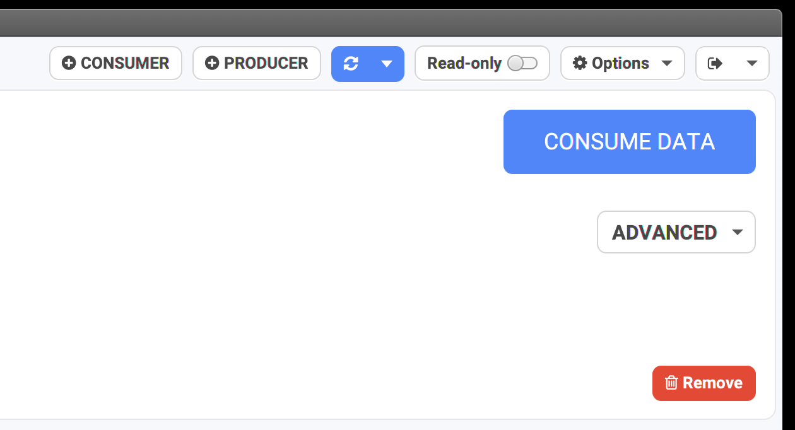
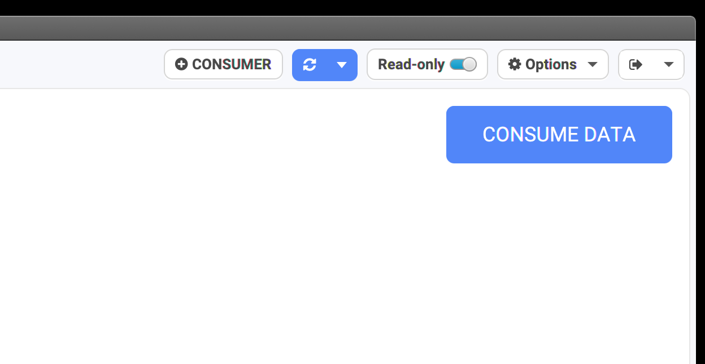
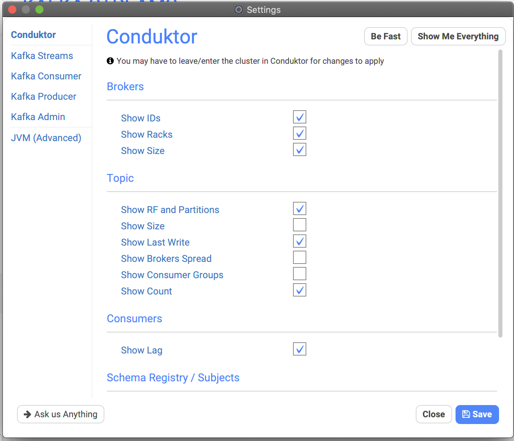

# Configuring Conduktor

## Read-Only mode

Sometimes, you want to be sure that you won't misclick anywhere or you just want to access Conduktor in read-only mode \(useful for Testers, Product Owners, Data Analysts etc.\).

Conduktor does not have a proper permissions system for now \(contact us if that matters to you, we may do that for enterprises\) and offer instead a quick toggleable read-only mode:

* Not Read-Only: we can produce data, have access to advanced commands, can delete topic...



* With Read-Only enabled: less features are visible, your resources are safe!



## Conduktor's Settings

Conduktor comes with many options \(and growing\) to customize its behaviour. This is important when it comes to large clusters: you don't need everything, so better remove some useless overhead.


Also, _unfortunately_, sometimes the clusters are just too big for Conduktor to handle properly, making it crash after some time ☹ \(improving!\)️


It's also there to configure:

* the Kafka clients used across Conduktor \(administration, consumer, producer...\)
  * Increase the timeouts if your cluster or connection is slow \(default is 30s\)
  * Does that ring a bell? _org.apache.kafka.common.errors.TimeoutException: Failed to update metadata after 30000 ms._
* a few Kafka Streams options

Go Options &gt; Settings:


We can decide which columns to hide or show. When columns are hidden, processing is not done \(like with "Show Last Write" which can be quite expensive if you have many topics, it's a good idea to hide it\).



## JVM \(Advanced\)

It's possible to grab some stats about the JVM \(read-only!\):


It's mostly for advanced users who understand what's going on.

By default, Conduktor is limited to 2GB of memory heap. It's possible to increase this and alter any Java configuration by editing the configuration file yourself:

* MacOS: `/Applications/Conduktor.app/Contents/app/Conduktor.cfg`
* Windows
* Linux: `/opt/conduktor/lib/app/Conduktor.cfg`


We do **NOT** recommend to alter this file, **all changes will be lost** when upgrading Conduktor


The default options are:

```text
[JavaOptions]
-Xms128m
-Xmx2048m
-Dsun.io.useCanonPrefixCache=false
-Djava.net.preferIPv4Stack=true
-XX:+HeapDumpOnOutOfMemoryError
-XX:+UseCompressedOops
-Dfile.encoding=UTF-8
```

## Custom environment variables

It's possible to customize the -D\* without losing them when upgrading. 

Instead of playing with `Conduktor.cfg`, create the file `conduktor.vmoptions` in your Conduktor personal folder and add as many "-D" as you want \(**only -D, no -XX**\), to set them when Conduktor starts \(only on startup, it's not taken into account after\):

* MacOS: `/Users/<user>/Library/Application Support/conduktor/conduktor.vmoptions`
* Windows: `C:\Users\<user>\AppData\Local\conduktor\conduktor\conduktor.vmoptions`
* Linux: `/home/<user>/.config/conduktor/conduktor.vmoptions` \(or XDG Config path if set\)

Example:

```text
-Djava.net.preferIPv4Stack=false
-Dhttp.proxyHost=1.2.3.4
-Djava.security.auth.login.config=/tmp/kafka_jaas.conf
```

