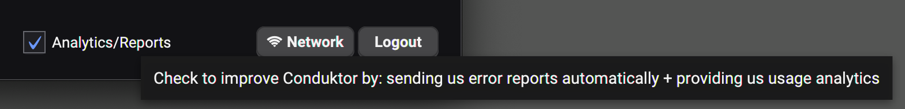

# Data Security

## How are my data and configurations used?

### Configuration: on your computer only

Conduktor Desktop, installed on your computer, stores its configuration on your computer. It is not stored nor send anywhere else. It may contain some username & password used in Conduktor Desktop to connect to the different technologies: Apache Kafka, Schema Registry etc.

### Data: not sent anywhere

The data only transits between your Conduktor Desktop and your Apache Kafka clusters and ecosystem \(Schema Registry, Kafka Connect, Kafka Streams, ksqlDB, ...\). They are not send anywhere else.

## Where is my configuration?

Your Conduktor configuration is stored in a fixed place on your computer:

* MacOS: `/Users/<user>/Library/Application Support/conduktor/`
* Windows: `C:\Users\<user>\AppData\Local\conduktor\conduktor\`
* Linux: `/home/<user>/.config/conduktor/` \(or XDG Config path if set\)

## Where are the logs?

As any software, Conduktor generates logs to help debugging or understanding what's going on. URLs, usernames could be found in \(and if present, passwords are always masked\).

* Windows: `C:\Users\<User>\AppData\Local\Temp\conduktor.log`
* Linux: `/tmp/conduktor.log`
* macOS: `/var/folders/wy/xxx/T/conduktor.log`

## Analytics

When the option "Analytics/Reports" is checked on our welcome screen, we will send some signals to Google Analytics \(totally anonymous\) about which dialog is opened, which button was clicked etc.

This will help us determining some screens are super used or not used at all.

