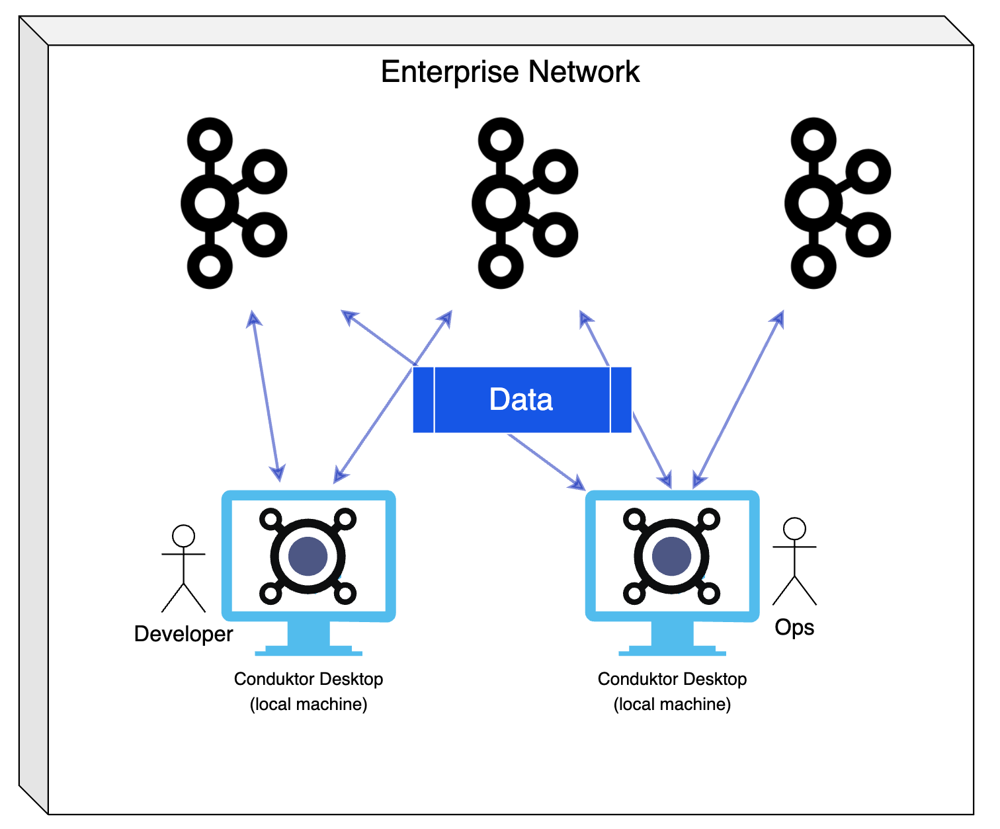

# Data Security

## How are my data and configurations used?

### Configuration: on your computer only

Conduktor Desktop, installed on your computer, stores its configuration on your computer. It is not stored nor sent anywhere else. It may contain some username & password used in Conduktor Desktop to connect to the different technologies: Apache Kafka, Schema Registry etc.

### Data: not sent anywhere

The data only transits between your Conduktor Desktop, on your machine, and your Apache Kafka clusters and ecosystem (Schema Registry, Kafka Connect, Kafka Streams, ksqlDB, ...). They are not sent anywhere else.

### Data Flow

Your data stays exclusively in your enterprise network. It flows only between Conduktor and your brokers & applications.

## Where is Conduktor installed?

We provide installers for all the systems to install Conduktor on default paths. Nothing custom is stored here, the configuration is stored in your personal folder only.

* MacOS: `/Applications/Conduktor.app`
* Windows: `C:\Program Files\Conduktor`
* Linux: `/opt/conduktor`

## Where is my configuration?

Your Conduktor configuration is stored in a fixed place on your computer:

* MacOS: `/Users/<user>/Library/Application Support/conduktor/`
* Windows: `C:\Users\<user>\AppData\Local\conduktor\conduktor\`
* Linux: `/home/<user>/.config/conduktor/` (or XDG Config path if set)


The folder contains your configuration **app.properties** and its previous version **app.properties.bak** that can be used to recover your configuration if something happened (and app.properties is broken).


## Where are the logs?

As any software, Conduktor generates logs to help debugging or understanding what's going on. URLs, usernames could be found in (and if present, passwords are always masked).

* Windows: `C:\Users\<User>\AppData\Local\Temp\conduktor.log`
* Linux: `/tmp/conduktor.log`
* macOS: `/var/folders/wy/xxx/T/conduktor.log`

## Analytics / Error reporting

.png>)

When the option "Analytics/Reports" is checked on our welcome screen, we will send some signals to:

* Google Analytics (totally anonymized): about which dialog is opened, which button was clicked etc. This will help us determining some screens are super used or not used at all.
* Sentry: only in case of errors, we send the error to Sentry to provide us visibility, if a feature is broken.

## Support: Ask us Anything!

Listening to our users is super important. We provide many spots in our interface, for the users to contact us in case of questions/issues/feature requests.

This sends us directly an email to support@conduktor.io where we continue the conversation in a classical manner. Details are kept purely private in the email conversation, and not sent anywhere.

## Login / Licenses

To use Conduktor, login is mandatory. This allows us to know our users and control if they have a license or not (to provide access to more features etc.).

### Security

To ensure a maximum security and availability of the login system, we use auth0 to manage our userbase which is fully certified, highly secured, and highly available. ([https://auth0.com/security](https://auth0.com/security))

### Identification Flow

Conduktor contacts auth0 when the user logins (on [https://auth.conduktor.io/](https://auth.conduktor.io/)). The user can register or login on auth0 secured pages, which then provide a secured JWT to Conduktor on the machine.

## How can I rollback in case of critical bug?

It should _never_ happen, but who knows! Our website only refers to our latest Conduktor Desktop version. You can download our previous releases [here](https://github.com/conduktor/builds/releases).

Note that we prevent old versions to work (you won't be able to login) in order for our users to always enjoy a recent version with less bugs and more features!
