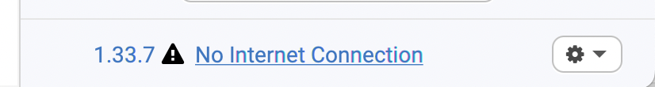

# Conduktor cannot access internet

If Conduktor cannot connect to the internet at startup, a warning will appear 
in the bottom right corner of the welcome screen (next to the version number)

## Why is this happening?
This warning appears when Conduktor cannot reach the servers to check for updates.
If your internet connection is not faulty, this can happen if you are accessing internet through a VPN.

## What are the consequences
If Conduktor cannot access internet, it will not be able to update configuration data such as your licence information.

