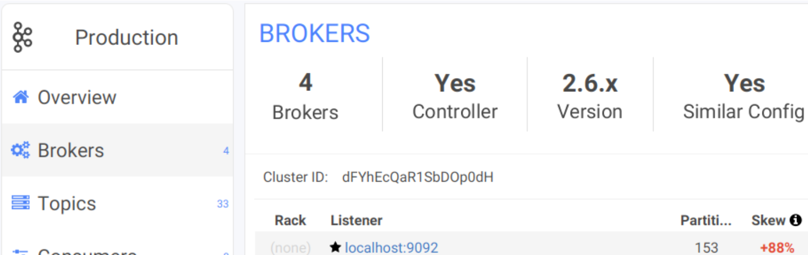

# Managing Permissions / RBAC


This feature is available to **Billing users** and **License Managers** only.


You can have control of what features of Conduktor Desktop is available to users in your subscription. This control is on a **per-cluster** basis. For example, you can give a read-only access to your production clusters, while still allowing full access to you development clusters.

## Defining a Kafka Cluster 

On the Account Management Portal, click on the **Manage** button under Subscription Details &gt; Cluster Permissions to get to the _Cluster Permission_ page :

From the next page, you will be able to add a new cluster or change the permission of an existing cluster:

Click C**reate** to add a new cluster, you will be asked with a Cluster ID, name and description. 


The Cluster ID is the important information that allows Conduktor Desktop to retrieve the permissions of the clusters.

**You can find it in Conduktor Desktop in the Broker Tab**


## Settings the permissions of a cluster

Once you added a cluster, you will be able to allow or denying access to specific features of Conduktor Desktop. Check the permissions you want to allow :


You can click _Read-only_ to get a preset of permissions which will prevent modifications to your cluster \(disallowing producing to topics, broker config modifications, topic creation/deletion, altering schemas in schema registry, ...\)


##  Effects of permissions on Conduktor Desktop

If a permission is denied, the corresponding button or menu entry will not appear in Conduktor Desktop. For instance, you can only create consumers but not producers on this cluster:


Removing the specific permission "_Allow Users to Connect_" will totally prevent the connection to the cluster.


## Additional Remarks

* The restrictions only apply when using to Conduktor Desktop. It still possible to by-pass the limitation using \(for instance\) the classical Kafka clients.
* Refining permission on a per-user basis will be available in a future version of the product.
* Clusters which are not referenced in the portal will get all permissions by default.

