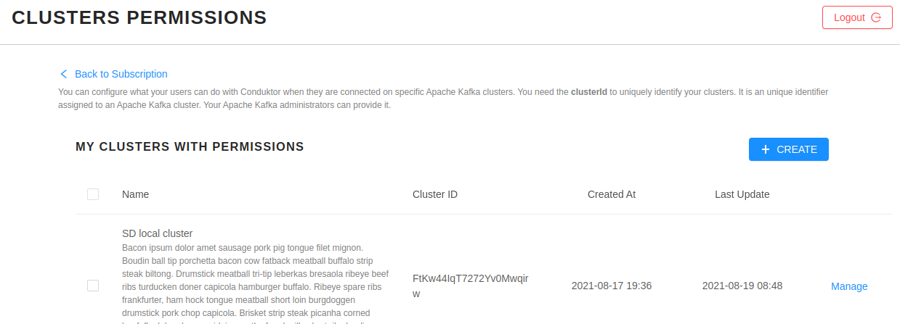
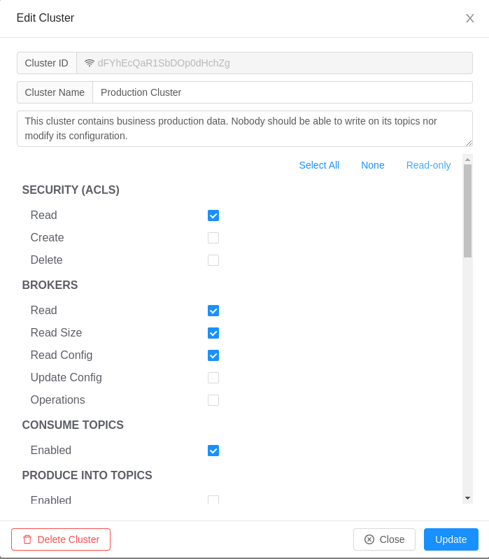

# Managing Permissions / RBAC


This feature is available only for Enterprises.


To be in control of what features your users can use on your clusters when using Conduktor Desktop, considering limiting their permissions. This is available on your account at [https://account.conduktor.io](https://account.conduktor.io/).

## Scope

Today, you can control this on a **per-cluster** basis. We don't manage a full RBAC system and it's not yet possible to define permissions per-user \(to come\).

## Example

You want to ensure that all your users cannot write into your production clusters: you want to provide read-only access. You also want them to have all the permissions on your development clusters: this is the default \(when no restrictions are put in place\).

## How to control the permissions of an Apache Kafka cluster?

* On the Account Management Portal, click on the **Manage** button under Subscription Details &gt; Cluster Permissions to get to the _Cluster Permission_ page :

* You will be able to declare your clusters or change the permission of an existing cluster:

* Click **Create** to declare a new cluster, you need to provide:
  * the Cluster ID: provides by your Apache Kafka administrators / your Ops team / Also available within Conduktor in the "Brokers" view
  * a short name
  * a longer description. 


A cluster ID uniquely identifies your clusters. It is a unique identifier assigned automatically to an Apache Kafka cluster. 


## How to setup the permissions of a cluster?

Once you've added a cluster, you will be able to allow or deny access to specific features of Conduktor Desktop. Check the permissions you want to allow :


You can click _Read-only_ to set predefined permissions to prevent any modifications to your cluster by your users \(eg: disallowing producing to topics, broker config modifications, topic creation/deletion, altering schemas in schema registry, ...\)


## How does this affect Conduktor Desktop?

When a permission is denied, the corresponding button or menu entry will not appear in Conduktor Desktop.

For instance, if we disabled "Produce Into Topics" on a cluster, users connected to this cluster won't be able to Produce any data \(no "Producer" button\):


Removing the specific permission "_Allow Users to Connect_" will entirely prevent the connection to the cluster.


## Additional Remarks

* This does not persist any ACLs into your Apache Kafka clusters, this controls only Conduktor
* Refining permission on a per-user basis will be available in a future version of the product.
* Clusters that are not declared in the portal get all permissions by default.

