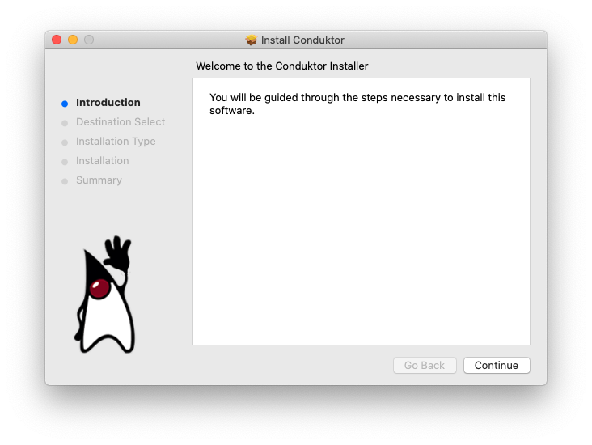

# Mac OS X

## General Steps

We have prepared an `.pkg` file for Mac OS X, example: `Conduktor-2.0.13.pkg`&#x20;

The installer is an easy step by step installer that will install Conduktor in your `Applications` folder

Conduktor requires about 300MB of space on your hard drive.&#x20;

.png>)

You may be prompted to entire your admin credentials so that Conduktor can be installed

.png>)

Conduktor is then installed !&#x20;

.png>)

Next step is to log into Conduktor


[Broken link](broken-reference)


## Installation Issues

### I can't find my issue here

Please [contact us](https://www.conduktor.io/contact)

