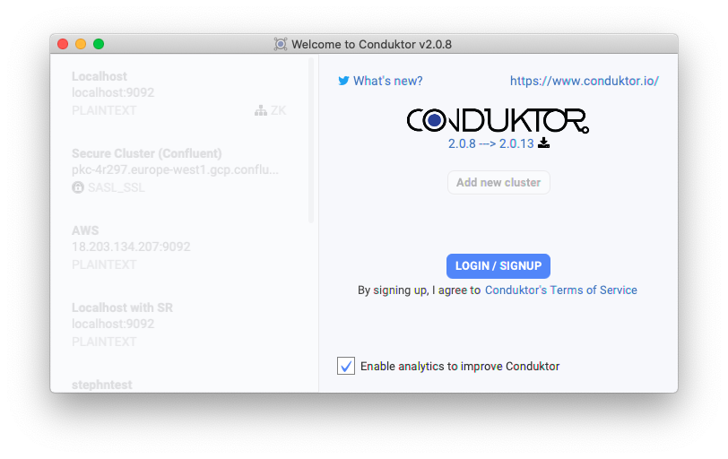
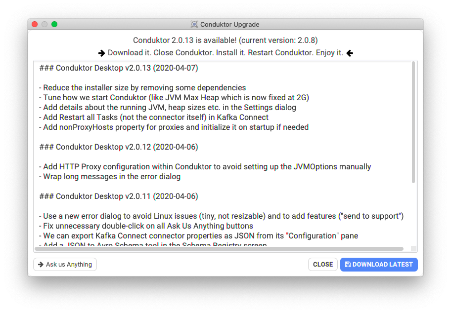

# Updating Conduktor

## Note on upgrade from Conduktor 1.X =&gt; 2.0


To upgrade from Conduktor 1.X to Conduktor 2.0, **please first uninstall Conduktor 1 and then install Conduktor 2.0**. Your configs are preserved


## Updating Conduktor 2.X

Conduktor is versioned and we allow you to stay on the version that you desire, or you can decide to upgrade Conduktor when necessary.

Upon starting Conduktor, we will be checking for a new version. If there is one, you should see in the UI something like

```text
2.0.8 ---> 2.0.13
```




Conduktor will be checking for updates, and display a changelog:



Upon clicking the **Download Latest** button, you will automatically download the latest version for your appropriate OS. 

To update Conduktor, follow these steps:

1. Close Conduktor
2. Install the new downloaded version \(the previous settings will be kept intact\)
3. Start Conduktor
4. Enjoy the updated version of Conduktor!

In case you are having update issues, please do not hesitate to [contact us](https://www.conduktor.io/contact)

