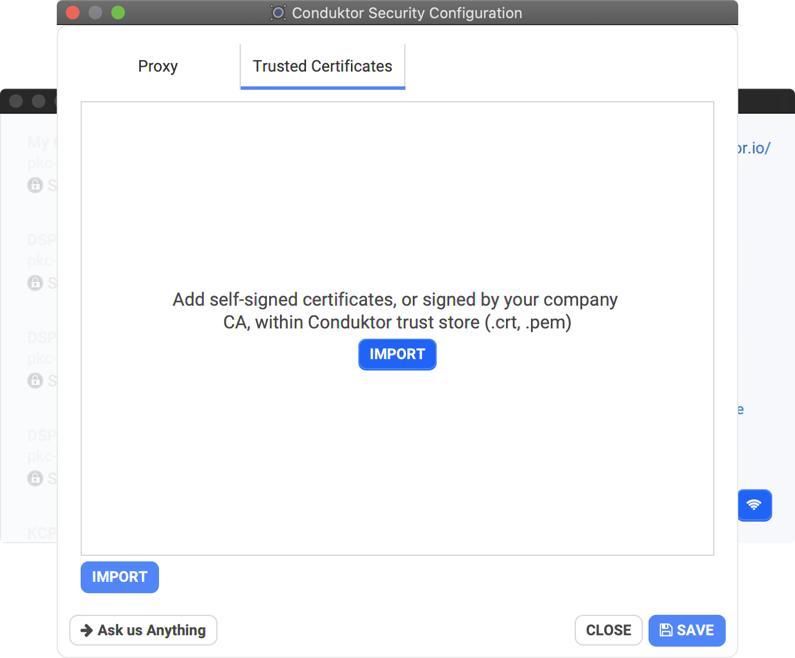

# Login Troubleshooting & FAQ

## I have an internet proxy, how do I configure it?

See the [Using an Internet Proxy](internet-proxy.md) page

## Will Conduktor work offline?

Conduktor does work offline after your first login. We require a re-login every week or so in order to refresh your token and verify your license validity. 

## My organization manage its own certificates / PKIX path building failed

If your organization has its own self-signed CA and certificates, you can add trusted certificates within Conduktor from the welcome screen.

* Conduktor will create its own internal truststore when starting up
* You need to restart Conduktor after adding/removing certificates in order for them to be taken into account

## My issue is not addressed here

Please [send us an email](mailto:support@conduktor.io?subject=Login%20Troubleshooting?body=Please%20include%20as%20much%20information%20as%20possible,%20as%20well%20as%20screenshots,%20or%20even%20better,%20videos)

