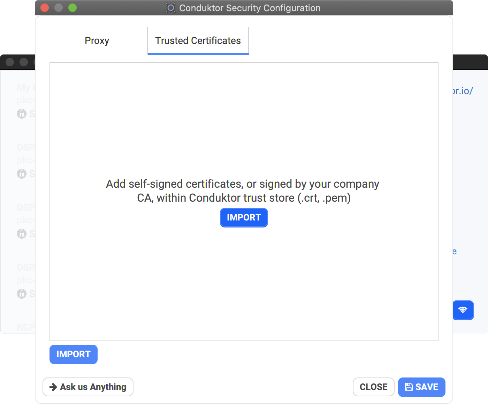

# Login Troubleshooting & FAQ

## I have an internet proxy, how do I configure it?

See the [Using an Internet Proxy](internet-proxy.md) page

## Will Conduktor work offline?

Conduktor does work offline after your first login. We may require a re-login every week or so in order to refresh your token and verify your license validity. 

We don't have any "offline license" available yet. Don't hesitate to contact us if your use-case needs this.

## Oops!, something went wrong!

When you login from Conduktor Desktop and get this error in the browser, instead of having the classic login screen, this may due to several reasons.

* your browser is blocking cookies: our identity provider, Auth0, needs its cookies 🍪. You may try to open the same link \(it will be something like [https://auth.conduktor.io/u/login?state=xxx](https://auth.conduktor.io/u/login?state=xxx)\) in a private tab \(where behavior can be different and cookies allowed temporary\)
* ensure you don't have some funny extension in your browser that could alter the url for some reasons
* you hit the "back button" in your browser and tried to come back. Please relogin properly from Conduktor.
* if nothing works, try to restart Conduktor Desktop and login \(to start fresh\)

## Oh no! Authentication has failed...

When you login, you can stumbled upon this error in your browser. That means that something is either preventing Conduktor to contact our authentication server \(`https://auth.conduktor.io`\) or the other way around, something is preventing our authentication server to contact Conduktor Desktop on your computer \(outside of our control\) to finish the identification flow.

This can happen due to many reasons. Here are a few:

* Are you running Conduktor from your enterprise network?
  * You may need to configure a **proxy**: [https://docs.conduktor.io/sign-in-section/internet-proxy](https://docs.conduktor.io/sign-in-section/internet-proxy)
  * You may need to add a **trusted certificate** to Conduktor: see below
* **Browser plugins** can redirect http calls to httpS. The last step of our identification flow is a call to a local temporary http server \(http://localhost:5xxx\), so if something in the browser forces a redirect from http to https, the flow will never complete.
* If you're using a **VPN**, you may have to configure it to not alter communication to \*.conduktor.io or add a certificate into Conduktor \(if you VPN adds its own security layer with a self-signed certificate..\)
  * Using **ZScaler** ? Download the ZScaler certificate and import it into Conduktor
* Ensure you don't have an **antivirus** or a **firewall** blocking communications. You may have to add `https://auth.conduktor.io` to some allow-list or something.


The JVM embedded in Conduktor \(Java 13+, if you are using the classic installation process\) trusts **Let's Encrypt**'s CA, which is the one that emits the https certificate of our authentication server `https://auth.conduktor.io` so nothing specific to setup here.


## My organization manage its own certificates / PKIX path building failed

If your organization has its own self-signed CA and certificates, you can add trusted certificates within Conduktor from the welcome screen.

* Conduktor will create its own internal truststore when starting up
* You need to restart Conduktor after adding/removing certificates in order for them to be taken into account



## I need to configure custom JVM options

Create the file `conduktor.vmoptions` in your Conduktor personal folder and add as many "-D" as you want \(only -D, no -XX\), to set them when Conduktor starts \(only on startup, it's not taken into account after\):

* MacOS: /Users/&lt;user&gt;/Library/Application Support/conduktor/conduktor.vmoptions
* Windows: C:\Users\&lt;user&gt;\AppData\Local\conduktor\conduktor\conduktor.vmoptions
* Linux: /home/&lt;user&gt;/.config/conduktor/conduktor.vmoptions \(or XDG Config path if set\)

Example:

```text
-Djava.net.preferIPv4Stack=false
-Dhttp.proxyHost=1.2.3.4
-Djava.security.auth.login.config=/tmp/kafka_jaas.conf
```

## Failed to launch JVM

On Windows, it's possible to get this error "Failed to launch JVM" in certain rare cases.

Check if you have some environment variables configured: `_JAVA_OPTIONS` or `JAVA_TOOL_OPTIONS` if that's the case, then unset them.

Some softwares add them for their own need, but this is taken into account by all the Java program running on your system. This may be dangerous and causes issues \(like here\).

## My issue is not addressed here

Please [send us an email](mailto:support@conduktor.io?subject=Login%20Troubleshooting?body=Please%20include%20as%20much%20information%20as%20possible,%20as%20well%20as%20screenshots,%20or%20even%20better,%20videos)

