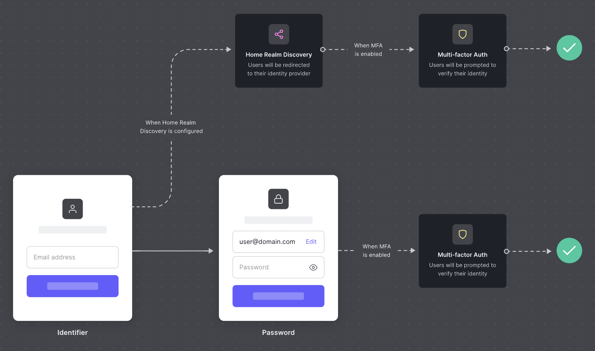

# Single Sign On

### What's SSO?

Single Sign-On is a mechanism that enables a user to log in using the same set of credentials within multiple third-party services, Conduktor being one of them.

There are two principal kinds of SSO:

* Social login lets users connect to applications with Google, Facebook, or other social network accounts.
* Enterprise login lets users connect to external applications using their company's credentials.

This mechanism encompasses multiples techniques, protocols, and technical jargon:

* OIDC, OAuth, SAML, Kerberos, LDAP

### Supported protocols

We support Enterprise connection Single Sign-On using any of the following protocols:

* SAML
* OpenID Connect (OIDC)
* Google Workspace
* Microsoft Azure AD

### Advantages

By configuring SSO with Conduktor, you can:

* Maintain within your IdP who is allowed to Conduktor
* Control the Authentication policies (2FA, network rules)
* Automatically disable accounts when people leave the company
* Forward your company groups to Conduktor (incoming feature)
  * leverage Conduktor RBAC
  * share Cluster Configuration between team members

Once we have configured the link between Conduktor and your Identity Provider, users from your company will be redirected to your identity provider automatically.

### What will change when I migrate to SSO?

Nothing from Conduktor's point of view as long as you use the same email address before and after the migration.

Before the migration, Conduktor was using Auth0 [User Store](https://auth0.com/docs/authenticate/database-connections/auth0-user-store) or Social Identity Provider to authenticate you.

After the migration, the next time you connect to Conduktor, you will automatically get redirected to your company's IdP.

### SAML configuration step by step

We first need to agree on a `Connection Name` that we'll share. It's most likely going to be your company name converted in kebab-case (`a-z`, `0-9,` or `-`). In the following examples, we'll use `your-company`.

You first need to declare a new SAML 2.0 Application in your IdP.&#x20;

There are two important fields you need to declare your Application:

| Item                         | Example                                                            |
| ---------------------------- | ------------------------------------------------------------------ |
| `Post-back URL` or `ACS URL` | https://auth.conduktor.io/login/callback?connection=`your-company` |
| `Entity ID`                  | urn:auth0:conduktor:`your-company`                                 |

#### Required claims


Due to some limitation on Auth0, we need that your SAML assertion contains custom claims. Check your IdP documentation to on how to do this.

Okta documentation: [Configure SAML attributes](https://support.okta.com/help/s/article/How-to-define-and-configure-a-custom-SAML-attribute-statement?language=en\_US)


* `email_verified` with the value `true`.&#x20;
* `email` must be present and **lowercase**

Once you're done, you need to collect and provide us with the following information:

| Item                                      | Example                                      |
| ----------------------------------------- | -------------------------------------------- |
| `SSO URL`                                 | https://login.your-company.com/sso/saml      |
| `Signing Certificate`                     | A .cer, .crt or .pem file                    |
| `Domain names to redirect authentication` | `your-company.com`, `subsidiary-company.com` |

### OIDC configuration step by step

You first need to declare a new OIDC Application in your IdP.&#x20;

If you are asked about the Application Type, pick `Server-side` or `Web Application` type.

Leave most default as-is except for the "Sign-in redirect URL": `https://auth.conduktor.io/login/callback`

#### Required claims


Due to some limitation on Auth0, we need that your OIDC token contains custom claims. Check your IdP documentation to on how to do this.

Okta documentation: [Configure OIDC attributes](https://developer.okta.com/docs/guides/customize-tokens-returned-from-okta/main/)


* `email_verified` with the value `true`.&#x20;
* `email` must be present and **lowercase**

Once you're done, you will provide us with your information:

| Item                                      | Example                                                                                                                            |
| ----------------------------------------- | ---------------------------------------------------------------------------------------------------------------------------------- |
| `Client ID`                               | `0oaztxq9vavFnY9wh696`                                                                                                             |
| `Client Secret`                           | `zTRaILrMOgFGHjHm5J_nrUuv3WPXTYoaj9r3jytl`                                                                                         |
| `Provider Configuration URI`              | [https://login.your-company.com/.well-known/openid-configuration](https://trial-8228023.okta.com/.well-known/openid-configuration) |
| `Domain names to redirect authentication` | `your-company.com`, `subsidiary-company.com`                                                                                       |
